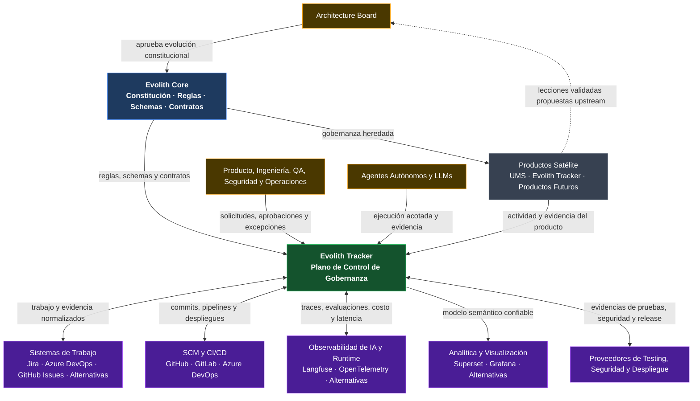
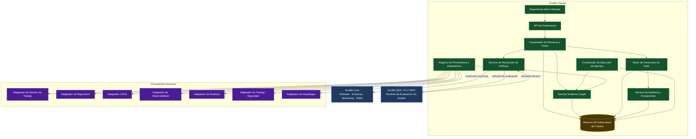
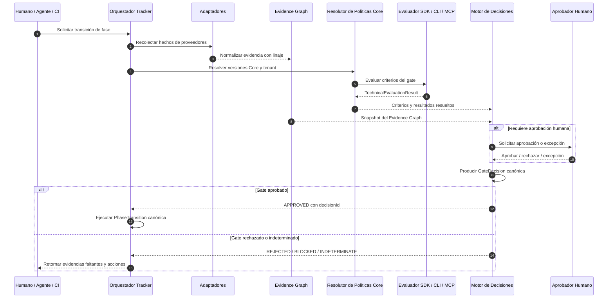
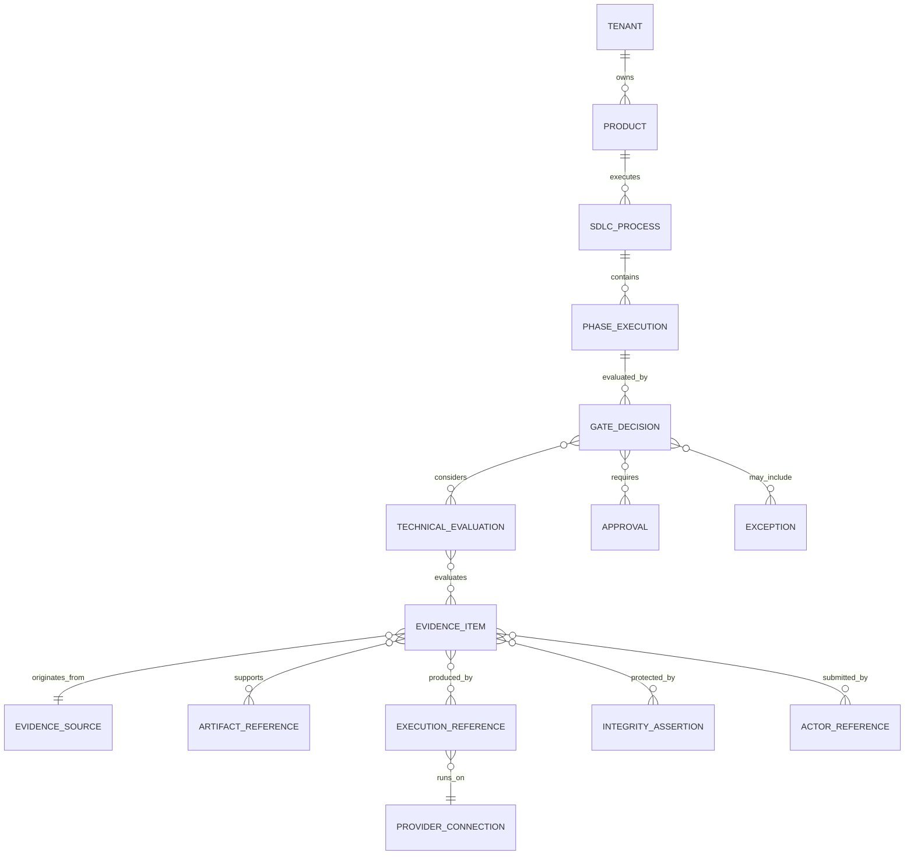
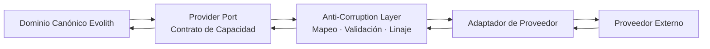
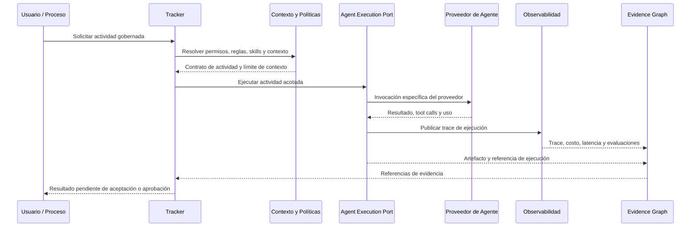
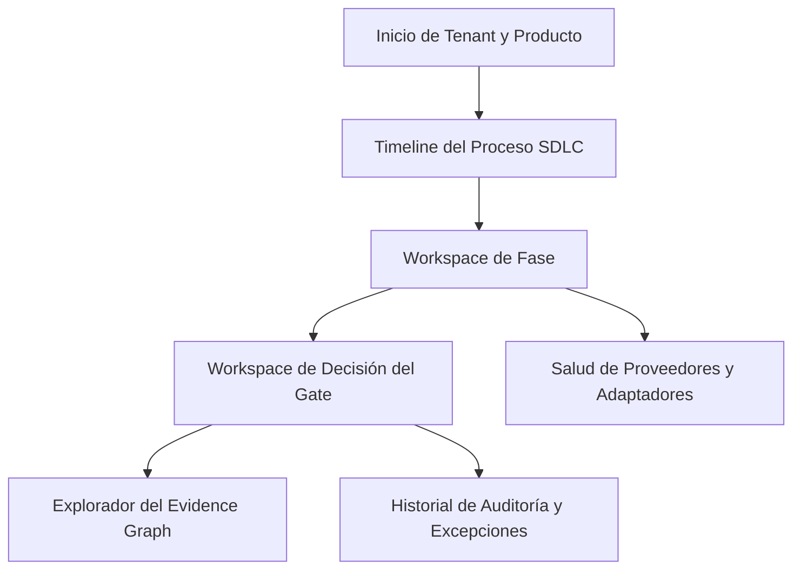

# Evolith — Diseño Objetivo de Composición Gobernada

> **Navegación Bilingüe:** [English Version](./evolith-governed-composition-target-design.md)

**Estado:** Diseño Propuesto — Requiere Revisión del Architecture Board  
**Propietario:** Evolith Architecture Board  
**Visión Padre:** [Visión Maestra del Producto Evolith](./evolith-product-vision-master.es.md)  
**Creado:** 2026-06-10  
**Estado de Implementación:** Solo diseño — este documento no autoriza cambios de código

---

## 1. Propósito

Este documento define el diseño objetivo que implementa la nueva visión de Evolith antes de iniciar cambios de código fuente.

El modelo central de responsabilidades es:

> **Core define. Los proveedores ejecutan. CLI y MCP evalúan. Tracker decide y audita.**

El diseño reemplaza la interpretación anterior en la que CLI, CI o agentes autónomos podían parecer propietarios del veredicto final de un Phase Gate.

---

## 2. Invariantes del Sistema

1. **Evolith Core es constitucional y de solo lectura en runtime.** Define rulesets, schemas, estándares, taxonomías, gates y contratos de proveedores.
2. **Evolith Tracker posee el estado canónico de gobernanza.** Controla procesos, fases, decisiones, aprobaciones, excepciones y auditoría.
3. **CLI, MCP, CI y agentes son evaluadores sin estado o productores de evidencia.** Nunca modifican directamente el estado canónico de una fase.
4. **Los sistemas externos conservan autoridad sobre sus hechos operativos.** SCM posee commits, CI posee ejecuciones, observabilidad posee traces y los sistemas de trabajo poseen sus work items nativos.
5. **Tracker es autoritativo para interpretar la gobernanza.** Decide si la evidencia recolectada satisface las políticas del Core y del tenant.
6. **Los agentes son ejecutores reemplazables, nunca autoridades de aprobación.**
7. **Cada proveedor queda aislado detrás de un puerto neutral y una Anti-Corruption Layer.**
8. **Un pipeline verde, una tarea completada, un documento generado o una respuesta exitosa de un agente no pueden avanzar una fase por sí solos.**
9. **Toda decisión canónica puede reproducirse a partir de reglas versionadas, evidencias, aprobaciones y excepciones.**
10. **No se inicia implementación hasta aprobar este diseño y sus documentos relacionados.**

---

## 3. Contexto del Sistema



---

## 4. Arquitectura de Contenedores



### 4.1 Responsabilidades de Contenedores

| Contenedor | Posee | No Posee |
|---|---|---|
| **Experiencia Web Unificada** | Navegación, vistas de evidencia, acciones gobernadas, aprobaciones y deep links | La verdad operativa del proveedor |
| **API de Gobernanza** | Contrato externo estable y frontera de autorización | Reglas de negocio duplicadas desde Core |
| **Orquestador de Procesos y Fases** | Ciclo de vida y solicitudes de transición | La implementación técnica de evaluación |
| **Motor de Decisiones de Gate** | Decisión canónica, combinación de políticas, aprobaciones y excepciones | Ejecución de herramientas fuente |
| **Servicio Evidence Graph** | Identidad, linaje, relaciones, integridad y consulta de evidencia | Almacenes crudos de proveedores |
| **Servicio de Políticas** | Resolución de Core y políticas del tenant, versionado | Estado canónico del proceso |
| **Coordinador de Agentes** | Actividades acotadas, contexto, permisos, registros y evidencia | Aprobación final de gates |
| **Registro de Proveedores** | Metadata, capacidades, versiones y salud de adaptadores | Reglas específicas filtradas al dominio |
| **SDK / CLI / MCP** | Evaluación determinista y sin estado contra reglas versionadas | Estado del Tracker, aprobaciones y transiciones |

---

## 5. Separación entre Evaluación y Decisión

### 5.1 Conceptos Canónicos

| Concepto | Producido Por | Significado |
|---|---|---|
| **Evidence Item** | Humano, agente, CI o proveedor | Hecho o artefacto ofrecido como prueba |
| **Technical Evaluation Result** | SDK, CLI, MCP o evaluador especializado | Evaluación determinista de evidencia contra una regla o criterio |
| **Gate Decision** | Motor de Decisiones del Tracker | Decisión canónica que combina evaluaciones, aprobaciones, excepciones y política |
| **Phase Transition** | Orquestador del Tracker | Cambio de estado ejecutado únicamente después de una Gate Decision autorizada |

### 5.2 Flujo de Decisión



### 5.3 Vocabulario de Estados

```text
TechnicalEvaluationResult.status
  compliant | non_compliant | indeterminate | error

GateDecision.status
  approved | rejected | blocked | approved_with_exception

PhaseTransition.status
  requested | authorized | executed | failed | cancelled
```

El término `passed` puede conservarse como etiqueta de presentación, pero no debe ocultar qué objeto es técnico y cuál es canónico.

---

## 6. Diseño del Evidence Graph



### 6.1 Metadata Mínima

Toda evidencia aceptada contiene:

- identificador estable;
- referencias a tenant, producto, proceso, fase, gate y criterio;
- proveedor de origen e identificador externo;
- tipo de evidencia, versión de schema y hash de contenido;
- actor productor, agente y modelo cuando aplique;
- versiones de prompt, skill y ruleset cuando aplique;
- referencias a commit, pipeline, prueba, deployment o documento;
- timestamps, costo, latencia y metadata de integridad;
- retención y clasificación de datos;
- referencias a evaluación, aprobación, excepción y decisión final.

---

## 7. Diseño de Proveedores y Adaptadores



### 7.1 Contratos de Proveedores

| Puerto | Capacidades | Ejemplos |
|---|---|---|
| **Work Management Port** | Buscar, importar, vincular y actualizar work items | Jira, Azure DevOps, GitHub Issues, alternativas abiertas |
| **Agent Execution Port** | Ejecutar actividad acotada y devolver evidencia | Claude, OpenAI, Gemini, agentes locales |
| **LLM Observability Port** | Trace, evaluación, costo, latencia y versiones de prompt | Langfuse y alternativas |
| **Analytics Port** | Publicar datasets gobernados y embeber visualizaciones | Apache Superset, Grafana y alternativas |
| **Repository Port** | Commits, ramas, pull requests y tags | GitHub, GitLab, Azure Repos |
| **CI/CD Port** | Builds, pruebas, artefactos y deployments | GitHub Actions, Azure Pipelines, GitLab CI |
| **Testing Port** | Resultados, coverage y verificación de contratos | Adaptadores específicos de frameworks |
| **Security Port** | Findings, policy checks y clasificación de riesgo | CodeQL, Trivy, Snyk y alternativas |
| **Deployment Port** | Release, entorno, rollout y rollback | Kubernetes, clouds y alternativas |
| **Collaboration Port** | Notificaciones, aprobaciones y comunicación operacional | Email, Teams, Slack y alternativas |

### 7.2 Niveles de Certificación

```text
Community Adapter
    -> Conforme al contrato y mantenido por la comunidad

Certified Adapter
    -> Supera validación de seguridad, compatibilidad y linaje

Managed Adapter
    -> Operación empresarial, monitoreo, upgrades, soporte y SLA
```

---

## 8. Diseño de Ejecución de Agentes



Los agentes no pueden:

- aprobar un gate;
- modificar directamente el estado de fase;
- ampliar su contexto fuera del límite aprobado;
- cambiar reglas del tenant o rulesets del Core;
- convertir un artefacto generado en evidencia aceptada sin validación.

---

## 9. Experiencia Unificada



La experiencia muestra primero el estado canónico Evolith y luego los detalles del proveedor. Las herramientas externas permanecen accesibles mediante enlaces al origen, pero el usuario no debe reconstruir manualmente la historia de gobernanza.

---

## 10. Corte Mínimo Comprobable

```text
Un tenant
  -> un producto
  -> un proceso SDLC de cinco fases
  -> un proveedor de gestión de trabajo
  -> un repositorio y CI
  -> un proveedor de agentes
  -> un proveedor de observabilidad
  -> un proveedor de analítica
  -> un Evidence Graph
  -> cinco Gate Decisions canónicas
```

El diseño se acepta únicamente si:

- Tracker sigue siendo autoritativo;
- toda evidencia conserva linaje del proveedor;
- los adaptadores son reemplazables;
- los agentes permanecen acotados y sin autoridad;
- el usuario experimenta un proceso coherente;
- ningún schema específico se filtra al dominio canónico.

---

## 11. Impacto Documental Antes de Código

Deben alinearse antes de implementar:

1. Diseño de Interfaces Técnicas del Tracker.
2. Arquitectura Objetivo SDK / CLI / MCP.
3. Modelo de Evidencia y Trazabilidad.
4. Mapeo de Artefactos y templates de Discovery.
5. Responsibility Matrix y semántica de decisiones.
6. Fronteras Open-Core y ecosistema de adaptadores.
7. One-pager ejecutivo y diagramas de gobernanza.
8. Roadmap evolutivo y evaluación de madurez.

Rulesets, schemas y código quedan fuera de este primer conjunto de cambios de diseño.

---

## 12. Decisiones que Debe Aprobar el Board

- separación entre evaluación técnica y decisión canónica;
- límites de agregados del Evidence Graph;
- taxonomía inicial de provider ports;
- niveles de certificación de adaptadores;
- corte vertical mínimo;
- terminología de `compliant`, `approved` y `passed`;
- condiciones de aprobación configurables por tenant.

---

## 13. Documentos Relacionados

- [Visión Maestra del Producto Evolith](./evolith-product-vision-master.es.md)
- [Framework Estratégico de Validación y Composición](./evolith-strategic-validation-and-composition-framework.es.md)
- [Diseño de Interfaces Técnicas del Tracker](./sdlc-tracker-technical-interfaces.es.md)
- [Modelo de Trazabilidad SDLC](../../sdlc/traceability-model.es.md)
- [Workflow de Validación Asistida por IA](./evolith-ai-assisted-validation-workflow.es.md)

---

*Este documento es la línea base de diseño para la nueva visión. Autoriza únicamente alineación documental; la implementación requiere una baseline técnica y ADRs aprobados por separado.*