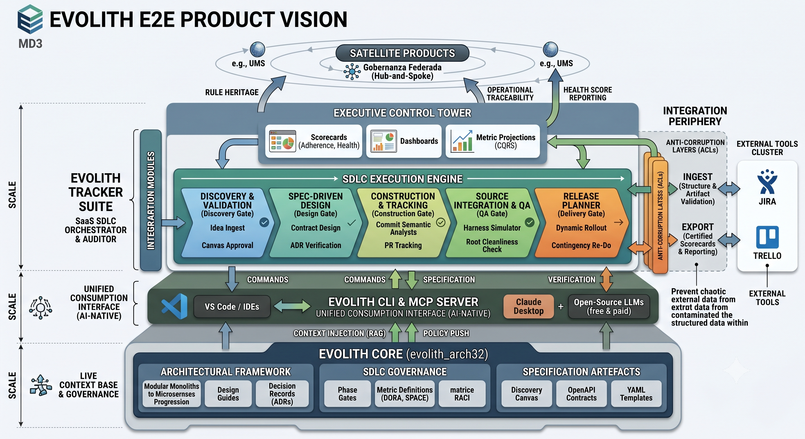

# Evolith — Product Vision Master

> **Bilingual Navigation:** [Versión en Español](./evolith-product-vision-master.es.md)

**Status:** Approved
**Owner:** Evolith Architecture Board
**Last Updated:** 2026-06-06

---

## 1. Vision Statement

**Evolith** is an AI-Native Engineering Governance Framework designed to democratize elite software development. It acts as the lifeline for companies with high operational load and technical gaps, converting complex systems into **predictable, assisted, and shielded** processes.

---

## 2. Ecosystem Pillars

### 2.1 Evolith Core (`evolith_arch32`)

The living database (Reference Corpus) containing the **Constitution** — guides for Progressive Monolith, ADRs, standards, and taxonomy. It is the source of truth readable by humans and consumable by machines.

```
Reference Corpus (Constitution)
├── Architectural Directives
├── ADRs (Architecture Decision Records)
├── Standards & Taxonomies
├── Rulesets (machine-readable + human-readable)
└── Schemas (Phase Gate artifacts)
```

### 2.2 Evolith Tracker

The **SaaS SDLC Orchestrator & Auditor Suite** that executes and traces the SDLC defined by the Core. It is not a traditional task manager (not Jira or Trello) — it is an **AI-Native End-to-End Engineering Suite** composed of 5 independent progressive monolithic systems (modules), each corresponding to a Phase Gate. It acts as the audit engine and management layer, guaranteeing compliance with Core rules through an immutable governance contract.

> Repository: [`evolith_tracker`](https://github.com/beyondnetcode/evolith_tracker)

#### 2.2.1 Execution Modes (Dual-Track & Hybrid)

The Tracker supports three operational modes, configurable per module via *Convention over Configuration*:

| Mode | Who Executes | Use Case |
|------|-------------|----------|
| **Traditional (Human-Driven)** | Engineering teams | Scrum/Kanban/PMI ceremonies |
| **AI-Native (Agent-Driven)** | BMAD AI Agents | Spec-Driven autonomous execution |
| **Hybrid** | Humans govern · Agents execute | Discovery meetings + automated Design phase |

#### 2.2.2 The 5 Phase Gate Modules

```
Phase 1          Phase 2            Phase 3           Phase 4          Phase 5
Discovery ──── Spec-Driven ──── Construction ──── Automated QA ──── Release
  │              Design               │                │              Planner
  │                │                  │                │                │
  ▼                ▼                  ▼                ▼                ▼
Business       Contract           Drift-free        .harness       Dynamic
Sign-Off       Design             Build             Guardian       Rollout +
(Canvas)       (OpenAPI/ADR)      (Agile/AI)        (Contract      Re-Do Flow
                                                     Testing)
```

| Module | Gate | Key Capability |
|--------|------|----------------|
| **Product Discovery & Ideation Hub** | Business Sign-Off | AI-challenged Discovery Canvas · ROI/KPI gate before any design is authorized |
| **Architecture Spec-Driven** | Design Baseline | Spec-as-Source · OpenAPI/AsyncAPI contracts · ADR verification · human approves contracts, not code |
| **Construction Tracking** | Successful Build | Methodology-agnostic engine (Scrum/Kanban/BMAD) · real-time drift detection |
| **Automated QA & Integration** | RC Stamped | Deep `.harness` integration · contract testing · Root Cleanness validation · SAST/DAST |
| **Dynamic Release Planner** | Production Live | Multi-country/multi-channel dashboards · Regression Score · Re-Do Flow contingency engine |

#### 2.2.3 Architectural Pillars

- **Multi-Tenant Progressive Monolith:** 5 independent modules deployable as SaaS or On-Premise, with absolute TenantID isolation.
- **Hexagonal Architecture (Ports & Adapters):** Core domain shielded against AI or methodology changes.
- **Delegated Identity (UMS):** No own user management — consumes AuthN, AuthZ, and RACI roles from the UMS SaaS.
- **Upstream Immutability:** The Tracker does not invent rules. Any improvement must be proposed as an ADR to `evolith_arch32`. Only after Core approval does the Tracker inherit the change.

#### 2.2.4 Core Responsibilities

- Execute and enforce the 5 Phase Gates
- Track **Architecture Drift Index** (0% tolerance — no code deployed without a backing Spec and ADR)
- Consolidate **DORA + SPACE metrics** via CQRS async engine
- Provide real-time executive scorecards (Adherence, Deployment Frequency, Lead Time, Change Failure Rate)
- Activate **Re-Do Flow** contingency engine when a release gate is blocked

#### 2.2.5 Business Value (ROI from Discovery Canvas)

| KPI | Target |
|-----|--------|
| Deployment Frequency | Weekly → Daily (On-Demand) via automated quality gates |
| Lead Time for Changes | -50% from ideation to production |
| Architecture Adherence Index | 100% Spec↔Code correlation · zero drift |
| Change Failure Rate | < 2% via deep `.harness` contract testing integration |
| Refactoring Cost (Technical Debt) | -40% reduction in rework hours |

#### 2.2.6 Technical Interface Layer — CLI · MCP · REST · Agents

The Tracker is not a feature of the CLI — it is an independent platform that
**orchestrates** the CLI, MCP server, REST services, and autonomous agents to
drive the SDLC lifecycle. Each interface serves a distinct consumer class:

```
┌─────────────────────────────────────────────────────┐
│                  SDLC Tracker                        │
│                                                      │
│  Phase 1 ──► Phase 2 ──► Phase 3 ──► Phase 4/5      │
│     │           │           │           │            │
└─────┼───────────┼───────────┼───────────┼────────────┘
      │           │           │           │
   REST API    MCP tools   CLI embed   Agents
  (frontend   (AI/agents)  (chatbox)  (auto-gates)
   + CI/CD)
      │           │           │           │
      └───────────┴───────────┴───────────┘
                        │
               Evolith Core (read-only)
            rulesets · ADRs · standards
```

**Interface responsibilities:**

| Interface | Consumer | Purpose |
|-----------|----------|---------|
| **MCP HTTP/SSE** | AI agents, LLMs | Gate evaluation, metrics, architecture validation |
| **REST API** | Tracker frontend, CI/CD pipelines | Phase management, gate status, satellite registration |
| **CLI chatbox embed** | Developer (in-UI) | Session-aware conversational guidance per phase |
| **Autonomous agents** | Phase transitions | Automatic gate evaluation without human trigger |
| **Webhook / event bus** | Tracker internal | Reactive gate pass/fail propagation |

**Tracker database — owned state (Tracker-exclusive, no external write access):**

The Tracker maintains its own database as sole source of runtime truth.
Evolith Core is consumed read-only for rulesets and governance definitions.

| Entity | Purpose |
|--------|---------|
| `SatelliteProject` | Registered satellite repositories |
| `SDLCProcess` | One active flow instance per project |
| `PhaseExecution` | Execution record per phase |
| `GateEvaluation` | Gate result with evidence and ruleset reference |
| `ChatboxSession` | Conversational session with turn history and tool-call log |
| `AgentRun` | Autonomous agent execution at phase transitions |

> Full interface contracts, data models, and CLI extension requirements:
> [SDLC Tracker — Technical Interface Design](./sdlc-tracker-technical-interfaces.md)

### 2.3 Technological Exposure (CLI + MCP)

The interoperability layer that exposes Core knowledge via CLI and MCP servers, enabling any LLM or IDE to consume governance as real-time context.

```
CLI Commands          MCP Servers
    │                     │
    └────► Evolith Core ◄─┘
              │
              ▼
         Reference Corpus
```

---

## 3. Operational Model: Federated Governance

Evolith operates through a **Hub-and-Spoke Inheritance and Federated Governance Model**:

### 3.1 Inheritance

Satellite products (e.g., UMS) inherit rules, artifacts, and SDLC from the Core, ensuring consistency across the organization.

```
        ┌─────────────────┐
        │   Evolith Core  │  Level 0 — Source of Truth
        │  (Constitution) │
        └────────┬────────┘
                 │ inherits
                 ▼
        ┌─────────────────┐
        │  UMS (Satellite)│  Level 1 — Product Instance
        └────────┬────────┘
                 │ extends (with Architecture Board approval)
                 ▼
        ┌─────────────────┐
        │  Custom Product │  Level 2 — Extended Satellite
        └─────────────────┘
```

### 3.2 Anti-Corruption Layers (ACLs)

Integration with external systems (Jira, Trello, Linear) that **normalizes and validates** external data against Core artifacts, preventing external chaos from contaminating Evolith governance.

```
  External Systems          ACL (Anti-Corruption Layer)         Evolith Core
  ┌──────────────┐         ┌──────────────────────────┐         ┌────────────┐
  │ Jira         │──────►  │ Normalize & Validate      │──────►  │ Rules      │
  │ Trello       │         │ against Core artifacts    │         │ Schemas    │
  │ Linear       │         │ Block non-compliant data  │         │ ADRs       │
  │ GitHub       │         │ Transform to Core model   │         │ Standards  │
  └──────────────┘         └──────────────────────────┘         └────────────┘
```

**ACL Rules:**
- All external data MUST be validated against Core schemas before ingestion
- Transformations MUST preserve traceability to the original external source
- Non-compliant data MUST be rejected, not normalized away
- ACL implementations MUST be versioned alongside Core evolution

---

## 4. The Development Life Cycle (SDLC)

The Tracker systematizes development into **5 auditable Phase Gates**:

```
Phase 1        Phase 2         Phase 3         Phase 4          Phase 5
Discovery ──── Specification ── Construction ── Automated QA ─── Release
   │               │                │               │               │
   ▼               ▼                ▼               ▼               ▼
 Business     Design Baseline   Successful       RC Stamped    Production
 Sign-Off     ADRs + Stories     Build            Test Summary     Live
```

| Gate | Evidence Required | Pass Criterion |
|------|-------------------|----------------|
| **Business Sign-Off** | PRD, Discovery Canvas, ROI, Ballpark | Stakeholder acceptance |
| **Design Baseline** | ADRs, Functional Stories, Blueprint alignment | Architecture Board review |
| **Successful Build** | Technical Stories, CI pipeline, DoD checklist | All CI gates green |
| **RC Stamped** | Test Summary Report, coverage thresholds | Quality metrics met |
| **Production Live** | Release Notes, observability, rollback plan | Operations sign-off |

---

## 5. Business Strategy: Open-Core

```
┌─────────────────────────────────────────────────────────┐
│                    Evolith Ecosystem                     │
├─────────────────────────┬───────────────────────────────┤
│   OPEN SOURCE (Free)    │    ENTERPRISE SAAS (Paid)      │
├─────────────────────────┼───────────────────────────────┤
│ Core Constitution       │ Tracker Suite                  │
│ ADRs & Standards        │ Advanced Dashboards            │
│ CLI + MCP               │ ACLs (Jira, Trello, Linear)    │
│ Reference Corpus        │ Executive Scorecards           │
│ Community Support       │ Priority Support               │
│                         │ Audit & Compliance Reports     │
└─────────────────────────┴───────────────────────────────┘
```

**Monetization Vector:** Automation, satellite governance, executive views, and intelligent legacy integration.

---

## 6. Executive Vision (Scorecards)

Evolith Tracker eliminates micro-management by providing:

### 6.1 Predictability
Real-time state of phase gates — know exactly where every product stands in the SDLC pipeline.

### 6.2 Adherence
**Architecture Drift Index** — measures deviation from Core standards. Low drift = high compliance.

### 6.3 Efficiency
**Consolidated DORA + SPACE Metrics:**
- Deployment Frequency
- Lead Time for Changes
- Change Failure Rate
- Time to Restore
- Reliability (observability)
- Culture (team health)
- Execution (throughput)
- Communication (visibility)
- Sponsorship (leadership alignment)

---

## 7. Conceptual Master View

The following diagram illustrates the complete Evolith ecosystem architecture:



*Figure 1: Evolith ecosystem architecture showing Core, Tracker, ACLs, and the 5-phase SDLC lifecycle.*

---

## 8. Relationship to This Repository

This repository (**Evolith**) serves as the **Evolith Core** — the Reference Corpus and Constitution for all satellite products.

| Artifact | Location |
|----------|----------|
| Architectural Directives | `reference/governance/standards/vision/architectural-directives.md` |
| Evolutionary Roadmap | `reference/governance/standards/vision/evolutionary-strategy-roadmap.md` |
| SDLC Artifact Mapping | `reference/governance/sdlc/sdlc-evolith-artifact-mapping.md` |
| Rulesets (Machine-Readable) | `rulesets/` |
| Schemas (Phase Gate Artifacts) | `rulesets/schema/` |
| Impact Analysis Agent | `.harness/scripts/impact-analysis-synchronizer.mjs` |

---

## 9. Supplemental Reading

- [Architectural Directives](./architectural-directives.md) — Non-negotiable technical constraints
- [Evolutionary Strategy Roadmap](./evolutionary-strategy-roadmap.md) — Phase-by-phase technical roadmap
- [Maturity Evaluation](./maturity-evaluation.md) — Anti-pattern immunization and pattern readiness
- [Maturity Matrix](./maturity-matrix.md) — TOGAF ACMM assessment
- [SDLC Artifact Mapping](../../sdlc/sdlc-evolith-artifact-mapping.md) — Complete artifact-to-gate traceability
- [SDLC Tracker — Technical Interface Design](./sdlc-tracker-technical-interfaces.md) — CLI/MCP/REST/Agent interface contracts and Tracker DB model

---

*This document constitutes the official product vision for Evolith. All architectural decisions, rules, and standards must align with this vision.*

---
[Back to Vision Index](./README.md)