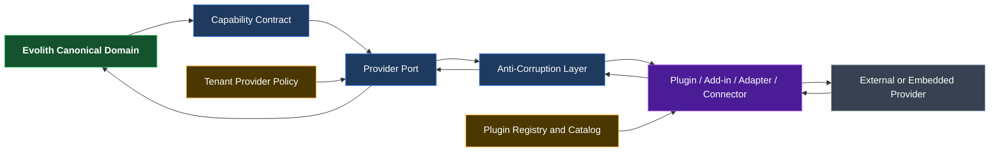
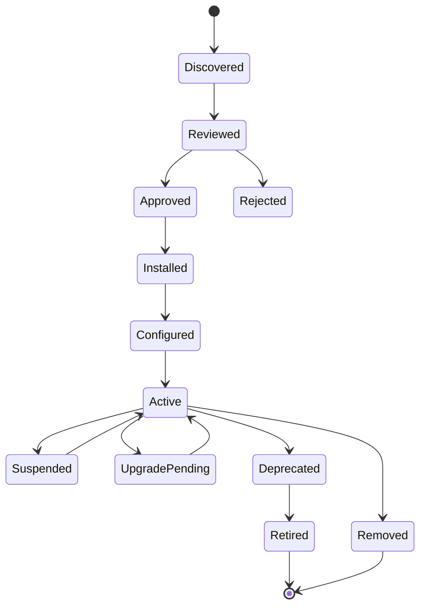
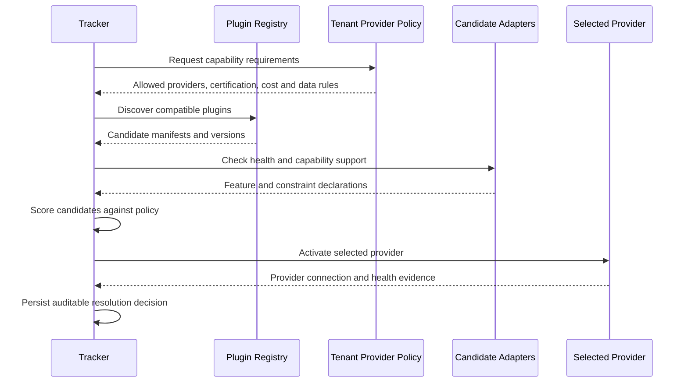

# Evolith — Provider Abstraction and Plugin Model

> **Bilingual Navigation:** [Versión en Español](./evolith-provider-abstraction-plugin-model.es.md)

**Status:** Proposed Foundational Design Principle  
**Owner:** Evolith Architecture Board  
**Parent Vision:** [Evolith Product Vision Master](./evolith-product-vision-master.md)  
**Companion Design:** [Governed Composition Target Design](./evolith-governed-composition-target-design.md)  
**Created:** 2026-06-10  
**Implementation Status:** Design only — no code changes authorized

---

## 1. Foundational Premise

Every tool, platform, model, service, integration, dashboard, agent, repository, pipeline, scanner, or external capability used by Evolith must be:

- **adaptable** to Evolith's canonical contracts;
- **interchangeable** without changing the domain model;
- **installable** as a plugin, add-in, adapter, connector, or provider package;
- **replaceable** per tenant, product, environment, or use case;
- **optional**, except for Evolith's irreducible governance kernel;
- **governed** by Evolith permissions, rules, evidence, and audit;
- **observable** through health, usage, cost, failures, and evidence lineage.

> **A default provider is an onboarding convenience, never an architectural dependency.**

Evolith may ship recommended defaults, reference adapters, or managed options, but no provider-specific API, schema, identifier, workflow, or commercial assumption may become part of the canonical domain.

---

## 2. Product Principle

```text
Evolith Capability
        │
        v
Canonical Capability Contract
        │
        v
Provider Port
        │
        v
Plugin / Add-in / Adapter / Connector
        │
        v
Selected Provider
```

The product speaks in capabilities, not vendors.

Examples:

| Canonical Capability | Possible Default | Replaceable Alternatives |
|---|---|---|
| Work management | Jira adapter | Azure DevOps, GitHub Issues, Linear, open-source tools |
| Agent execution | Claude adapter | OpenAI, Gemini, local models, future providers |
| LLM observability | Langfuse adapter | OpenTelemetry-compatible or other observability platforms |
| Analytics | Apache Superset adapter | Grafana, Power BI, custom analytics, future providers |
| Source control | GitHub adapter | GitLab, Azure Repos, Bitbucket |
| CI/CD | GitHub Actions adapter | Azure Pipelines, GitLab CI, Jenkins, Tekton |
| Security scanning | CodeQL adapter | Snyk, Trivy, Semgrep, enterprise scanners |
| Deployment | Kubernetes adapter | Cloud-native platforms, serverless, VM or on-premise platforms |

Defaults may vary by deployment edition, tenant policy, geography, compliance profile, or customer preference.

---

## 3. Architectural Model



### 3.1 Layer Responsibilities

| Layer | Responsibility |
|---|---|
| **Canonical Domain** | Express business and governance concepts without vendor vocabulary |
| **Capability Contract** | Define what Evolith needs, including inputs, outputs, errors, evidence, and non-functional expectations |
| **Provider Port** | Stable application boundary used by Evolith services |
| **Anti-Corruption Layer** | Map, validate, normalize, reject, and preserve source lineage |
| **Plugin / Adapter** | Implement one provider-specific integration |
| **Provider** | Execute the external or embedded capability |
| **Provider Policy** | Choose defaults, fallbacks, permitted providers, cost and data restrictions |
| **Registry** | Discover, install, version, activate, certify, deprecate, and remove plugins |

---

## 4. Plugin Types

| Type | Execution Location | Typical Use |
|---|---|---|
| **In-Process Plugin** | Loaded in an Evolith runtime | Lightweight deterministic extensions with strong trust requirements |
| **Sidecar Adapter** | Separate process near Tracker | Isolation, independent upgrades, language flexibility |
| **Remote Connector** | External service accessed over API | SaaS tools and enterprise platforms |
| **MCP Provider Plugin** | MCP server or tool set | Agent- and LLM-accessible capabilities |
| **Webhook/Event Add-in** | Event-driven integration | CI/CD, work systems, notifications and asynchronous evidence |
| **Embedded UI Add-in** | Sandboxed or federated user interface | Dashboards, provider views and contextual actions |
| **Data Provider Plugin** | Batch, stream or query integration | Analytics, metrics and evidence import |

The plugin type is an implementation detail. All types must conform to the same capability and evidence contracts.

---

## 5. Provider Selection and Defaults

### 5.1 Resolution Scope

Provider selection can be configured at:

```text
Platform Default
    -> Organization / Tenant
        -> Product
            -> Environment
                -> Process or Capability Instance
```

The most specific valid configuration wins, provided it complies with higher-level policy.

### 5.2 Default Provider Rules

A default provider:

- accelerates setup;
- can be changed before or after activation;
- cannot leak provider-specific fields into canonical entities;
- must declare fallback and migration behavior;
- must be visible to tenant administrators;
- must never be silently selected when policy requires explicit consent;
- must not make historical evidence unreadable after replacement.

### 5.3 Capability-Based Resolution

```typescript
interface ProviderRequirement {
  capability: string;
  requiredFeatures: string[];
  dataResidency?: string[];
  maximumCostPolicyRef?: string;
  minimumCertification?: 'community' | 'certified' | 'managed';
  requiredDeploymentModes?: Array<'saas' | 'self_hosted' | 'on_premise'>;
}

interface ProviderResolution {
  providerConnectionId: string;
  pluginId: string;
  pluginVersion: string;
  capabilityVersion: string;
  selectionReason: string;
  fallbackProviderConnectionIds: string[];
}
```

Provider resolution is policy-driven and auditable.

---

## 6. Plugin Manifest

Every plugin publishes a machine-readable manifest.

```yaml
id: evolith.langfuse.observability
name: Langfuse Observability Adapter
version: 1.0.0
pluginType: remote-connector
providerType: llm-observability
capabilityContracts:
  - id: evolith.capability.llm-trace
    version: 1.0.0
  - id: evolith.capability.llm-evaluation
    version: 1.0.0
deploymentModes:
  - saas
  - self-hosted
permissions:
  - evidence.write
  - trace.read
dataClassifications:
  - internal
  - confidential
configurationSchemaRef: schemas/plugins/langfuse.config.schema.json
evidenceSchemas:
  - rulesets/schema/evidence-item.schema.json
healthCheck:
  type: http
  path: /health
certification:
  level: certified
  validUntil: 2027-06-10
license:
  type: OSS-and-commercial-service
migration:
  exportSupported: true
  importSupported: true
  historicalReadSupported: true
```

---

## 7. Lifecycle



Every lifecycle transition is tenant-scoped, authorized, and auditable.

### 7.1 Upgrade Rules

- Capability-contract compatibility is checked before activation.
- Breaking changes require a new major contract version.
- Configuration and evidence migrations must be explicit.
- Rollback support is required for managed plugins.
- A plugin upgrade cannot invalidate historical evidence.

### 7.2 Removal Rules

A plugin may be removed only when:

- active workflows no longer depend on it;
- historical evidence remains readable;
- export or archival requirements are satisfied;
- replacement mappings are validated when applicable;
- credentials and tokens are revoked;
- audit history is preserved.

---

## 8. Capability Negotiation



No provider is selected solely because it is the platform default. It must satisfy current capability and tenant policy.

---

## 9. Failure, Fallback, and Replacement

### 9.1 Failure Modes

| Condition | Required Behavior |
|---|---|
| Provider unavailable | Mark evidence source unavailable; do not fabricate or silently approve evidence |
| Provider returns invalid schema | Reject at ACL boundary and record provider failure |
| Provider loses certification | Block new use according to tenant policy; preserve historical access |
| Cost limit exceeded | Pause or route according to approved fallback policy |
| Data residency violation | Block execution and alert governance owners |
| Plugin version incompatible | Prevent activation and retain the previous compatible version |

### 9.2 Replacement Flow


Replacement must not require changes to:

- canonical domain entities;
- Phase Gate semantics;
- Core rulesets unrelated to provider capability;
- user-facing process identity;
- historical decision identifiers.

---

## 10. User Experience

Evolith presents providers as configurable capability implementations.

```text
Capability: LLM Observability
Current provider: Langfuse
Certification: Certified
Deployment: Self-hosted
Health: Healthy
Fallback: OpenTelemetry Adapter
Actions: Configure · Test · Replace · Suspend · View evidence
```

Users may see recommended defaults, but the interface must always expose:

- selected provider;
- reason for selection;
- scope of configuration;
- certification and version;
- deployment and data location;
- health and cost status;
- fallback and replacement options;
- affected processes and evidence.

---

## 11. Security and Isolation

Every plugin must:

- receive least-privilege permissions;
- operate inside tenant data boundaries;
- use isolated credentials and secret references;
- declare outbound networks and data classes;
- produce auditable operations;
- support credential rotation and revocation;
- prevent cross-tenant caching or state leakage;
- validate all inbound and outbound payloads;
- fail closed for governance-relevant operations.

In-process plugins require a higher trust and certification level than remote connectors or sidecars.

---

## 12. Open-Core and Enterprise Boundary

### Open Core

- capability-contract specifications;
- provider-port interfaces;
- plugin manifest schema;
- adapter SDK;
- certification test harness;
- reference and community adapters;
- compatibility rules and examples.

### Enterprise Tracker

- tenant-scoped registry and administration;
- managed and certified adapters;
- private plugin catalogs;
- policy-based provider selection;
- health, cost and compliance monitoring;
- upgrade orchestration and SLA;
- controlled on-premise and managed deployment.

The enterprise model monetizes governance and operations, not artificial provider lock-in.

---

## 13. Anti-Patterns

The following are prohibited:

- vendor names in canonical aggregate or field names;
- provider-specific payloads persisted as canonical domain entities;
- hard-coded provider selection in business logic;
- a plugin bypassing the ACL or Evidence Graph;
- a default provider becoming mandatory without an approved governance reason;
- direct provider credentials exposed to agents or end users;
- provider replacement requiring a rewrite of Phase Gate logic;
- historical evidence becoming inaccessible after plugin removal;
- commercial licensing assumptions embedded in Core rules.

---

## 14. Acceptance Criteria

This design principle is satisfied when:

1. each external capability is represented by a canonical capability contract;
2. every provider implementation is registered as a versioned plugin or adapter;
3. defaults can be replaced through configuration and policy;
4. provider-specific schemas remain behind ACLs;
5. plugin health, cost, permissions and evidence lineage are visible;
6. provider replacement preserves canonical state and historical evidence;
7. tenant administrators control allowed and preferred providers;
8. no provider can independently change canonical governance state.

---

## 15. Relationship and Navigation

- [Evolith Product Vision Master](./evolith-product-vision-master.md)
- [Governed Composition Target Design](./evolith-governed-composition-target-design.md)
- [SDLC Tracker Technical Interface Design](./sdlc-tracker-technical-interfaces.md)
- [Strategic Validation and Composition Framework](./evolith-strategic-validation-and-composition-framework.md)

---

*Provider abstraction is a product premise, not an implementation option. Evolith succeeds by governing interchangeable capabilities without becoming dependent on any single tool, model, platform, or vendor.*