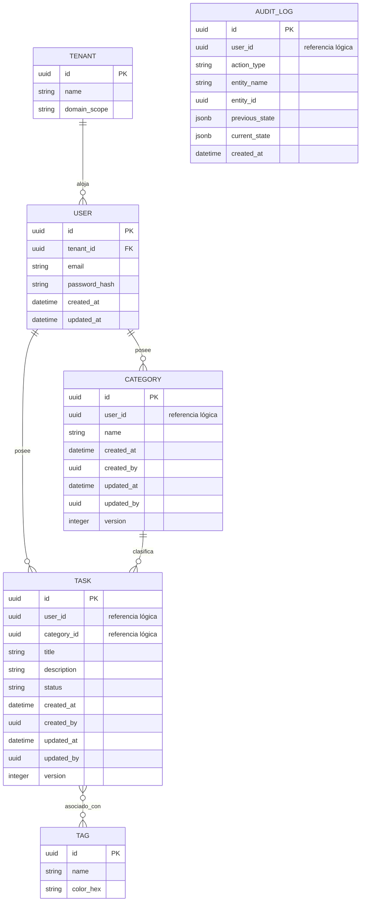

# Modelo de Datos Conceptual

El modelo de dominio central utiliza una **Estrategia de Auditoría Híbrida** ([ADR-0016](../../../architecture/adrs/core/0016-immutable-business-audit-trail.md)). Cada tabla transaccional hereda columnas de auditoría estándar, y un ledger inmutable externo registra los cambios históricos en formato delta.

## 1. Diagrama Entidad-Relación (Mermaid)

---

## 2. Columnas de Auditoría Comunes (BaseEntity)
Para garantizar que el modelo se alinee con las estrategias de cumplimiento corporativo, las entidades `CATEGORY` y `TASK` DEBEN implementar los siguientes metadatos del sistema:

| Nombre de Columna | Tipo | Propósito |
| :--- | :--- | :--- |
| `created_at` | `TIMESTAMP` | Instante de la primera transacción de escritura. |
| `created_by` | `UUID` | Usuario originador que confirmó el registro. |
| `updated_at` | `TIMESTAMP` | Instante de la modificación más reciente. |
| `updated_by` | `UUID` | Actor responsable de la modificación. |
| `version` | `INT` | Token de secuencia incremental para prevenir condiciones de carrera. |

## 3. Definiciones de Campos

### Tabla User
* `email`: Identidad de inicio de sesión primaria. Restricción de unicidad.

### Tabla Task
* `user_id`: Propietario con alcance (FK) para autorización básica de la aplicación.
* `category_id`: Contenedor de clasificación. Puede ser NULL.

### Tabla Audit Log
* **Regla de Inmutabilidad**: Esta tabla solo permite operaciones `INSERT`.
* `action_type`: Enumeración (CREATE, UPDATE, DELETE).
* `previous_state` / `current_state`: Serialización JSON utilizada para análisis visual de diferencias por parte de los auditores.

---
[Volver al Índice](./README.md)
