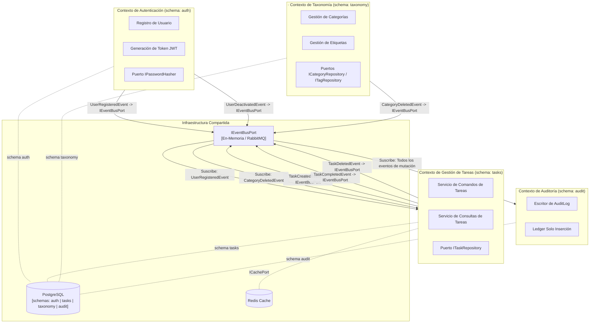

# Mapa de Bounded Contexts - To-Do Reference Skeleton

Este documento establece el **Mapa de Bounded Contexts DDD (Domain-Driven Design)** formal para la Plantilla de Referencia. Cada contexto posee su propio **esquema de PostgreSQL** ([ADR-0031](../../../architecture/adrs/core/0031-schema-per-context-domain-event-catalog.md)), habilitando la extracción de microservicios sin migraciones.

> **Nota sobre identificadores técnicos (R-04):** Los nombres de interfaces (`IEventBusPort`, `ITaskRepository`, etc.) y los nombres de eventos de dominio (`UserRegisteredEvent`, `TaskCreatedEvent`, etc.) se mantienen en inglés en todos los diagramas y tablas. Estos son identificadores de código que deben coincidir exactamente con la implementación fuente. Solo el lenguaje natural (títulos de sección, descripciones, misiones de contexto) se expresa en español.

---

## 1. Vista General del Mapa de Contextos

---

## 2. Definiciones de Contextos

### A. Contexto de Autenticación - `schema: auth`
**Misión:** Poseer los primitivos de gestión de identidad y la emisión de tokens de sesión.

**Posee:**
- Tabla `auth.users`
- Puerto `IPasswordHasher`
- Auth Controller (endpoints de Login/Register)

**Publica Eventos:**
- `UserRegisteredEvent` -> consumido por Task, Audit
- `UserDeactivatedEvent` -> consumido por Task, Audit

---

### B. Contexto de Gestión de Tareas - `schema: tasks`
**Misión:** Coordinar todas las operaciones relacionadas con tareas atómicas de flujo de trabajo.

**Posee:**
- Tabla `tasks.task`
- Tabla puente `tasks.task_tags`
- Puerto `ITaskRepository`
- Casos de Uso: `CreateTask`, `ListTasks`, `CompleteTask`, `DeleteTask`

**Contrato de Integración:**
- Lee `userId` del JWT (inyectado por el contexto Auth via claim del token — sin lecturas directas cross-schema)
- Suscribe a: `UserRegisteredEvent`, `CategoryDeletedEvent`

**Publica Eventos:**
- `TaskCreatedEvent`, `TaskCompletedEvent`, `TaskDeletedEvent`

---

### · C. Contexto de Taxonomía - `schema: taxonomy`
**Misión:** Gestionar el vocabulario de clasificación (Categorías y Etiquetas) disponible para el tenant.

**Posee:**
- Tabla `taxonomy.category`
- Tabla `taxonomy.tag`
- Puertos `ICategoryRepository`, `ITagRepository`

**Publica Eventos:**
- `CategoryDeletedEvent` -> consumido por Task (anular referencias `category_id` huérfanas)

---

### D. Contexto de Auditoría - `schema: audit`
**Misión:** Mantener un registro inmutable y de solo inserción de todos los cambios significativos de estado del dominio.

**Posee:**
- Tabla `audit.audit_log` (trigger de solo INSERT a nivel de base de datos aplicado según [ADR-0016](../../../architecture/adrs/core/0016-immutable-business-audit-trail.md))

**Suscribe a:** Todos los eventos de todos los contextos.

**NO publica eventos.** El contexto de Auditoría es un sumidero terminal.

---

## 3. Capas Anti-Corrupción (ACL)

| Límite | Mecanismo ACL | Razón |
| :--- | :--- | :--- |
| Task Redis | `ICachePort` | Previene que el driver de Redis se filtre hacia la capa de dominio |
| Task TypeORM | `ITaskRepository` | Los decoradores ORM no deben impactar las reglas de entidad TS del núcleo |
| Auth Bcrypt | `IPasswordHasher` | Desacopla el algoritmo de cifrado del flujo de trabajo de la aplicación |
| Cualquier Event Bus de Contexto | `IEventBusPort` | Desacopla el transporte (RabbitMQ/Kafka) de la lógica del dominio |
| Task Auth | Solo Domain Events | Task nunca lee `auth.users` directamente — obtiene userId de los claims del JWT |

---

## 4. Mapa de Extracción a Microservicios ([ADR-0031](../../../architecture/adrs/core/0031-schema-per-context-domain-event-catalog.md), [ADR-0006](../../../architecture/adrs/core/0006-future-microservices-transition-dapr.md))

Cuando el sistema evolucione a microservicios, cada contexto se extrae de forma limpia:

| Hito | Acción | Impacto en BD |
| :--- | :--- | :--- |
| **M1: Monolito** | Todos los contextos comparten una conexión a BD | PostgreSQL único, 4 schemas |
| **M2: Extraer Task** | `TaskService` obtiene su propia `DATABASE_URL` -> schema `tasks` | Sin migración — schema ya aislado |
| **M3: Extraer Taxonomy** | `TaxonomyService` obtiene su propia `DATABASE_URL` -> schema `taxonomy` | Sin migración — schema ya aislado |
| **M4: Mesh Completo** | Cada servicio en su propia instancia de PostgreSQL | `pg_dump --schema=<name>` por servicio |

---
[Volver al Índice](./README.md)
