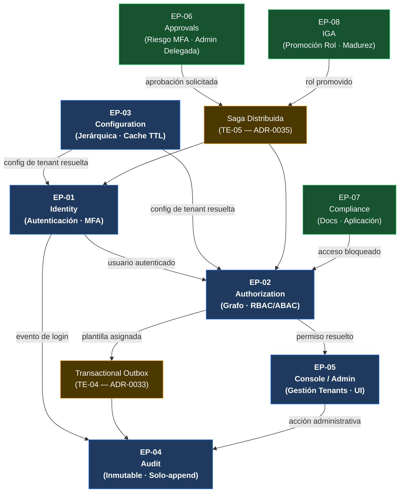

# UMS — Visión Técnica y Análisis Arquitectónico

> **Navegación bilingüe:** [English](./ums-technical-overview.md)  
> **Propietario:** Evolith Architecture Board  
> **Estado:** Referencia activa  
> **Padre:** [Hub de Referencia Aplicada UMS](./README.es.md)

---

## Por Qué Existe Este Documento

Los otros documentos de esta sección establecen la *relación de gobernanza* entre Evolith y UMS. Este documento hace algo diferente: explica **qué es UMS en realidad** — su visión, complejidad técnica, bounded contexts, patrones clave y cómo navegarlo desde aquí. Es el puente que te mantiene dentro de Evolith mientras te da una imagen arquitectónica completa antes de ir más profundo.

---

## 1. Visión

### El Problema que UMS Resuelve

El software empresarial falla en la gestión de identidad y acceso de maneras predecibles:

- Permisos dispersos en cada aplicación en lugar de estar gobernados centralmente
- Sin audit trail que pueda responder "quién tuvo acceso a qué, cuándo y por qué"
- Aislamiento de tenants construido como un afterthought, imposible de verificar bajo carga
- Lógica de autorización duplicada en cada servicio — inconsistente, no testeable, imposible de mantener
- Gestión de roles hecha manualmente, creando deuda de seguridad a escala (el problema IGA)

**UMS es la respuesta a los cinco simultáneamente.** Es un Sistema de Gestión de Usuarios diseñado para gobernar identidad, autorización de grano fino, aislamiento multi-tenant, auditoría inmutable, aprobaciones de acceso, aplicación de compliance y Gobernanza y Administración de Identidades (IGA) — en un único producto arquitectónicamente disciplinado y progresivamente construido.

### Por Qué Fue Elegido como la Referencia Evolith

UMS gana este rol porque:

1. **Ejerce los problemas arquitectónicos más difíciles** — multi-tenancy, grafos de autorización jerárquicos, sagas distribuidas e IGA no son problemas de juguete
2. **Demuestra cada ADR core de Evolith** en código real y en ejecución
3. **Vive en Fase 1 de Evolith** — un monolito modular con schema-per-context y fronteras estrictas de Arquitectura Hexagonal, listo para extraer a Fase 2 cuando se cumplan los criterios
4. **Es completamente trazable** — cada historia funcional traza a un ADR, que traza a un habilitador técnico, que traza a código

---

## 2. Alcance del Producto — Qué Gestiona UMS

```
┌──────────────────────────────────────────────────────────────┐
│                  FRONTERA DEL PRODUCTO UMS                   │
│                                                              │
│  USUARIOS ──── pertenecen a ──── ORGANIZACIONES (multi-tenant)│
│     │                                │                      │
│     │ asignados a               gobernadas por              │
│     ▼                                ▼                      │
│  ROLES ──── otorgan ──── PLANTILLAS DE AUTORIZACIÓN         │
│     │                                │                      │
│     │ evaluados por            aplicadas por                │
│     ▼                                ▼                      │
│  GRAFO DE PERMISOS ──── resuelto en ──── TIEMPO DE REQUEST  │
│                                                              │
│  Todo está:                                                  │
│  • Multi-tenant (scope de organización, aislado con RLS)    │
│  • Auditado de forma inmutable (quién hizo qué, cuándo)     │
│  • Bajo aprobación (operaciones sensibles requieren flujo)  │
│  • Rastreado por compliance (vencimiento de docs, acceso)   │
│  • Gestionado por IGA (madurez de rol, ciclo de promoción)  │
└──────────────────────────────────────────────────────────────┘
```

---

## 3. Los 8 Bounded Contexts

UMS está descompuesto en 8 contextos delimitados estratégicos. Cada uno es un candidato deployable independientemente y posee su schema, modelo de dominio y contratos.

| # | Contexto | Responsabilidad Core | Fase | ADRs Clave |
|---|---|---|---|---|
| **EP-01** | **Identity** | Ciclo de vida de usuario, autenticación, políticas de contraseña, login redirect, MFA/Passwordless | MVP | ADR-0020, ADR-0026 |
| **EP-02** | **Authorization** | Plantillas RBAC/ABAC, compilación del grafo de permisos, proyecciones contextuales, Visual Graph Resolver | MVP | ADR-0012, ADR-0021, ADR-0022 |
| **EP-03** | **Configuration** | Config jerárquica (ENV > SYSTEM > TENANT), resolución cacheada con TTL, proyección CQRS | MVP | ADR-0024, ADR-0034, ADR-0047 |
| **EP-04** | **Audit** | Log de eventos inmutable, esquema de auditoría de 10 columnas en cada tabla, escrituras solo-append | MVP | ADR-0016 |
| **EP-05** | **Console / Admin** | UI administrativa, gestión de tenants, registro de topología del sistema | MVP | ADR-0008, ADR-0030 |
| **EP-06** | **Approvals** | Scoring de riesgo MFA adaptivo (6 factores), acceso B2B externo, administración delegada (5 tipos de scope, 8 estados) | Post-MVP | ADR-0035, ADR-0015 |
| **EP-07** | **Compliance** | Carga de documentos, notificaciones de vencimiento (5 canales), aplicación de acceso (3 modos), motores de background | Post-MVP | ADR-0033, ADR-0036 |
| **EP-08** | **IGA** | Ciclo de vida de promoción de rol (6 historias), Role Maturity Model (5 niveles), motor de Promotion Impact Analysis, state machine (8 estados) | Post-MVP | ADR-0035, ADR-0039 |

### Mapa de Interacción entre Bounded Contexts



---

## 4. Complejidad Técnica — Por Qué No Es un CRUD

La mayoría de los tutoriales muestran "Usuario + Rol = Permiso". UMS resuelve problemas que hacen colapsar ese modelo a escala empresarial:

### 4.1 El Problema del Grafo de Autorización
Los permisos efectivos de un usuario no se almacenan — se **compilan** en tiempo de resolución a partir de un grafo acíclico dirigido de roles, plantillas, jerarquía organizacional y overrides contextuales. Esta compilación es el corazón de EP-02 y requiere el compilador de alto rendimiento descrito en ADR-0021.

### 4.2 El Problema del Multi-Tenancy
Cada tabla lleva una clave primaria compuesta `(id, root_tenant_id)` y está protegida por dos capas de seguridad independientes: un filtro de consulta global de EF Core (siempre activo) y un predicado RLS de SQL Server (failsafe). Un bug en una capa no puede exponer datos cross-tenant. Este es el modelo de dos capas del ADR-0010.

### 4.3 El Problema de la Saga Distribuida
Las Aprobaciones (EP-06) y el IGA (EP-08) requieren flujos de trabajo multi-paso que abarcan múltiples bounded contexts con transacciones compensatorias. Una promoción de rol, por ejemplo, dispara recompilación del grafo de autorización, registro de auditoría, verificaciones de compliance y envío de notificaciones — todo lo cual debe hacer rollback atómicamente si algún paso falla. Esto está gobernado por ADR-0035 (Sagas Distribuidas vía Dapr).

### 4.4 El Problema de la Madurez IGA
Los roles no son estáticos. Tienen un ciclo de vida: propuesto, en revisión, validado, activo, deprecado. El Role Maturity Model (5 niveles) en EP-08 impulsa las decisiones de promoción usando un motor de Promotion Impact Analysis que evalúa el radio de impacto antes de otorgar la elevación. Esta es gobernanza de autorización no trivial.

### 4.5 El Problema del Audit Trail
La inmutabilidad no es opcional. Cada escritura en UMS genera un registro de auditoría que no puede ser actualizado ni eliminado, lleva el sobre completo `(quién, qué, cuándo, desde_dónde, tenant, correlation_id)` y es consultable por oficiales de compliance independientemente de los datos operacionales. ADR-0016 lo rige.

---

## 5. Arquitectura: Tech Stack

| Capa | Tecnología | Versión | ADR Rector |
|---|---|---|---|
| **Backend** | .NET / C# | 8 / 12+ | Manifiesto de Ingeniería |
| **ORM** | Entity Framework Core | 8 | ADR-0057 |
| **Base de datos** | SQL Server | 2022 | ADR-0051 |
| **Multi-tenancy RLS** | Filtro EF Core + SQL Server RLS | — | ADR-0010, ADR-0044 |
| **Autorización** | XACML-inspirado (PEP/PDP/PAP/PIP) | — | ADR-0039 |
| **Event bus** | Inyectable (in-process → RabbitMQ) | — | ADR-0015 |
| **Outbox** | Patrón Transactional Outbox | — | ADR-0033 |
| **Sagas** | Sagas Distribuidas vía Dapr | — | ADR-0035 |
| **CQRS** | Escritura EF Core / lectura Dapper | — | ADR-0034 |
| **Configuración** | Resolución jerárquica + cache TTL | — | ADR-0047 |
| **Identidad** | OIDC / JWT (abstracción IdP) | — | ADR-0020 |
| **Observabilidad** | OpenTelemetry + Loki + Grafana | — | ADR-0007 |
| **Testing** | xUnit + NSubstitute + Testcontainers | — | ADR-0018, ADR-0052 |
| **CI/CD** | GitHub Actions | — | ADR-0005 |

---

## 6. Los 6 Habilitadores Técnicos

Los habilitadores técnicos son las inversiones de infraestructura transversal que hacen posibles las historias funcionales. UMS tiene 6:

| Habilitador | Qué construye | Satisface |
|---|---|---|
| **TE-01** — Flujo JWT / OIDC | Validación de tokens, capa de abstracción IdP, rotación de refresh | FS-01, FS-08, FS-09 |
| **TE-02** — Compilador del Grafo de Permisos | Compilación DAG de alto rendimiento, proyecciones contextuales, Visual Graph Resolver | FS-02, FS-05, FS-07, FS-14, FS-16 |
| **TE-03** — Provisionamiento Tenant + RLS | Setup de SESSION_CONTEXT, interceptor EF Core, predicados RLS de SQL Server, manejo de errores con Polly | FS-03, FS-14 |
| **TE-04** — Transactional Outbox | Despacho de eventos async confiable, entrega at-least-once, manejo de DLQ | FS-03, FS-06, FS-11, FS-15 |
| **TE-05** — Saga Distribuida (Dapr) | Orquestación de flujos multi-paso con compensación, almacén de estado Dapr | FS-10, FS-12 |
| **TE-06** — Reconstrucción Proyección CQRS | Reconstrucción de proyección del lado de lectura ante cambio de schema, consultas Dapper | FS-04, FS-07, FS-13 |

---

## 7. Trazabilidad de un Vistazo

UMS mantiene trazabilidad bidireccional completa desde requerimiento de negocio hasta código:

```
16 Historias Funcionales (FS)
        │
        ▼ cada historia tiene 5–9 Historias Técnicas
89 Historias Técnicas (TS)
  • MVP:      253 story points  (6-7 semanas, Fase 1)
  • Post-MVP: 325 story points  (8-10 semanas, Fase 2)
        │
        ▼ cada grupo implementa
6 Habilitadores Técnicos (TE)
        │
        ▼ cada habilitador prueba
57+ ADRs Evolith en código en ejecución
```

Cada línea de código UMS puede trazarse hacia atrás a un requerimiento funcional, una decisión técnica y un ADR Evolith. Este es el modelo de trazabilidad que Evolith exige (ADR-0040, V-07).

---

## 8. Decisiones Arquitectónicas Clave Ejercidas en UMS

Estos son los ADRs Evolith más fuertemente probados por UMS — organizados por la preocupación arquitectónica que abordan:

### Fundación Arquitectónica
| ADR | Decisión | Evidencia UMS |
|---|---|---|
| [ADR-0001](../../architecture/adrs/core/0001-nx-monorepo-orchestration.md) | Orquestación Monorepo Nx | Monorepo con fronteras de lib estrictas y aislamiento de dominio |
| [ADR-0002](../../architecture/adrs/nodejs/0002-clean-architecture-nestjs.md) | Arquitectura Hexagonal | Puertos + Adaptadores en los 8 bounded contexts |
| [ADR-0047](../../architecture/adrs/core/0047-modular-monolith-soa-microservices-selection.md) | Selección Monolito Modular | UMS es un monolito modular Fase 1 — extraction-ready pero no extraído |

### Datos y Multi-Tenancy
| ADR | Decisión | Evidencia UMS |
|---|---|---|
| [ADR-0010](../../architecture/adrs/core/0010-multi-tenancy-architecture-strategy.md) | Estrategia RLS Doble Capa | `root_tenant_id` en cada tabla, filtro EF Core + predicado RLS SQL Server |
| [ADR-0031](../../architecture/adrs/core/0031-schema-per-context-domain-event-catalog.md) | Schema-per-Context | 8 schemas separados, uno por bounded context |
| [ADR-0051](../../architecture/adrs/core/0051-enterprise-database-engine-selection.md) | SQL Server 2022 | Closure table, particionamiento, tablas temporales, RLS |
| [ADR-0057](../../architecture/adrs/dotnet/0057-dotnet-data-access-strategy.md) | EF Core 8 + Dapper | EF Core para escrituras, Dapper para proyecciones de lectura complejas |

### Autorización
| ADR | Decisión | Evidencia UMS |
|---|---|---|
| [ADR-0012](../../architecture/adrs/nodejs/0012-advanced-auth-rbac-abac-guards.md) | Guards RBAC/ABAC | Sistema de plantillas de permisos con overrides contextuales |
| [ADR-0021](../../architecture/adrs/nodejs/0021-high-performance-auth-graph-compilation.md) | Compilación del Grafo de Auth | Compilador DAG en TE-02 |
| [ADR-0039](../../architecture/adrs/core/0039-xacml-authorization-architecture.md) | PEP/PDP XACML-inspirado | Implementación completa PEP/PDP/PAP/PIP en el contexto Authorization |

### Eventos y Flujos de Trabajo
| ADR | Decisión | Evidencia UMS |
|---|---|---|
| [ADR-0015](../../architecture/adrs/core/0015-injectable-event-bus-strategy.md) | Event Bus Inyectable | Bus in-process actualizable a RabbitMQ sin cambios en el dominio |
| [ADR-0033](../../architecture/adrs/core/0033-transactional-outbox-pattern.md) | Transactional Outbox | TE-04, usado por los contextos Compliance y Approvals |
| [ADR-0035](../../architecture/adrs/core/0035-distributed-saga-strategy.md) | Sagas Distribuidas | TE-05 vía Dapr, usado por Approvals (EP-06) e IGA (EP-08) |
| [ADR-0034](../../architecture/adrs/core/0034-cqrs-applicability-matrix.md) | Aplicabilidad CQRS | Split lectura/escritura a nivel de protocolo (consultas Dapper / comandos EF Core) |

### Observabilidad y Calidad
| ADR | Decisión | Evidencia UMS |
|---|---|---|
| [ADR-0007](../../architecture/adrs/nodejs/0007-otel-loki-structured-logging.md) | OTel + Loki | Cada caso de uso tiene un span OTel; W3C TraceContext propagado de extremo a extremo |
| [ADR-0016](../../architecture/adrs/core/0016-immutable-business-audit-trail.md) | Audit Trail Inmutable | Tabla de auditoría solo-append con esquema estándar de 10 columnas (EP-04) |
| [ADR-0018](../../architecture/adrs/core/0018-testing-pyramid-quality-gates.md) | Pirámide de Testing | 70% unit / 20% integración / 10% E2E aplicado en GitHub Actions CI |

---

## 9. Navegar UMS — Deep Links por Rol

Usa estos enlaces para ir directamente a la sección relevante de la documentación UMS sin perder el contexto arquitectónico:

### Para Arquitectos
| Recurso | Qué encontrarás |
|---|---|
| [Portal de Arquitectura UMS](https://github.com/beyondnetcode/ums/blob/main/docs/architecture/index.md) | Mapa de bounded contexts, decisiones arquitectónicas, diagramas C4, registro ADR |
| [Índice Maestro UMS](https://github.com/beyondnetcode/ums/blob/main/docs/MASTER_INDEX.md) | Mapa de navegación completo de toda la documentación UMS |
| [Registro ADR UMS](https://github.com/beyondnetcode/ums/blob/main/docs/architecture/index.md) | ADRs a nivel de producto que extienden y especializan las decisiones Evolith |

### Para Desarrolladores Backend
| Recurso | Qué encontrarás |
|---|---|
| [Raíz del Repositorio UMS](https://github.com/beyondnetcode/ums) | Código fuente, instrucciones de setup, estructura del proyecto |
| [README UMS](https://github.com/beyondnetcode/ums/blob/main/README.md) | Visión del stack, setup local, cómo ejecutar la aplicación |
| [Plan de Construcción — Historias Técnicas](https://github.com/beyondnetcode/ums/blob/main/governance/construction/TECHNICAL-STORIES-AND-TEAM-COMPOSITION.md) | 89 historias técnicas con estimaciones de esfuerzo, perfiles de equipo, guía de sprint |
| [Mapeo FS-a-TS](https://github.com/beyondnetcode/ums/blob/main/governance/construction/FS-TO-TS-MAPPING.md) | Trazabilidad de cada historia funcional a sus historias técnicas |

### Para QA / SDET
| Recurso | Qué encontrarás |
|---|---|
| [Arquitectura de Testing UMS](https://github.com/beyondnetcode/ums/blob/main/docs/architecture/index.md) | Pirámide de testing, estrategia de contract tests, gates de cobertura |
| [Pipeline CI UMS](https://github.com/beyondnetcode/ums/blob/main/.github/workflows) | Flujo de GitHub Actions — unit, integración, seguridad, cobertura |

### Para DevOps / SRE
| Recurso | Qué encontrarás |
|---|---|
| [Setup de Infraestructura UMS](https://github.com/beyondnetcode/ums/blob/main/README.md) | Stack Docker Compose, config del OTel collector, setup Grafana |
| [Stack de Observabilidad UMS](https://github.com/beyondnetcode/ums/blob/main/docs/architecture/index.md) | Configuración OTel + Loki + Tempo + Grafana y runbooks |

### Para Product Owners / PMs
| Recurso | Qué encontrarás |
|---|---|
| [Índice Documental UMS](https://github.com/beyondnetcode/ums/blob/main/docs/MASTER_INDEX.md) | Todas las historias funcionales, criterios de aceptación, estructura de épicas |
| [Visión General Fase de Construcción](https://github.com/beyondnetcode/ums/blob/main/governance/construction/README.md) | Timeline MVP, composición del equipo, guía de planificación de sprints |

---

## 10. Qué NO Es UMS

Entender la frontera es tan importante como entender qué hace UMS:

| UMS **es** | UMS **no es** |
|---|---|
| La prueba ejecutable de las decisiones Evolith | La fuente de esas decisiones (Evolith posee los ADRs) |
| Una referencia para patrones arquitectónicos en .NET 8 | Una plantilla starter para copiar a producción |
| Un producto evolutivo que puede promover descubrimientos de vuelta a Evolith | Un demo congelado que no cambia |
| Operado y mantenido independientemente de Evolith | Parte de este repositorio |

Ver [Referencia vs Modelo Aplicado](./demo-vs-reference.es.md) para la definición completa de la frontera.

---

<div align="center">
  <sub>Evolith — Enterprise Architecture Platform | Visión Técnica de UMS</sub>
</div>
