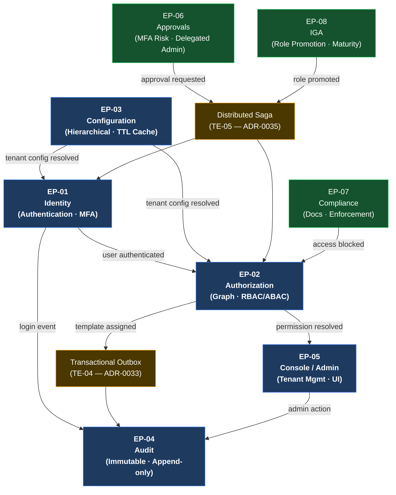

# UMS — Technical Overview & Architectural Deep Dive

> **Bilingual navigation:** [Español](./ums-technical-overview.es.md)  
> **Owner:** Evolith Architecture Board  
> **Status:** Active reference  
> **Parent:** [UMS Applied Reference Hub](./README.md)

---

## Why This Document Exists

The other documents in this section establish the *governance relationship* between Evolith and UMS. This document does something different: it explains **what UMS actually is** — its vision, technical complexity, bounded contexts, key patterns, and how to navigate into it from here. It is the bridge that keeps you inside Evolith while giving you a complete architectural picture before going deeper.

---

## 1. Vision

### The Problem UMS Solves

Enterprise software fails at identity and access management in predictable ways:

- Permissions scattered across every application instead of being centrally governed
- No audit trail that can answer "who had access to what, when, and why"
- Tenant isolation built as an afterthought, impossible to verify under load
- Authorization logic duplicated in every service — inconsistent, untestable, unmaintainable
- Role management done manually, creating security debt at scale (IGA problem)

**UMS is the answer to all five simultaneously.** It is a User Management System designed to govern identity, fine-grained authorization, multi-tenant isolation, immutable auditing, access approvals, compliance enforcement, and Identity Governance & Administration (IGA) — in a single, architecturally disciplined, progressively built product.

### Why It Was Chosen as the Evolith Reference

UMS earns this role because it:

1. **Exercises the hardest architectural problems** — multi-tenancy, hierarchical authorization graphs, distributed sagas, and IGA are not toy problems
2. **Demonstrates every core Evolith ADR** in real, running code
3. **Lives in Evolith Phase 1** — a modular monolith with schema-per-context and strict Hexagonal Architecture boundaries, ready to extract to Phase 2 when the criteria are met
4. **Is fully traceable** — every functional story traces to an ADR, which traces to a technical enabler, which traces to code

---

## 2. Product Scope — What UMS Manages

```
┌──────────────────────────────────────────────────────────────┐
│                  UMS PRODUCT BOUNDARY                        │
│                                                              │
│  USERS ──── belong to ──── ORGANIZATIONS (multi-tenant)     │
│     │                           │                           │
│     │ assigned to           governed by                      │
│     ▼                           ▼                           │
│  ROLES ──── grant ──── AUTHORIZATION TEMPLATES              │
│     │                           │                           │
│     │ evaluated by          enforced by                      │
│     ▼                           ▼                           │
│  PERMISSION GRAPH ──── resolved at ──── REQUEST TIME        │
│                                                              │
│  Everything is:                                              │
│  • Multi-tenant (organization-scoped, RLS-isolated)         │
│  • Immutably audited (who did what, when, from where)       │
│  • Approval-gated (sensitive operations require workflow)    │
│  • Compliance-tracked (document expiry, access enforcement) │
│  • IGA-managed (role maturity, promotion lifecycle)         │
└──────────────────────────────────────────────────────────────┘
```

---

## 3. The 8 Bounded Contexts

UMS is decomposed into 8 strategic bounded contexts. Each is an independently deployable candidate and owns its schema, domain model, and contracts.

| # | Context | Core Responsibility | Phase | Key ADRs |
|---|---|---|---|---|
| **EP-01** | **Identity** | User lifecycle, authentication, password policies, hosted login redirect, MFA/Passwordless | MVP | ADR-0020, ADR-0026 |
| **EP-02** | **Authorization** | RBAC/ABAC templates, permission graph compilation, contextual projections, Visual Graph Resolver | MVP | ADR-0012, ADR-0021, ADR-0022 |
| **EP-03** | **Configuration** | Hierarchical config (ENV > SYSTEM > TENANT), cached resolution with TTL, CQRS projection | MVP | ADR-0024, ADR-0034, ADR-0047 |
| **EP-04** | **Audit** | Immutable event log, 10-column audit schema on every table, append-only writes | MVP | ADR-0016 |
| **EP-05** | **Console / Admin** | Administrative UI, tenant management, system topology registration | MVP | ADR-0008, ADR-0030 |
| **EP-06** | **Approvals** | Adaptive MFA risk scoring (6 factors), B2B external access, delegated administration (5 scope types, 8 states) | Post-MVP | ADR-0035, ADR-0015 |
| **EP-07** | **Compliance** | Document upload, expiration notifications (5 channels), access enforcement (3 modes), background engines | Post-MVP | ADR-0033, ADR-0036 |
| **EP-08** | **IGA** | Role promotion lifecycle (6 stories), Role Maturity Model (5 levels), Promotion Impact Analysis engine, state machine (8 states) | Post-MVP | ADR-0035, ADR-0039 |

### Bounded Context Interaction Map



---

## 4. Technical Complexity — Why This Is Not a CRUD

Most tutorials show "User + Role = Permission." UMS solves problems that make that model collapse at enterprise scale:

### 4.1 The Authorization Graph Problem
A user's effective permissions are not stored — they are **compiled** at resolution time from a directed acyclic graph of roles, templates, organizational hierarchy, and contextual overrides. This compilation is the heart of EP-02 and requires the high-performance graph compiler described in ADR-0021.

### 4.2 The Multi-Tenancy Problem
Every table carries a composite primary key `(id, root_tenant_id)` and is protected by two independent security layers: an EF Core global query filter (always active) and a SQL Server RLS predicate (failsafe). A bug in one layer cannot expose cross-tenant data. This is the two-layer model from ADR-0010.

### 4.3 The Distributed Saga Problem
Approvals (EP-06) and IGA (EP-08) require multi-step workflows that span multiple bounded contexts with compensating transactions. A role promotion, for example, triggers authorization graph recompilation, audit logging, compliance checks, and notification dispatch — all of which must roll back atomically if any step fails. This is governed by ADR-0035 (Distributed Sagas via Dapr).

### 4.4 The IGA Maturity Problem
Roles are not static. They have a lifecycle: proposed, under review, validated, active, deprecated. The Role Maturity Model (5 levels) in EP-08 drives promotion decisions using a Promotion Impact Analysis engine that evaluates blast radius before granting elevation. This is non-trivial authorization governance.

### 4.5 The Audit Problem
Immutability is not optional. Every write to UMS generates an audit record that cannot be updated or deleted, carries the full `(who, what, when, from_where, tenant, correlation_id)` envelope, and is queryable by compliance officers independently of the operational data. ADR-0016 governs this.

---

## 5. Architecture: Tech Stack

| Layer | Technology | Version | Governing ADR |
|---|---|---|---|
| **Backend** | .NET / C# | 8 / 12+ | Engineering Manifesto |
| **ORM** | Entity Framework Core | 8 | ADR-0057 |
| **Database** | SQL Server | 2022 | ADR-0051 |
| **Multi-tenancy RLS** | EF Core filter + SQL Server RLS | — | ADR-0010, ADR-0044 |
| **Authorization** | XACML-inspired (PEP/PDP/PAP/PIP) | — | ADR-0039 |
| **Event bus** | Injectable (in-process → RabbitMQ) | — | ADR-0015 |
| **Outbox** | Transactional Outbox pattern | — | ADR-0033 |
| **Sagas** | Distributed Sagas via Dapr | — | ADR-0035 |
| **CQRS** | EF Core write / Dapper read | — | ADR-0034 |
| **Configuration** | Hierarchical resolution + TTL cache | — | ADR-0047 |
| **Identity** | OIDC / JWT (IdP-abstracted) | — | ADR-0020 |
| **Observability** | OpenTelemetry + Loki + Grafana | — | ADR-0007 |
| **Testing** | xUnit + NSubstitute + Testcontainers | — | ADR-0018, ADR-0052 |
| **CI/CD** | GitHub Actions | — | ADR-0005 |

---

## 6. The 6 Technical Enablers

Technical enablers are the cross-cutting infrastructure investments that make the functional stories possible. UMS has 6:

| Enabler | What it builds | Satisfies |
|---|---|---|
| **TE-01** — JWT / OIDC Flow | Token validation, IdP abstraction layer, refresh rotation | FS-01, FS-08, FS-09 |
| **TE-02** — Permission Graph Compiler | High-performance DAG compilation, contextual projections, Visual Graph Resolver | FS-02, FS-05, FS-07, FS-14, FS-16 |
| **TE-03** — Tenant Provisioning + RLS | SESSION_CONTEXT setup, EF Core interceptor, SQL Server RLS predicates, Polly error handling | FS-03, FS-14 |
| **TE-04** — Transactional Outbox | Reliable async event dispatch, at-least-once delivery, DLQ handling | FS-03, FS-06, FS-11, FS-15 |
| **TE-05** — Distributed Saga (Dapr) | Multi-step workflow orchestration with compensation, Dapr state store | FS-10, FS-12 |
| **TE-06** — CQRS Projection Rebuild | Read-side projection reconstruction on schema change, Dapper queries | FS-04, FS-07, FS-13 |

---

## 7. Traceability at a Glance

UMS maintains full bidirectional traceability from business requirement to code:

```
16 Functional Stories (FS)
        │
        ▼ each story has 5–9 Technical Stories
89 Technical Stories (TS)
  • MVP:      253 story points  (6-7 weeks, Phase 1)
  • Post-MVP: 325 story points  (8-10 weeks, Phase 2)
        │
        ▼ each group implements
6 Technical Enablers (TE)
        │
        ▼ each enabler proves
57+ Evolith ADRs in running code
```

Every line of UMS code can be traced back to a functional requirement, a technical decision, and an Evolith ADR. This is the traceability model Evolith mandates (ADR-0040, V-07).

---

## 8. Key Architectural Decisions Exercised in UMS

These are the Evolith ADRs most heavily tested by UMS — organized by the architectural concern they address:

### Architecture Foundation
| ADR | Decision | UMS Evidence |
|---|---|---|
| [ADR-0001](../../architecture/adrs/core/0001-nx-monorepo-orchestration.md) | Nx Monorepo Orchestration | Monorepo with strict lib boundaries and domain isolation |
| [ADR-0002](../../architecture/adrs/nodejs/0002-clean-architecture-nestjs.md) | Hexagonal Architecture | Ports + Adapters across all 8 bounded contexts |
| [ADR-0047](../../architecture/adrs/core/0047-modular-monolith-soa-microservices-selection.md) | Modular Monolith Selection | UMS is a Phase 1 modular monolith — extraction-ready but not extracted |

### Data & Multi-Tenancy
| ADR | Decision | UMS Evidence |
|---|---|---|
| [ADR-0010](../../architecture/adrs/core/0010-multi-tenancy-architecture-strategy.md) | Dual-Layer RLS Strategy | `root_tenant_id` on every table, EF Core filter + SQL Server RLS predicate |
| [ADR-0031](../../architecture/adrs/core/0031-schema-per-context-domain-event-catalog.md) | Schema-per-Context | 8 separate schemas, one per bounded context |
| [ADR-0051](../../architecture/adrs/core/0051-enterprise-database-engine-selection.md) | SQL Server 2022 | Closure table, partitioning, temporal tables, RLS |
| [ADR-0057](../../architecture/adrs/dotnet/0057-dotnet-data-access-strategy.md) | EF Core 8 + Dapper | EF Core for writes, Dapper for complex read projections |

### Authorization
| ADR | Decision | UMS Evidence |
|---|---|---|
| [ADR-0012](../../architecture/adrs/nodejs/0012-advanced-auth-rbac-abac-guards.md) | RBAC/ABAC Guards | Permission template system with contextual overrides |
| [ADR-0021](../../architecture/adrs/nodejs/0021-high-performance-auth-graph-compilation.md) | Auth Graph Compilation | DAG compiler in TE-02 |
| [ADR-0039](../../architecture/adrs/core/0039-xacml-authorization-architecture.md) | XACML-inspired PEP/PDP | Full PEP/PDP/PAP/PIP implementation in Authorization context |

### Events & Workflows
| ADR | Decision | UMS Evidence |
|---|---|---|
| [ADR-0015](../../architecture/adrs/core/0015-injectable-event-bus-strategy.md) | Injectable Event Bus | In-process bus upgradeable to RabbitMQ without domain changes |
| [ADR-0033](../../architecture/adrs/core/0033-transactional-outbox-pattern.md) | Transactional Outbox | TE-04, used by Compliance and Approvals contexts |
| [ADR-0035](../../architecture/adrs/core/0035-distributed-saga-strategy.md) | Distributed Sagas | TE-05 via Dapr, used by Approvals (EP-06) and IGA (EP-08) |
| [ADR-0034](../../architecture/adrs/core/0034-cqrs-applicability-matrix.md) | CQRS Applicability | Read/write split at protocol level (Dapper queries / EF Core commands) |

### Observability & Quality
| ADR | Decision | UMS Evidence |
|---|---|---|
| [ADR-0007](../../architecture/adrs/nodejs/0007-otel-loki-structured-logging.md) | OTel + Loki | Every use case has an OTel span; W3C TraceContext propagated end-to-end |
| [ADR-0016](../../architecture/adrs/core/0016-immutable-business-audit-trail.md) | Immutable Audit Trail | Append-only audit table with 10-column standard schema (EP-04) |
| [ADR-0018](../../architecture/adrs/core/0018-testing-pyramid-quality-gates.md) | Testing Pyramid | 70% unit / 20% integration / 10% E2E enforced in GitHub Actions CI |

---

## 9. Navigate UMS — Deep Links by Role

Use these links to go directly to the relevant section of the UMS documentation without leaving the architectural context:

### For Architects
| Resource | What you'll find |
|---|---|
| [UMS Architecture Portal](https://github.com/beyondnetcode/ums/blob/main/docs/architecture/index.md) | Bounded context map, architectural decisions, C4 diagrams, ADR registry |
| [UMS Master Index](https://github.com/beyondnetcode/ums/blob/main/docs/MASTER_INDEX.md) | Complete navigation map of all UMS documentation |
| [UMS ADR Registry](https://github.com/beyondnetcode/ums/blob/main/docs/architecture/index.md) | Product-level ADRs that extend and specialize Evolith decisions |

### For Backend Developers
| Resource | What you'll find |
|---|---|
| [UMS Repository Root](https://github.com/beyondnetcode/ums) | Source code, setup instructions, project structure |
| [UMS README](https://github.com/beyondnetcode/ums/blob/main/README.md) | Stack overview, local setup, how to run the application |
| [Construction Plan — Technical Stories](https://github.com/beyondnetcode/ums/blob/main/governance/construction/TECHNICAL-STORIES-AND-TEAM-COMPOSITION.md) | 89 technical stories with effort estimates, team profiles, sprint guidance |
| [FS-to-TS Mapping](https://github.com/beyondnetcode/ums/blob/main/governance/construction/FS-TO-TS-MAPPING.md) | Traceability from every functional story to its technical stories |

### For QA / SDET
| Resource | What you'll find |
|---|---|
| [UMS Test Architecture](https://github.com/beyondnetcode/ums/blob/main/docs/architecture/index.md) | Testing pyramid, contract test strategy, coverage gates |
| [UMS CI Pipeline](https://github.com/beyondnetcode/ums/blob/main/.github/workflows) | GitHub Actions workflow — unit, integration, security, coverage |

### For DevOps / SRE
| Resource | What you'll find |
|---|---|
| [UMS Infrastructure Setup](https://github.com/beyondnetcode/ums/blob/main/README.md) | Docker Compose stack, OTel collector config, Grafana setup |
| [UMS Observability Stack](https://github.com/beyondnetcode/ums/blob/main/docs/architecture/index.md) | OTel + Loki + Tempo + Grafana configuration and runbooks |

### For Product Owners / PMs
| Resource | What you'll find |
|---|---|
| [UMS Documentation Index](https://github.com/beyondnetcode/ums/blob/main/docs/MASTER_INDEX.md) | All functional stories, acceptance criteria, epic structure |
| [Construction Phase Overview](https://github.com/beyondnetcode/ums/blob/main/governance/construction/README.md) | MVP timeline, team composition, sprint planning guidance |

---

## 10. What UMS Is Not

Understanding the boundary is as important as understanding what UMS does:

| UMS **is** | UMS **is not** |
|---|---|
| The executable proof of Evolith decisions | The source of those decisions (Evolith owns the ADRs) |
| A reference for architectural patterns in .NET 8 | A starter template to copy into production |
| An evolving product that can promote discoveries back to Evolith | A frozen demo that stays unchanged |
| Owned and operated independently from Evolith | Part of this repository |

See [Reference vs Applied Model](./demo-vs-reference.md) for the full boundary definition.

---

<div align="center">
  <sub>Evolith — Enterprise Architecture Platform | UMS Technical Overview</sub>
</div>
