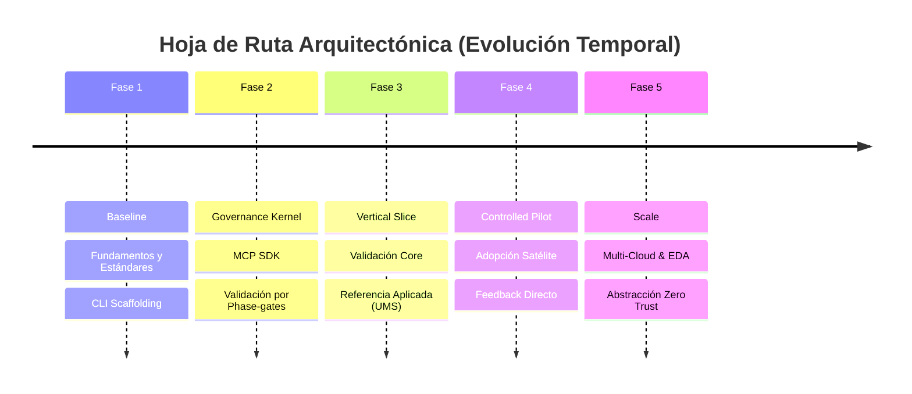

# Evolith — Estrategia Evolutiva y Roadmap Arquitectónico

> **Navegación Bilingüe:** [English Version](./evolutionary-strategy-roadmap.md)

Este documento establece el roadmap estratégico de **Evolith** — la evolución técnica por fases desde la arquitectura modular fundacional hasta una plataforma global agnóstica y altamente resiliente.

---

## 1. Visión y Pilares Técnicos

Nuestra visión consiste en construir un ecosistema donde la **Infraestructura es un Detalle**, asegurando el control soberano absoluto sobre las Reglas de Negocio Core.

* **Arquitectura Core:** Hexagonal (Puertos y Adaptadores). El dominio reside en el centro y es ciego a la persistencia y frameworks.
* **Prioridad Absoluta:** Desacoplamiento agresivo. Prohibido acoplar la lógica a proveedores específicos.
* **Seguridad Dinámica:** Utilización del selector configurable `SECURITY_STRATEGY_MODE` para adaptar el aislamiento según el entorno de ejecución.
* **Cumplimiento Nativo:** Diseño regido por los controles de soberanía del RGPD y la norma ISO/IEC 27001:2022.

---

## 2. Roadmap Evolutivo por Fases



### Fase 1: Baseline (Corto Plazo)
**Enfoque:** Fundamentos, reglas y estructuras modulares.

| Dominio | Estrategia |
| :--- | :--- |
| **Arquitectura** | Monolito Modular con límites estrictamente forzados. |
| **Persistencia** | Instancia única relacional. Seguridad forzada en Capa de Aplicación. |
| **Entregables** | CLI scaffolding, guías arquitectónicas agnósticas. |

### Fase 2: Governance Kernel (Corto Plazo)
**Enfoque:** Validación automatizada y mecanismos de gobernanza.

| Dominio | Estrategia |
| :--- | :--- |
| **Arquitectura** | Implementación de chequeo automático de reglas y validación vía SDK MCP. |
| **Entregables** | Estándares interpretables por máquina (OPA/Rego), lógica de Phase-gates. |

### Fase 3: Vertical Slice (Mediano Plazo)
**Enfoque:** Demostración del kernel de gobernanza en una ruta de producto completa.

| Dominio | Estrategia |
| :--- | :--- |
| **Arquitectura** | Aplicación de la base teórica a un producto real y desplegable (`ums`). |
| **Foco Crítico** | Validación del Producto Mínimo Probable (MPP). |

### Fase 4: Controlled Pilot (Mediano Plazo)
**Enfoque:** Prueba de eficacia en escenarios del mundo real.

| Dominio | Estrategia |
| :--- | :--- |
| **Arquitectura** | Adopción guiada por repositorios satélite seleccionados. |
| **Foco Crítico** | Adaptación de estándares en función de retroalimentación empírica y evidencia de carga. |

### Fase 5: Scale (Largo Plazo)
**Enfoque:** Eficiencia operativa, procesamiento distribuido y abstracción.

| Dominio | Estrategia |
| :--- | :--- |
| **Arquitectura** | Extracción selectiva de servicios críticos activada por métricas cuantitativas. |
| **Foco Crítico** | Escalamiento de la infraestructura, introducción de abstracción de plataforma amplia. |

---

## 3. Tecnologías Diferidas y Triggers de Evidencia

Para secuenciar la inversión de manera responsable, la opcionalidad costosa se retrasa hasta que la evidencia explícita lo justifique. El roadmap impone los siguientes disparadores (triggers):

- **Arquitectura Distribuida (Dapr / EDA):** Activado por un volumen de eventos de dominio cruzado que excede los umbrales de procesamiento (>X eventos/seg) o el escalado organizacional a >2 equipos de dominio independientes.
- **Abstracción Multi-Cloud:** Activado por una evaluación de riesgo explícita del proveedor o un mandato regulatorio de cumplimiento (no por optimización técnica prematura).
- **Red Zero-Trust (Full Mesh):** Activado por implementaciones a escala más allá de un único clúster Kubernetes o un requerimiento de auditoría de seguridad documentado.

---

## 4. Tablero de Observabilidad y KPIs (Métricas Arquitectónicas)

Para asegurar la deriva arquitectónica cero, evaluamos cada fase con el siguiente set de métricas deterministas.

### 4.1 Índice de Agnosticismo ($PI$)
Mide el acoplamiento saludable vs. contaminación de infraestructura.

```math
PI = \frac{\text{Líneas de Código (Dominio + Aplicación)}}{\text{Líneas de Código (Infraestructura)}}
```

* **Meta:** Valor creciente o estable. Si cae, indica "sangrado" de lógica de negocio hacia el ORM o Framework.
* **Ejemplo Práctico:**
 * Código de Negocio: 10,000 líneas.
 * Código de Persistencia/Infra: 2,000 líneas.
 * **PI Actual:** $10,000 / 2,000 = 5.0$ (Estado Sano). Si baja a 2.0, se requiere auditoría urgente.

### 4.2 Delta de Rendimiento de Seguridad ($\Delta P$)
Impacto de latencia comparativo entre el filtrado por software vs. el filtrado nativo por hardware.

```math
\Delta P = P95_{\text{APP\_AGNOSTIC}} - P95_{\text{INFRA\_NATIVE}}
```

* **Meta:** Penalización porcentual de latencia inferior al 15% en modo Agnóstico.
* **Ejemplo Práctico:**
 * Modo Nativo RLS: 40ms de respuesta en lectura.
 * Modo Agnóstico App: 45ms de respuesta.
 * **Impacto:** Aumento de 5ms (+12.5%). **PASA EL CONTROL** (Menor al 15%).

### 4.3 Tiempo de Recuperación y Migración (MTTM)
Esfuerzo real necesario para reemplazar por completo un adaptador de infraestructura crítica.

* **Meta:** Menor a 24 horas hombre para servicios críticos en la Fase 3.
* **Ejemplo Práctico:** Un equipo de 3 desarrolladores debe ser capaz de migrar de TypeORM a Drizzle en una sola jornada laboral (8h x 3 = 24h) gracias al desacoplamiento de la interfaz `IRepositoryPort`.

### 4.4 Ratio de Deuda Técnica Planeada ($RTD$)
Garantía de salud del código base contra la presión de producto.

```math
RTD = \frac{\text{Tickets de Refactorización}}{\text{Tickets de Funcionalidades}}
```

* **Meta:** Mantener un ratio constante del 20% para saneamiento continuo.
* **Ejemplo Práctico:** Por cada 10 User Stories finalizadas en un Sprint, el equipo debe procesar 2 Tickets de Refactoring (`tech-debt`) dedicados a la limpieza del MVP foundation.

---

## 5. Manifiesto de Principios e Innegociables

Para evitar el caos evolutivo, se establecen las siguientes prohibiciones técnicas:

1. **Prohibición de Lógica en BD:** Queda estrictamente prohibido el uso de *Procedimientos Almacenados* o *Triggers* que contengan Reglas de Negocio (la BD solo almacena datos).
2. **Persistencia Ciega:** El Dominio no puede importar librerías de persistencia, ORMs o anotaciones de base de datos directas.
3. **Contratos Inmutables:** Una vez publicado el contrato gRPC o Protobuf, no puede haber cambios que rompan la compatibilidad hacia atrás sin versionado explícito.

---

## 6. Estrategia de Compliance y Recuperación

### Mapeo de Controles ISO 27001 por Entorno

| Control | Implementación en AWS / Azure | Solución On-Premise / Híbrida |
| :--- | :--- | :--- |
| **A.8.1.3 (Activos)** | Azure Policy / IAM Scopes limitados por región para cumplir soberanía. | Aislamiento físico en rack con Firewall perimetral dedicado. |
| **A.10.1.1 (Cripto)** | Cifrado nativo KMS con Llaves Gestionadas por el Cliente (CMK). | HashiCorp Vault + Backup Inmutable desconectado. |

### Protocolo de Rollback Operativo (Activación de RLS)
En caso de degradación de rendimiento masiva al activar el modo `INFRA_NATIVE` en producción:
1. **Trigger:** Alarma P95 > 200% del baseline histórico.
2. **Acción:** Conmutación de la Feature Flag `SECURITY_STRATEGY_MODE` a `APP_AGNOSTIC` vía Dashboard Central.
3. **Efecto:** Tiempo de propagación < 5 segundos. El sistema reabsorbe la lógica de filtrado en memoria del pod de aplicación, mitigando el cuello de botella en la BD inmediatamente.

---
[Volver al Índice](./README.es.md)
