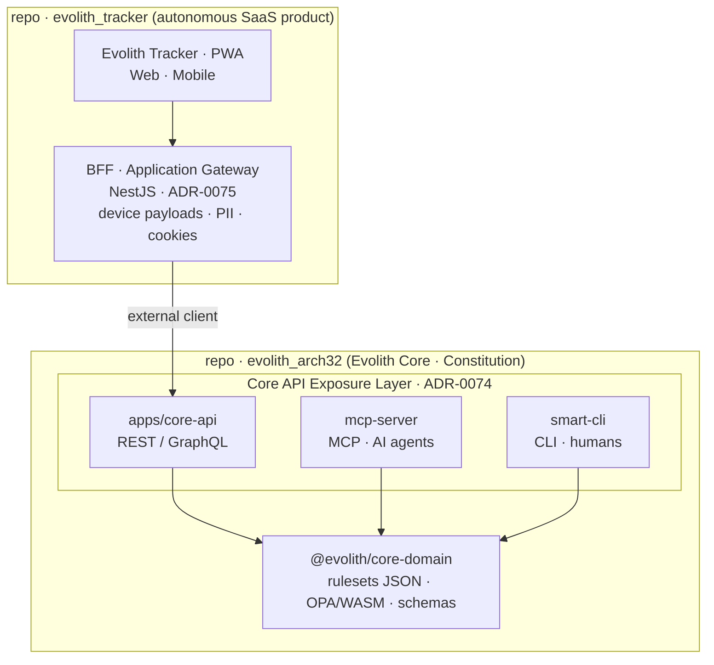

# Evolith — Product Vision Master

> **Bilingual Navigation:** [Versión en Español](./evolith-product-vision-master.es.md)

**Status:** Approved  
**Owner:** Evolith Architecture Board  
**Last Updated:** 2026-06-17

---

## 1. Vision, Category, and Value Proposition

### 1.1 Vision Statement

**Evolith** democratizes elite software engineering by converting fragmented, high-risk development processes into **predictable, assisted, governed, and auditable** product delivery.

### 1.2 Product Category

Evolith is the **governance control plane for AI-Native software engineering**.

It governs people, autonomous agents, engineering tools, artifacts, evidence, and decisions through one enforceable chain from business idea to production. Evolith may integrate external execution and analytics products, but it retains authority over Phase Gates, evidence acceptance, exceptions, traceability, and audit history.

> **Work platforms manage work. Agents execute work. Observability platforms inspect AI. Analytics platforms visualize data. Evolith governs the complete engineering process.**

### 1.3 Target Problem and Customer Hypothesis

Evolith targets organizations that operate multiple products, repositories, teams, countries, or delivery tools and suffer from:

- fragmented architecture and process knowledge;
- inconsistent evidence and approval criteria;
- tool-specific workflows that do not create end-to-end traceability;
- excessive dependence on tribal knowledge;
- uncontrolled agent and LLM execution;
- costly audits, rework, and architecture drift.

The initial customer hypothesis is a medium or large organization that needs stronger engineering governance without replacing every existing system. This hypothesis must be validated through interviews and controlled product experiments.

### 1.4 Value Proposition

Evolith provides:

1. one inherited engineering Constitution;
2. one canonical taxonomy of phases, artifacts, evidence, and decisions;
3. one enforceable Phase Gate model;
4. one audit chain across humans, agents, tools, and source code;
5. one provider-neutral governance layer across tenants;
6. one upstream learning mechanism from satellite products into Evolith Core.

---

## 2. Ecosystem and Governance Kernel

### 2.1 Evolith Core (`evolith_arch32`)

Evolith Core is the living Reference Corpus and engineering **Constitution**. It is readable by humans and consumable by machines.

```text
Reference Corpus (Constitution)
├── Architectural Directives
├── Core and Platform-Specific ADRs
├── Standards and Taxonomies
├── Rulesets and Skills
├── Artifact and Evidence Schemas
├── Phase Gate Definitions
└── Adapter and Integration Contracts
```

Core remains vendor-neutral. Product-specific decisions belong in adapters, platform-specific references, or satellite repositories unless generalized into reusable, evidence-backed patterns.

### 2.2 Evolith Tracker

Evolith Tracker is the **SaaS SDLC Orchestrator and Auditor** that executes the governance model defined by Core.

It is not merely a task manager. Tracker owns the runtime governance state for:

- registered satellite products;
- active SDLC processes;
- phase executions;
- gate evaluations;
- accepted and rejected evidence;
- exceptions and approvals;
- agent runs and conversational sessions;
- immutable decision and audit history.

> Repository: [`evolith_tracker`](https://github.com/beyondnetcode/evolith_tracker)

### 2.3 The Irreducible Governance Kernel

Evolith must build and own:

1. the canonical five-phase SDLC and Phase Gate state machine;
2. Core rulesets, schemas, standards, taxonomy, and inheritance;
3. the canonical artifact and evidence model;
4. gate evaluation, exception, approval, and immutable audit logic;
5. traceability from business intent to architecture, code, QA, and release;
6. Architecture Drift and adherence scoring;
7. tenant-level rules, skills, model policies, and authorization;
8. provider-neutral contracts for work systems, agents, observability, analytics, repositories, CI/CD, testing, and deployment;
9. final authority over every phase transition;
10. promotion of validated satellite lessons upstream into Core.

### 2.4 Execution Modes

Each module supports configurable execution through *Convention over Configuration*:

| Mode | Who Executes | Governance Model |
|---|---|---|
| **Human-Driven** | Engineering and product teams | Humans execute and approve under Evolith rules |
| **Agent-Driven** | Specialized AI agents | Agents execute bounded activities; humans govern exceptions and critical decisions |
| **Hybrid** | Humans and agents | Responsibilities are assigned per phase, activity, artifact, or gate criterion |

The chatbox is an intermediary, not the source of authority. Tenant-selected LLMs and agents consume approved context, rulesets, skills, and permissions through Evolith contracts.

### 2.5 Technical Interface Layer

> **Two-layer exposure (ADRs [0074](../../architecture/adrs/core/0074-evolith-core-api-exposure-layer.md) + [0075](../../architecture/adrs/nodejs/0075-application-gateway-bff-nestjs.md)).** Evolith Core **exposes** its capability through a product-neutral **Core API Exposure Layer** — `apps/core-api` (REST/GraphQL) plus the `mcp-server` (MCP) and the `smart-cli` (CLI). The Evolith Tracker is an **external client**: its **BFF / Application Gateway** (NestJS, ADR-0075, in the `evolith_tracker` repository) consumes that exposure and tailors per-device payloads, strips PII, and manages session/cookies for the PWA. The Tracker BFF does **not** live in Core — [ADR-0074](../../architecture/adrs/core/0074-evolith-core-api-exposure-layer.md) explicitly **rejected** that option.



<details>
<summary>Legacy text diagram (same interfaces, pre ADR-0074)</summary>

```text
                         Evolith Tracker
          ┌──────────────────────────────────────────┐
          │ Phase State · Gates · Evidence · Audit   │
          └───────────────┬──────────────────────────┘
                          │
       ┌──────────────────┼──────────────────┐
       │                  │                  │
    REST API          MCP Tools          Event Bus
  UI and CI/CD      LLMs and Agents    Reactive Flows
       │                  │                  │
       └──────────────────┼──────────────────┘
                          │
                    Evolith Core
          rulesets · schemas · ADRs · standards
```

</details>

| Interface | Consumer | Purpose |
|---|---|---|
| **REST API** | Tracker UI, CI/CD, enterprise integrations | Manage processes, phases, evidence, gates, and configuration |
| **MCP HTTP/SSE** | LLMs and autonomous agents | Retrieve governed context, evaluate criteria, and submit evidence |
| **CLI and Chatbox** | Engineers and product roles | Guided interaction using the current tenant, product, and phase context |
| **Agent Execution Port** | Claude, OpenAI, Gemini, local or future agents | Execute bounded activities behind a provider-neutral contract |
| **Webhook / Event Bus** | Internal and external systems | Propagate commands, evidence, status changes, and gate outcomes |

---

## 3. Governed Composition

### 3.1 Strategic Principle

Evolith adopts **Governed Composition**:

> **Build the irreducible governance kernel. Compose mature commodity capabilities behind replaceable ports, adapters, and Anti-Corruption Layers.**

The objective is not to rebuild every specialized product. The objective is to make external capabilities operate under one Evolith governance model.

### 3.2 Capabilities Evolith Should Usually Compose

Evolith should normally integrate or embed:

- LLM and agent telemetry;
- prompt experimentation and evaluation;
- analytical dashboards and data exploration;
- generic backlog and task-board mechanics;
- source control and CI/CD execution;
- test runners, contract testing, and security scanners;
- deployment and release platforms;
- document-generation engines;
- general-purpose autonomous agents;
- collaboration and notification channels.

### 3.3 Capability Decision Model

Every new capability must receive one explicit disposition:

| Disposition | Meaning |
|---|---|
| **Adopt** | Use the external capability largely as provided |
| **Embed** | Present an external capability within the Evolith experience |
| **Integrate** | Keep it external and exchange commands, events, and evidence |
| **Extend** | Add Evolith adapters, plugins, or governance controls |
| **Build** | Implement natively because it is an irreducible differentiator or unmet requirement |
| **Reject** | Exclude it because of security, licensing, lock-in, operational, or architecture risk |

The decision must evaluate strategic differentiation, functional fit, governance fit, replaceability, data ownership, tenant isolation, security, licensing, user experience, operational burden, and total cost of ownership.

### 3.4 Adapter Taxonomy

```text
Evolith Provider Contracts
├── Work Management Port
├── Agent Execution Port
├── LLM Observability Port
├── Analytics Port
├── Repository Port
├── CI/CD Port
├── Testing Port
├── Security Scanner Port
├── Deployment Port
└── Collaboration Port
```

No vendor-specific schema may leak into the canonical domain model. Provider changes must not require rewriting Evolith bounded contexts.

---

## 4. Operational Model and Authority

### 4.1 Federated Governance

Evolith uses a Hub-and-Spoke inheritance model:

```text
Evolith Core (Level 0 — Constitution)
              │ inherits
              v
Satellite Product (Level 1 — Product Instance)
              │ proposes evidence-backed improvement
              v
Architecture Board Review
              │ approved promotion
              v
Evolith Core evolves and all satellites inherit
```

Satellites may define local product and tenant configuration. Reusable architectural rules, patterns, schemas, and standards require upstream approval.

### 4.2 Anti-Corruption Layers

External tools are integrated through ACLs that:

- preserve source identifiers, timestamps, and evidence lineage;
- map external concepts to Evolith canonical artifacts;
- validate Core and tenant rules;
- reject non-compliant transitions or evidence;
- remain versioned and replaceable.

### 4.3 Authority and Data Ownership

| Information | Authoritative Source |
|---|---|
| Phase and Gate state | Evolith Tracker |
| Core rule definition | Evolith Core |
| Tenant rule, skill, and model configuration | Evolith Tracker under tenant authorization |
| Exception and approval decision | Evolith Tracker |
| Code and commit state | Connected source-control platform |
| Pipeline and deployment execution | Connected CI/CD or deployment platform |
| Agent trace and evaluation | Connected observability provider, referenced by Evolith |
| Work-item operational state | Connected work system, mapped through ACL |
| Official metric definition and acceptance threshold | Evolith Core or approved tenant governance |
| Dashboard rendering | Evolith or connected analytics provider |

External tools produce operational facts and evidence. Tracker decides whether that evidence satisfies governance.

### 4.4 Unified Product Experience

Users must experience one coherent Evolith process even when specialized capabilities are external. Evolith provides:

- unified navigation by tenant, product, process, phase, and gate;
- canonical state and evidence summaries;
- governed actions and approvals;
- deep links to source tools;
- consistent identity and authorization;
- explicit source lineage and provider status;
- one audit narrative from idea to production.

---

## 5. The Five-Phase SDLC

### 5.1 Phase Modules

```text
Phase 1          Phase 2            Phase 3           Phase 4          Phase 5
Discovery ──── Spec-Driven ──── Construction ──── Automated QA ──── Release
                   Design                                              Planner
    │                 │                  │                │                │
    v                 v                  v                v                v
Business          Design             Successful       RC Stamped     Production
Sign-Off          Baseline            Build                            Live
```

| Module | Gate | Core Outcome |
|---|---|---|
| **Product Discovery and Ideation** | Business Sign-Off | Validated problem, customer, ROI, KPIs, assumptions, and capability strategy |
| **Architecture Spec-Driven** | Design Baseline | Approved functional intent, contracts, ADRs, evidence requirements, and architecture baseline |
| **Construction Tracking** | Successful Build | Implemented work with source, pipeline, specification, and drift traceability |
| **Automated QA and Integration** | RC Stamped | Verified quality, security, contracts, regression, and accepted exceptions |
| **Dynamic Release Planner** | Production Live | Approved rollout, operational readiness, observability, rollback, and release evidence |

### 5.2 Gate Evidence

| Gate | Minimum Evidence | Pass Authority |
|---|---|---|
| **Business Sign-Off** | Discovery Canvas, customer hypothesis, ROI, KPIs, assumptions, build-versus-compose analysis | Accountable business stakeholders |
| **Design Baseline** | Functional stories, contracts, ADRs, threat and risk analysis, evidence plan | Architecture and product governance |
| **Successful Build** | Source changes, linked work, successful CI, DoD, architecture-drift result | Construction gate policy and authorized approvers |
| **RC Stamped** | Test summary, coverage, security and contract results, exception status | Quality governance |
| **Production Live** | Release plan, observability, rollback, operational sign-off, deployment evidence | Operations and release governance |

### 5.3 Build-versus-Compose Requirement

Discovery must evaluate existing open-source, free-tier, and commercial capabilities before native development is approved. The evidence must include:

- alternatives and functional coverage;
- Adopt, Embed, Integrate, Extend, Build, or Reject disposition;
- three-year cost and operating burden;
- licensing and redistribution constraints;
- security, tenant isolation, and data ownership;
- provider replaceability;
- proof-of-concept requirements;
- explicit justification for native implementation.

---

## 6. Evidence Graph and Agent Governance

### 6.1 Canonical Evidence Graph

Every accepted evidence item must be traceable to:

- tenant and product;
- SDLC process, phase, gate, and criterion;
- artifact and business intent;
- source provider and external identifier;
- human or agent actor;
- model, prompt, ruleset, and skill versions when applicable;
- repository, commit, pipeline, test, or deployment reference;
- cost, latency, timestamps, and integrity metadata;
- evaluation result, approval, exception, and final decision.

The graph must answer: **what business decision produced this change, which rules governed it, what evidence validated it, and who authorized production?**

### 6.2 Governed Agent Execution

Agents are replaceable executors, not authorities. Evolith owns:

- the activity contract;
- approved context and data boundaries;
- tenant permissions;
- expected artifact and evidence;
- acceptance criteria;
- human approval requirements;
- audit linkage and failure handling.

### 6.3 LLM and Agent Observability

Specialized platforms may provide traces, evaluations, cost, prompt versions, tool calls, and latency. Evolith maps those records into its canonical evidence model and determines whether they satisfy a gate criterion.

---

## 7. Product Boundaries and Non-Goals

### 7.1 Evolith Is Not

Evolith is not required to be:

- a replacement for Jira, Trello, Linear, or Azure DevOps;
- a source-control or CI/CD platform;
- a specialized LLM observability product;
- a general-purpose BI engine;
- a model provider;
- a desktop autonomous agent;
- a replacement for every testing, security, or deployment tool.

Evolith may provide native capabilities where evidence proves strategic value, but its category does not depend on replacing these products.

### 7.2 Non-Negotiable Boundary

No external platform, successful LLM response, completed work item, generated document, or green pipeline can independently approve a phase transition. Only Evolith's authorized gate evaluation can change the canonical governance state.

---

## 8. Business Strategy and Ecosystem

### 8.1 Open-Core Model

```text
OPEN CORE                                  ENTERPRISE TRACKER
Core Constitution                         Multi-Tenant Governance
ADRs, Standards, and Taxonomies           Governed Orchestration
Rulesets, Schemas, and Contracts           Evidence Graph and Audit
CLI · MCP · REST/GraphQL Exposure         Managed and Certified Adapters
Community Adapter SDK                     Executive and Compliance Views
Reference Implementations                 Enterprise Support and SLA
```

### 8.2 Enterprise Value

Enterprise monetization focuses on:

- tenant governance and administration;
- evidence consolidation and immutable audit;
- configurable gates, policies, exceptions, and approvals;
- certified and managed integrations;
- regulatory and compliance packs;
- on-premise and controlled deployment;
- private rules, skills, and adapter catalogs;
- trusted scorecards and executive reporting;
- enterprise support, SLA, and managed hosting.

Evolith does not monetize merely by rendering dashboards. It monetizes the reliability, governance, and auditability of the information and decisions behind them.

### 8.3 Adapter Ecosystem

The ecosystem may include official, certified, and community adapters with:

- stable SDK and contracts;
- compatibility and security requirements;
- version and deprecation policies;
- test harnesses and certification;
- deployment and licensing metadata;
- a future integration marketplace.

---

## 9. Validation Before Construction

### 9.1 AI-Assisted Validation Workflow

Before implementation, teams use approved AI research and engineering tools to challenge the product hypothesis:

```text
Evidence Pack
    -> Product Research and Counterarguments
    -> Human Review
    -> Brainstorming or Product Office Hours
    -> Capability Disposition Matrix
    -> Product Decision Record
    -> Architecture and Engineering Review
    -> Approved Plan
    -> Controlled Implementation
    -> Operational Evidence
    -> Upstream Lessons
```

The provider is replaceable. Claude Chat, Research, Cowork, Claude Code, Superpowers, gstack, or future equivalents are execution options, not Core dependencies.

### 9.2 Required Validation Outputs

Every significant capability proposal must produce:

- problem reframing;
- customer and assumption register;
- competitive counterargument;
- capability disposition matrix;
- differentiation proof;
- falsifiable experiment plan;
- human-approved decision record;
- unresolved risks and uncertainty.

### 9.3 Guardrails

AI output is analysis, not authority. Humans approve changes to vision, rulesets, ADRs, exceptions, and gates. Credentials, production secrets, and unrestricted customer data must remain outside unapproved contexts.

---

## 10. Minimum Provable Product

### 10.1 Vertical Slice

The first proof should not implement every module in full. It should execute one controlled product slice through all five gates with:

- one tenant;
- one product and SDLC process;
- one work-management provider;
- one repository and CI pipeline;
- one agent provider;
- one observability provider;
- one analytics provider;
- one canonical evidence graph;
- five minimum gate decisions.

### 10.2 Success Criteria

The proof succeeds when:

- Tracker remains authoritative for every gate;
- evidence lineage is complete and tenant-safe;
- providers can be replaced without changing the domain model;
- users experience one coherent process;
- composed delivery is faster than rebuilding commodity tools;
- Evolith produces measurable value beyond the tools used independently.

---

## 11. Metrics and Capability Maturity

### 11.1 Engineering and Executive Metrics

Evolith consolidates DORA and selected SPACE metrics while preserving their source and calculation definition.

### 11.2 Governance Metrics

| Metric | Purpose |
|---|---|
| **Evidence Completeness** | Percentage of decisions with all mandatory evidence |
| **Gate Automation Rate** | Percentage of criteria evaluated automatically |
| **Traceability Coverage** | Percentage of changes linked to intent, artifact, evidence, and decision |
| **Architecture Drift Prevention** | Violations blocked before production |
| **Decision Lead Time** | Time from complete evidence to authorized decision |
| **Exception Rate** | Percentage and risk profile of approvals through exception |
| **Audit Preparation Time** | Effort required to produce an audit-ready chain |
| **Provider Replacement Cost** | Effort required to replace an integrated capability |
| **Integration Lead Time** | Time required to onboard a new provider |
| **Rework Avoided** | Estimated rework prevented by early governance |
| **Governance Adoption** | Products and teams actively using the gate model |
| **Composed Value Index** | Measured benefit versus the same tools used independently |

### 11.3 Capability Maturity States

Every major capability must declare one state:

| State | Meaning |
|---|---|
| **Visioned** | Approved as part of the target product vision |
| **Designed** | Supported by approved functional and technical specifications |
| **Prototyped** | Demonstrated through a controlled technical proof |
| **Implemented** | Available in the product |
| **Validated** | Proven with representative users or customers |
| **Scaled** | Operated reliably under enterprise conditions |

Documentation must not present a Visioned or Designed capability as operationally validated.

---

## 12. Competitive Positioning

### 12.1 Category Message

> **Evolith composes the best engineering and AI tools under one executable governance model, preserving control, evidence, and auditability from idea to production.**

### 12.2 Defensible Differentiator

Evolith is differentiated by the combination of:

- executable Constitution;
- evidence-backed Phase Gates;
- canonical Evidence Graph;
- governed human and agent execution;
- provider-neutral composition;
- architecture adherence and drift control;
- federated upstream learning.

### 12.3 Strategic Test

A composed tool stack can replace many visible features. If Evolith cannot make its governance kernel operational, measurable, and easier to adopt than disconnected products, the composed stack can replace most of the product idea.

The roadmap must therefore prioritize governance proof over feature count.

---

## 13. Relationship to This Repository

This repository is Evolith Core: the authoritative Constitution and Reference Corpus for satellite products.

| Artifact | Location |
|---|---|
| Architectural Directives | `reference/governance/standards/vision/architectural-directives.md` |
| Strategic Validation and Composition Framework | `reference/governance/standards/vision/evolith-strategic-validation-and-composition-framework.md` |
| Strategic Comparative Landscape | `reference/governance/standards/vision/evolith-strategic-positioning-comparative-landscape.md` |
| AI-Assisted Validation Workflow | `reference/governance/standards/vision/evolith-ai-assisted-validation-workflow.md` |
| Evolutionary Roadmap | `reference/governance/standards/vision/evolutionary-strategy-roadmap.md` |
| SDLC Artifact Mapping | `reference/governance/sdlc/sdlc-evolith-artifact-mapping.md` |
| Rulesets and Schemas | `rulesets/` |

---

## 14. Supplemental Reading

- [Strategic Validation and Composition Framework](../methods/evolith-strategic-validation-and-composition-framework.md)
- [Strategic Positioning and Comparative Landscape](../positioning/evolith-strategic-positioning-comparative-landscape.md)
- [AI-Assisted Product Validation Workflow](../methods/evolith-ai-assisted-validation-workflow.md)
- [Architectural Directives](../architecture/architectural-directives.md)
- [Evolutionary Strategy Roadmap](../strategy/evolutionary-strategy-roadmap.md)
- [Maturity Assessment](../../governance/standards/vision/maturity-assessment.md)
- [SDLC Artifact Mapping](../../governance/sdlc/sdlc-evolith-artifact-mapping.md)
- [SDLC Tracker — Technical Interface Design](../../products/evolith-tracker/sdlc-tracker-technical-interfaces.md)

---

*This document constitutes the official product vision for Evolith. All product, architecture, governance, and roadmap decisions must align with it.*

---
[Back to Vision Index](./README.md)