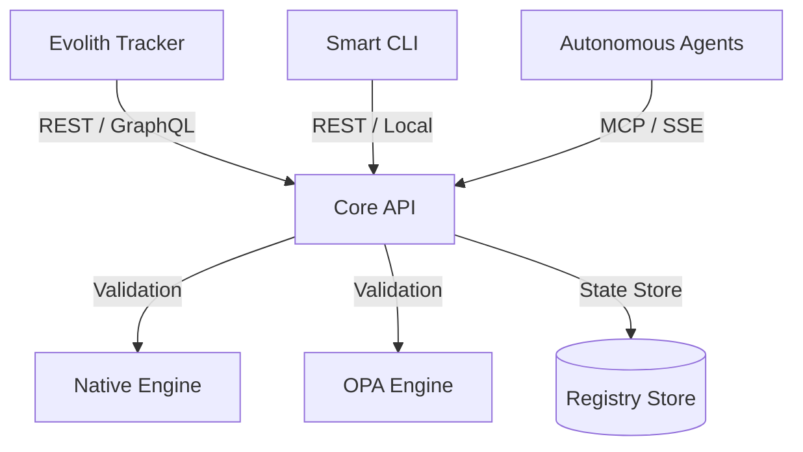

# Hub del Producto Evolith Core API

> **Navegación Bilingüe:** [English Version](./README.md)

Bienvenido al Hub del Producto **Evolith Core API**. El Core API es el motor central de validación, estado y gobernanza del ecosistema Evolith, exponiendo capacidades de verificación controladas por ejecución a desarrolladores, pipelines de CI y agentes de IA autónomos.

---

## 1. Visión del Producto y Arquitectura

El Core API actúa como la implementación en tiempo de ejecución de las reglas de gobernanza de Evolith. Coordina los motores de validación (tanto el validador nativo de TypeScript como los motores de Open Policy Agent) para verificar aplicaciones satélite, procesar transiciones de fases del SDLC y rastrear la deriva arquitectónica (drift).



### Capacidades Clave

1. **Evaluación de Gates:** Valida si un proyecto cumple con todos los criterios de calidad de sus gates para la fase actual del SDLC (concepción, diseño, construcción, QA, entrega).
2. **Transición de Fases:** Automatiza las transiciones entre fases de SDLC basándose en la coincidencia de evidencias con reglas predefinidas.
3. **Verificación de Arquitectura:** Audita proyectos satélite contra rulesets multi-topología declarados (Modular Monolith, Serverless, Event-Driven, Data Mesh, Edge, Agentic/AI-First).
4. **Detección de Deriva (Drift):** Rastrea en tiempo real la divergencia entre los estándares topológicos declarados y las configuraciones de los workspaces activos.

---

## 2. Stack Tecnológico y Estructura

- **Framework:** NestJS
- **Lenguaje:** TypeScript
- **Interfaces:** REST API (versionada por URI), Swagger/OpenAPI, y SSE (Server-Sent Events) integrado para streaming.
- **Motores de Validación:**
  - **Validador Nativo de TypeScript:** Validador en memoria de alta velocidad.
  - **Validador OPA WASM:** Paridad de evaluación con motor dual ejecutando políticas compiladas en WebAssembly.

---

## 3. Directorio de Superficies del Proyecto

El Core API expone sus funcionalidades a través de controladores de NestJS:

- [ArchitectureController](../../../apps/core-api/src/presentation/controllers/architecture.controller.ts): Topologías, detección de deriva y verificación de satélites.
- [GatesController](../../../apps/core-api/src/presentation/controllers/gates.controller.ts): Evaluación de gates de fases del SDLC.
- [PhasesController](../../../apps/core-api/src/presentation/controllers/phases.controller.ts): Avance y transiciones de fases.
- [ProjectsController](../../../apps/core-api/src/presentation/controllers/projects.controller.ts): Inicialización de proyectos y propuestas de avance de fase.
- [ReferenceController](../../../apps/core-api/src/presentation/controllers/reference.controller.ts): Endpoints de consulta pública para rulesets activos, gates y requisitos.
- [HealthController](../../../apps/core-api/src/presentation/controllers/health.controller.ts): Health checks de liveness y readiness.
- [MetricsController](../../../apps/core-api/src/presentation/controllers/metrics.controller.ts): Exportador de métricas Prometheus.

---

## 4. Descripción General del Consumo de la API

Los clientes se conectan al Core API a través de endpoints REST estándar versionados bajo `/api/v1/...`. Todas las respuestas cumplen con el envelope unificado de payload definido en la **ADR-0073**:

```json
{
  "success": true,
  "data": {
    "verdict": "passed",
    "violations": []
  },
  "meta": {
    "context": {
      "correlationId": "5f3a76ef-c5b9-478a-a92c-0e78fde14022",
      "tenant": "default",
      "initiative": "governance-audit"
    },
    "timing": {
      "startedAt": "2026-06-21T14:00:00Z",
      "durationMs": 45
    },
    "schemaVersion": "1.0.0"
  }
}
```

La documentación detallada de los endpoints, payloads de request y envelopes de error se encuentra en la [Referencia de la API](./api-reference.md).

---

[Volver al Índice de Productos](../README.es.md)
