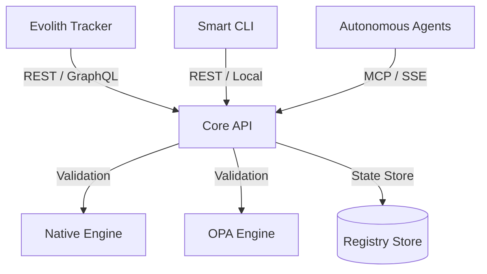

# Evolith Core API Product Hub

> **Bilingual Navigation:** [Versión en Español](./README.es.md)

Welcome to the **Evolith Core API** Product Hub. The Core API is the central validation, state, and governance engine of the Evolith ecosystem, exposing execution-gated verification capabilities to developers, CI pipelines, and autonomous AI agents.

---

## 1. Product Vision & Architecture

The Core API serves as the run-time implementation of the Evolith governance rulesets. It coordinates validation engines (both the Native TypeScript validator and the Open Policy Agent engines) to verify satellite applications, process SDLC phase transitions, and track architecture drift.



### Key Capabilities

1. **Gate Evaluation:** Validates whether a project satisfies all quality gate criteria for its current SDLC phase (conception, design, construction, QA, delivery).
2. **Phase Transitioning:** Automates transitions between SDLC phases based on evidence matching predefined rules.
3. **Architecture Verification:** Audits satellite projects against declared multi-topology rulesets (Modular Monolith, Serverless, Event-Driven, Data Mesh, Edge, Agentic/AI-First).
4. **Drift Detection:** Tracks real-time divergence between declared topological standards and active workspace configurations.

---

## 2. Technical Stack & Structure

- **Framework:** NestJS
- **Language:** TypeScript
- **Interfaces:** REST API (URI-versioned), Swagger/OpenAPI, and integrated SSE (Server-Sent Events) for streaming.
- **Validation Engines:**
  - **Native TypeScript Evaluator:** In-memory, high-speed validator.
  - **OPA WASM Evaluator:** Dual-engine evaluation parity running compiled WebAssembly policy targets.

---

## 3. Project Surface Directory

The Core API exposes its functionality via NestJS Controllers:

- [ArchitectureController](../../../apps/core-api/src/presentation/controllers/architecture.controller.ts): Topologies, drift detection, and satellite verification.
- [GatesController](../../../apps/core-api/src/presentation/controllers/gates.controller.ts): SDLC phase gate evaluation.
- [PhasesController](../../../apps/core-api/src/presentation/controllers/phases.controller.ts): Phase advance and transitions.
- [ProjectsController](../../../apps/core-api/src/presentation/controllers/projects.controller.ts): Project initialization and phase-advance proposals.
- [ReferenceController](../../../apps/core-api/src/presentation/controllers/reference.controller.ts): Public query endpoints for active rulesets, gates, and requirements.
- [HealthController](../../../apps/core-api/src/presentation/controllers/health.controller.ts): Liveness and readiness health checks.
- [MetricsController](../../../apps/core-api/src/presentation/controllers/metrics.controller.ts): Prometheus metrics exporter.

---

## 4. API Consumption Overview

Clients connect to the Core API via standard REST endpoints versioned under `/api/v1/...`. All responses conform to the **ADR-0073** unified payload envelope:

```json
{
  "success": true,
  "data": {
    "verdict": "passed",
    "violations": []
  },
  "meta": {
    "context": {
      "correlationId": "5f3a76ef-c5b9-478a-a92c-0e78fde14022",
      "tenant": "default",
      "initiative": "governance-audit"
    },
    "timing": {
      "startedAt": "2026-06-21T14:00:00Z",
      "durationMs": 45
    },
    "schemaVersion": "1.0.0"
  }
}
```

Detailed endpoint documentation, request bodies, and error response envelopes can be found in the [API Reference](./api-reference.md).

---

[Back to Products Index](../README.md)
