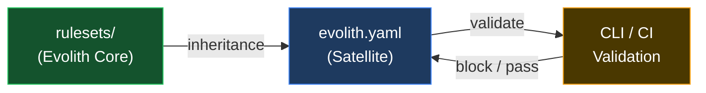

# Hub de Reglas de Evolith

> **Bilingual navigation:** [English version](./README.md)

Reglas de gobernanza machine-readable que los repositorios satélite heredan y contra las cuales validan.

---

## Propósito

Los Rulesets de Evolith son la **capa de ejecución machine-readable** del framework de gobernanza Evolith. Mientras `reference/` contiene estándares escritos por humanos, ADRs y documentación, `rulesets/` contiene las reglas concretas, esquemas y contratos que las herramientas (CLI, pipelines CI, linters) consumen para **validar** el cumplimiento de satélites.

---

## Punto de Entrada

Si estás integrando un nuevo repositorio satélite, comienza aquí:

1. **[Reglas de Gobernanza](./governance/)** — contrato `evolith.yaml` y reglas de herencia
2. **[Reglas de Arquitectura](./architecture/)** — reglas de progresión de fase F1/F2/F3
3. **[Reglas SDLC](./sdlc/)** — definiciónes de quality gates y thresholds
4. **[Reglas Anti-Corrupción](./acl/)** — gobernanza de integración con sistemas externos
5. **[Reglas del CLI](./cli/)** — preparación de release del Smart CLI y paridad con Core
6. **[Reglas de Evidencia](./evidence/)** — manifests de evidencia auditable
7. **[Reglas MCP](./mcp/)** — cumplimiento del protocolo MCP
8. **[Reglas de Observabilidad](./observability/)** — evidencia de telemetría para operación
9. **[Schemas](./schema/)** — JSON Schema para validación de artefactos Evolith

---

## Estructura de Directorios

```
rulesets/
├── schema/                     # Definiciones de JSON Schema
│   ├── adr.schema.json         # Validación de artefacto ADR
│   ├── prd.schema.json         # Validación de artefacto PRD
│   ├── discovery-canvas.schema.json     # Fase 1
│   ├── business-case-roi.schema.json     # Fase 1
│   ├── ballpark-estimation.schema.json   # Fase 1
│   ├── evolith-user-story.schema.json    # Fase 1
│   ├── agile-backlog.schema.json          # Fase 1
│   ├── cli-impact-analysis.schema.json   # Fase 1-2
│   ├── functional-story.schema.json      # Fase 2
│   ├── technical-story.schema.json       # Fase 3
│   ├── test-summary-report.schema.json   # Fase 4
│   ├── release-notes.schema.json         # Fase 5
│   └── evolith-yaml.schema.json  # Gobernanza satélite
├── architecture/               # Reglas de fase de arquitectura
│   ├── f1-modular-monolith.rules.json
│   ├── f2-distributed-modules.rules.json
│   └── f3-microservices.rules.json
├── adr/                        # Reglas encoding ADR
│   ├── adr-0002-hexagonal-architecture.rules.json
│   ├── adr-0005-cicd-quality-gates.rules.json
│   ├── adr-0018-testing-pyramid.rules.json
│   ├── adr-0032-protocol-selection.rules.json
│   ├── adr-0040-multi-runtime.rules.json
│   ├── adr-0050-gitflow-branching.rules.json
│   └── adr-0010-multi-tenancy.rules.json
├── cross-cutting/              # Reglas de baseline de compliance
│   ├── compliance-baseline.rules.json    # 5 pilares
│   ├── definition-of-done.rules.json     # Checklist DoD
│   ├── engineering-manifesto.rules.json  # SOLID, DRY, KISS, YAGNI
│   └── repository-taxonomy.rules.json    # Nomenclatura, estructura
├── acl/                        # Reglas Anti-Corruption Layer
│   ├── anti-corruption-layer.rules.json  # Aplicación ACL
│   └── anti-corruption-layer.rules.es.json
├── sdlc/                       # Reglas de gates SDLC
│   ├── phase-gates.rules.json
│   └── quality-thresholds.rules.json
├── cli/                        # Reglas de release y paridad del Smart CLI
│   ├── release-readiness.rules.json
│   └── core-parity.rules.json
├── evidence/                   # Contrato de evidencia auditable
│   └── evidence-manifest.rules.json
├── mcp/                        # Reglas de exposición del protocolo MCP
│   └── protocol-compliance.rules.json
├── observability/              # Reglas de evidencia de telemetría
│   └── telemetry-evidence.rules.json
└── governance/                 # Reglas de gobernanza federada
    ├── inheritance.rules.json
    ├── satellite-contracts.rules.json
    ├── open-core-boundary.rules.json  # Frontera Core vs Enterprise
    └── executive-scorecards.rules.json  # Métricas DORA + SPACE
```

---

## Cómo Funcionan los Rulesets



1. **Evolith Core** publica rulesets
2. **Satélites** declaran `evolith.yaml` heredando versiones específicas de reglas
3. **CLI / CI** valida satélite contra reglas heredadas
4. **Failures** bloquean phase gates o merge

---

## Principios Clave

| Principio | Descripción |
|---|---|
| **Reglas versionadas** | Cada regla tiene versión; satélites hacen pin a versión específica |
| **Fail-fast validation** | CI debe fallar en violaciones de reglas; sin bypass sin waiver explícito |
| **Phase-aware** | Las reglas cambian dependiendo de la fase de arquitectura F1/F2/F3 |
| **Herencia federada** | Satélites heredan de Core; no modifican reglas del Core |
| **Schema-first** | Todos los artefactos tienen JSON Schema para validación machine |

---

## Documentos Relacionados

| Documento | Propósito |
|---|---|
| [AGENTS.md](../AGENTS.md) | Reglas y convenciones de agentes |
| [Repository Taxonomy](../reference/governance/standards/repository-taxonomy.md) | Qué va dónde en Evolith |
| [Child Repository Inheritance](../reference/governance/standards/onboarding/child-repository-inheritance-guide.md) | Cómo productos heredan de Evolith |
| [Navigation Hub](../reference/navigation/README.md) | Navegación completa del repositorio |

---

<div align="center">
  <sub>Evolith — Enterprise Architecture Platform | Rulesets Hub</sub>
</div>
