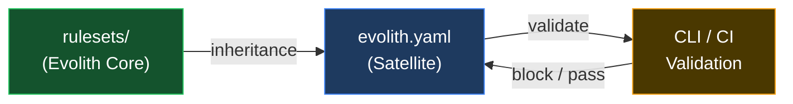

# Hub de Reglas de Evolith

> **Bilingual navigation:** [English version](./README.md)

Reglas de gobernanza machine-readable que los repositorios satélite heredan y contra las cuales validan.

---

## Propósito

> **Meta:** convertir la constitución escrita por humanos en reglas automatizadas exigibles en CI que los satélites no puedan eludir en silencio.
>
> **Objetivos:** versionar cada regla, validar cada artefacto contra un schema y custodiar automáticamente cada transición de fase.

Los Rulesets de Evolith son la **capa de ejecución machine-readable** del framework de gobernanza Evolith. Mientras `reference/` contiene estándares escritos por humanos, ADRs y documentación, `rulesets/` contiene las reglas concretas, esquemas y contratos que las herramientas (CLI, pipelines CI, linters) consumen para **validar** el cumplimiento de satélites.

---

## Categorías de Reglas

Si estás integrando un nuevo repositorio satélite, lee las categorías en este orden — del contrato de herencia a la validación de artefactos:

| Documento | Descripción | Objetivo / Meta | Tipo | Obligatorio |
|---|---|---|---|---|
| [Reglas de Gobernanza](./governance/README.es.md) | Contrato `evolith.yaml` y reglas de herencia | Gobernar la herencia de satélites | Categoría de reglas | Sí |
| [Reglas de Arquitectura](./architecture/README.es.md) | Reglas de progresión de fase F1/F2/F3 | Custodiar las fases de arquitectura | Categoría de reglas | Sí |
| [Reglas Codificadas desde ADRs](./adr/README.es.md) | Reglas derivadas de ADRs aceptados | Hacer cumplir las decisiones automáticamente | Categoría de reglas | Sí |
| [Reglas Transversales](./cross-cutting/README.es.md) | Baseline de cumplimiento, Definition of Done, manifiesto y taxonomía | Hacer cumplir las reglas transversales | Categoría de reglas | Sí |
| [Reglas SDLC](./sdlc/README.es.md) | Definiciones de quality gates y thresholds | Hacer cumplir la calidad del ciclo de vida | Categoría de reglas | Sí |
| [Reglas Anti-Corrupción](./acl/README.es.md) | Gobernanza de integración con sistemas externos | Proteger los límites del dominio | Categoría de reglas | Sí |
| [Reglas del CLI](./cli/README.es.md) | Preparación de release del Smart CLI y paridad con Core | Custodiar los releases del CLI | Categoría de reglas | Sí |
| [Reglas de Evidencia](./evidence/README.es.md) | Manifests de evidencia auditable | Estandarizar la evidencia | Categoría de reglas | Sí |
| [Reglas MCP](./mcp/README.es.md) | Cumplimiento del protocolo MCP | Validar la exposición MCP | Categoría de reglas | Sí |
| [Reglas de Observabilidad](./observability/README.es.md) | Evidencia de telemetría para operación | Verificar la evidencia de telemetría | Categoría de reglas | Sí |
| [Rulesets Topologicos](./topologies/README.es.md) | Reglas ejecutables Native y OPA especificas por topologia | Gobernar la validacion topologica | Categoria de reglas | Si |
| [Schemas](./schema/README.es.md) | JSON Schema para validación de artefactos Evolith | Validar la estructura de artefactos | Colección de schemas | Sí |
| [Políticas OPA](./opa/README.es.md) | Políticas OPA y sus schemas de entrada | Validar gobernanza y reglas de arquitectura | Colección de políticas | Sí |

---

## Estructura de Directorios

```
rulesets/
├── compliance-baseline/        # Punto de entrada WS1 del baseline de cumplimiento
│   └── compliance-baseline.rules.json
├── definition-of-done/         # Punto de entrada WS1 de Definition of Done
│   └── definition-of-done.rules.json
├── engineering-manifesto/      # Punto de entrada WS1 del Manifiesto de Ingeniería
│   └── engineering-manifesto.rules.json
├── repository-taxonomy/        # Punto de entrada WS1 de Taxonomía del Repositorio
│   └── repository-taxonomy.rules.json
├── phase-gates/                # Punto de entrada WS1 de gates de fase SDLC
│   └── phase-gates.rules.json
├── quality-thresholds/         # Punto de entrada WS1 de umbrales de calidad
│   └── quality-thresholds.rules.json
├── satellite-contracts/        # Punto de entrada WS1 de Satellite Contracts
│   └── satellite-contracts.rules.json
├── opa/                        # Políticas OPA y schemas de entrada
│   ├── schemas/                # Schemas de entrada de políticas OPA (9 schemas)
│   ├── *.rego                  # Archivos de políticas Rego
│   └── README.es.md            # Índice OPA
├── schema/                     # Definiciones de JSON Schema (19 schemas)
│   ├── adr.schema.json         # Validación de artefacto ADR
│   ├── prd.schema.json         # Validación de artefacto PRD
│   ├── discovery-canvas.schema.json     # Fase 1
│   ├── technical-feasibility.schema.json # Fase 1
│   ├── ballpark-estimation.schema.json   # Fase 1
│   ├── evolith-user-story.schema.json    # Fase 1
│   ├── agile-backlog.schema.json          # Fase 1
│   ├── cli-impact-analysis.schema.json   # Fase 1-2
│   ├── functional-story.schema.json      # Fase 2
│   ├── technical-story.schema.json       # Fase 3
│   ├── test-summary-report.schema.json   # Fase 4
│   ├── release-notes.schema.json         # Fase 5
│   ├── evolith-yaml.schema.json          # Gobernanza satelite
│   └── topology-manifest.schema.json     # Contrato de manifiesto topologico
├── architecture/               # Alias de compatibilidad F1/F2/F3 y guía de migración
│   └── README.md               # Resuelve alias mediante manifiestos topológicos
├── topologies/                 # Reglas ejecutables especificas por topologia
│   └── README.es.md
├── adr/                        # Reglas encoding ADR
│   ├── adr-0002-hexagonal-architecture.rules.json
│   ├── adr-0005-cicd-quality-gates.rules.json
│   ├── adr-0018-testing-pyramid.rules.json
│   ├── adr-0032-protocol-selection.rules.json
│   ├── adr-0040-multi-runtime.rules.json
│   ├── adr-0050-gitflow-branching.rules.json
│   └── adr-0010-multi-tenancy.rules.json
├── cross-cutting/              # Reglas de baseline de compliance
│   ├── compliance-baseline.rules.json    # 5 pilares
│   ├── definition-of-done.rules.json     # Checklist DoD
│   ├── engineering-manifesto.rules.json  # SOLID, DRY, KISS, YAGNI
│   └── repository-taxonomy.rules.json    # Nomenclatura, estructura
├── acl/                        # Reglas Anti-Corruption Layer
│   ├── anti-corruption-layer.rules.json  # Aplicación ACL
│   └── anti-corruption-layer.rules.es.json
├── sdlc/                       # Reglas de gates SDLC
│   ├── phase-gates.rules.json
│   └── quality-thresholds.rules.json
├── cli/                        # Reglas de release y paridad del Smart CLI
│   ├── release-readiness.rules.json
│   └── core-parity.rules.json
├── evidence/                   # Contrato de evidencia auditable
│   └── evidence-manifest.rules.json
├── mcp/                        # Reglas de exposición del protocolo MCP
│   └── protocol-compliance.rules.json
├── observability/              # Reglas de evidencia de telemetría
│   └── telemetry-evidence.rules.json
└── governance/                 # Reglas de gobernanza federada
    ├── inheritance.rules.json
    ├── satellite-contracts.rules.json
    ├── open-core-boundary.rules.json  # Frontera Core vs Enterprise
    └── executive-scorecards.rules.json  # Métricas DORA + SPACE
```

---

El artefacto canónico de reglas topológicas es el archivo declarado por cada `topology.manifest.json`; los artefactos actuales del eje progresivo viven bajo `reference/architecture/topologies/progressive-axis/`. Los consumidores deben resolver el manifiesto en lugar de construir rutas legacy `rulesets/architecture/f*.rules.json`.

## Cómo Funcionan los Rulesets



1. **Evolith Core** publica rulesets
2. **Satélites** declaran `evolith.yaml` heredando versiones específicas de reglas
3. **CLI / CI** valida satélite contra reglas heredadas
4. **Failures** bloquean phase gates o merge

---

## Principios Clave

| Principio | Descripción |
|---|---|
| **Reglas versionadas** | Cada regla tiene versión; satélites hacen pin a versión específica |
| **Fail-fast validation** | CI debe fallar en violaciones de reglas; sin bypass sin waiver explícito |
| **Topology-aware** | F1/F2/F3 permanecen como aliases de compatibilidad progressive-axis mientras los manifiestos topologicos gobiernan validacion especifica mas amplia |
| **Herencia federada** | Satélites heredan de Core; no modifican reglas del Core |
| **Schema-first** | Todos los artefactos tienen JSON Schema para validación machine |

---

## Documentos Relacionados

| Documento | Descripción | Objetivo / Meta | Tipo | Obligatorio |
|---|---|---|---|---|
| [AGENTS.md](../AGENTS.es.md) | Reglas y convenciones de agentes | Gobernar las contribuciones de agentes | Estándar | Sí |
| [Taxonomía del Repositorio](../reference/governance/standards/repository-taxonomy.es.md) | Qué va dónde en Evolith | Mantener el repositorio organizado | Estándar de gobernanza | Sí |
| [Guía de Herencia de Repositorios Hijos](../reference/governance/standards/onboarding/child-repository-inheritance-guide.es.md) | Cómo los productos heredan de Evolith | Estandarizar la herencia | Guía | Sí |
| [Hub de Navegación](../reference/navigation/README.es.md) | Navegación completa del repositorio | Centralizar la navegación | Hub de navegación | No |

---

<div align="center">
  <sub>Evolith — Enterprise Architecture Platform | Rulesets Hub</sub>
</div>
