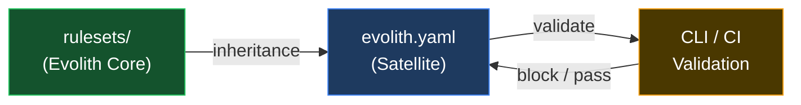

# Evolith Rulesets Hub

> **Navegación bilingüe:** [Versión en Español](./README.es.md)

Machine-readable governance rules that satellite repositories inherit and validate against.

---

## Purpose

Evolith Rulesets are the **machine-readable enforcement layer** of the Evolith governance framework. While `reference/` contains human-authored standards, ADRs, and documentation, `rulesets/` contains the concrete rules, schemas, and contracts that tools (CLI, CI pipelines, linters) consume to **validate** satellite compliance.

---

## Entry Point

If you are onboarding a new satellite repository, start here:

1. **[Governance Rules](./governance/)** — `evolith.yaml` contract and inheritance rules
2. **[Architecture Rules](./architecture/)** — F1/F2/F3 phase progression rules
3. **[SDLC Rules](./sdlc/)** — Quality gates and threshold definitions
4. **[Anti-Corruption Layer Rules](./acl/)** — External system integration governance
5. **[Schemas](./schema/)** — JSON Schema for validating Evolith artifacts

---

## Directory Structure

```
rulesets/
├── schema/                     # JSON Schema definitions (13 schemas)
│   ├── adr.schema.json         # ADR artifact validation
│   ├── prd.schema.json         # PRD artifact validation
│   ├── discovery-canvas.schema.json     # Phase 1
│   ├── business-case-roi.schema.json     # Phase 1
│   ├── ballpark-estimation.schema.json   # Phase 1
│   ├── evolith-user-story.schema.json    # Phase 1
│   ├── agile-backlog.schema.json          # Phase 1
│   ├── cli-impact-analysis.schema.json   # Phase 1-2
│   ├── functional-story.schema.json      # Phase 2
│   ├── technical-story.schema.json       # Phase 3
│   ├── test-summary-report.schema.json   # Phase 4
│   ├── release-notes.schema.json         # Phase 5
│   └── evolith-yaml.schema.json  # Satellite governance
├── architecture/               # Architecture phase rules
│   ├── f1-modular-monolith.rules.json
│   ├── f2-distributed-modules.rules.json
│   └── f3-microservices.rules.json
├── adr/                        # ADR-encoded rules (7 ADRs)
│   ├── adr-0002-hexagonal-architecture.rules.json
│   ├── adr-0005-cicd-quality-gates.rules.json
│   ├── adr-0018-testing-pyramid.rules.json
│   ├── adr-0032-protocol-selection.rules.json
│   ├── adr-0040-multi-runtime.rules.json
│   ├── adr-0050-gitflow-branching.rules.json
│   └── adr-0010-multi-tenancy.rules.json
├── cross-cutting/              # Compliance baseline rules
│   ├── compliance-baseline.rules.json    # 5 pillars
│   ├── definition-of-done.rules.json     # DoD checklist
│   ├── engineering-manifesto.rules.json  # SOLID, DRY, KISS, YAGNI
│   └── repository-taxonomy.rules.json    # Naming, structure
├── acl/                        # Anti-Corruption Layer rules (NEW)
│   ├── anti-corruption-layer.rules.json  # ACL enforcement
│   └── anti-corruption-layer.rules.es.json
├── sdlc/                       # SDLC gate rules
│   ├── phase-gates.rules.json
│   └── quality-thresholds.rules.json
└── governance/                 # Federated governance rules
    ├── inheritance.rules.json
    ├── satellite-contracts.rules.json
    └── open-core-boundary.rules.json  # Core vs Enterprise separation
```

---

## How Rulesets Work



1. **Evolith Core** publishes rulesets
2. **Satellites** declare `evolith.yaml` inheriting specific rule versions
3. **CLI / CI** validates satellite against inherited rules
4. **Failures** block phase gates or merge

---

## Key Principles

| Principle | Description |
|---|---|
| **Versioned rules** | Every rule has a version; satellites pin to a specific version |
| **Fail-fast validation** | CI must fail on rule violations; no bypass without explicit waiver |
| **Phase-aware** | Rules change depending on F1/F2/F3 architecture phase |
| **Federated inheritance** | Satellites inherit from Core; they do not modify Core rules |
| **Schema-first** | All artifacts have JSON Schema for machine validation |

---

## Related Documents

| Document | Purpose |
|---|---|
| [AGENTS.md](../AGENTS.md) | Agent rules and conventions |
| [Repository Taxonomy](../reference/governance/standards/repository-taxonomy.md) | What goes where in Evolith |
| [Child Repository Inheritance](../reference/governance/standards/onboarding/child-repository-inheritance-guide.md) | How products inherit from Evolith |
| [Navigation Hub](../reference/navigation/README.md) | Full repository navigation |

---

<div align="center">
  <sub>Evolith — Enterprise Architecture Platform | Rulesets Hub</sub>
</div>