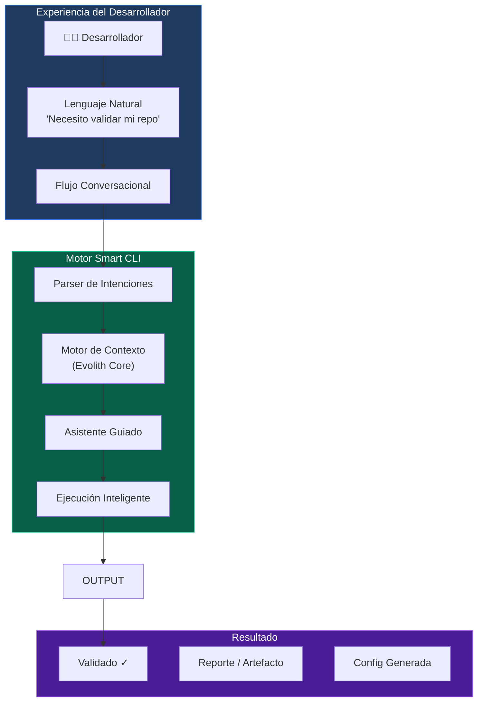
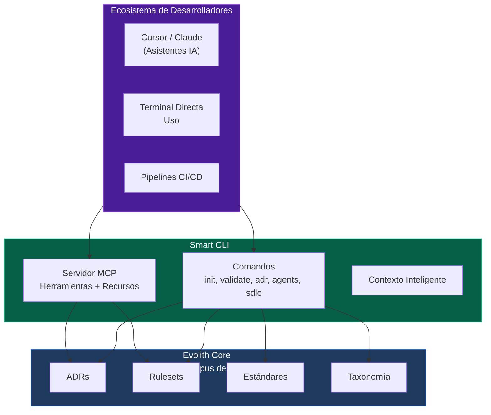
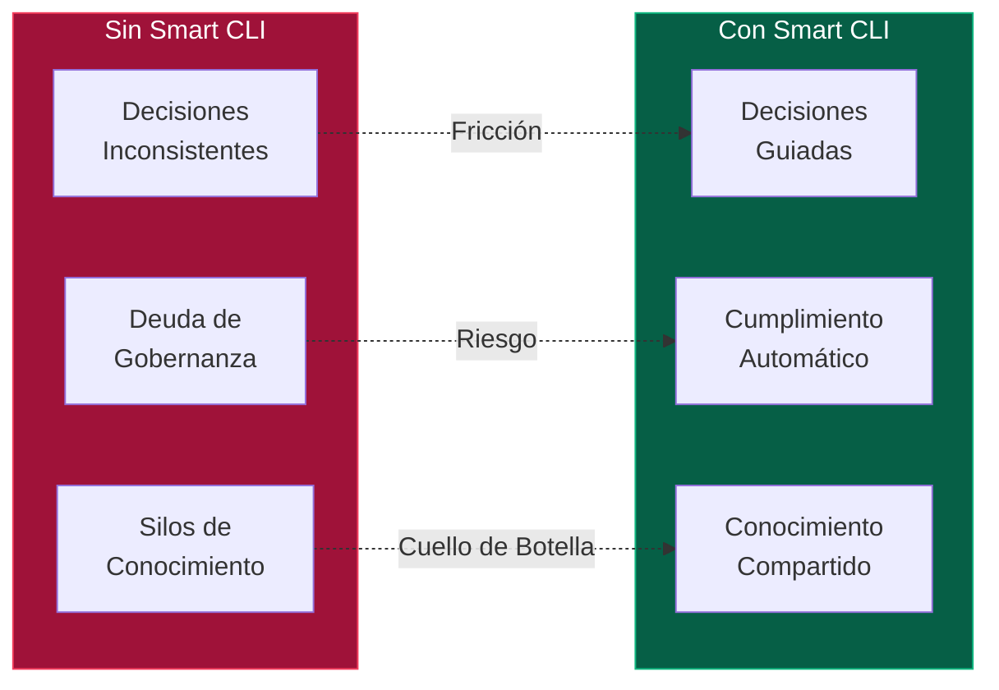
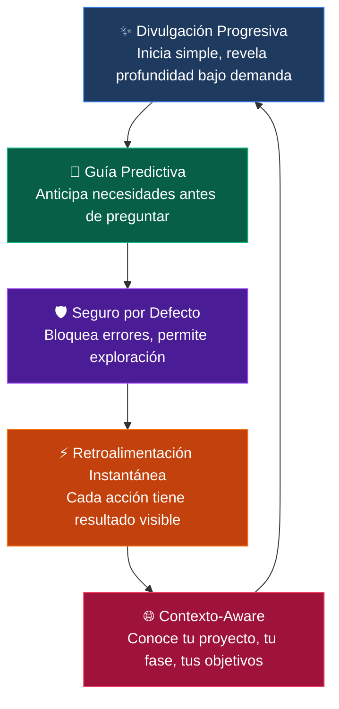
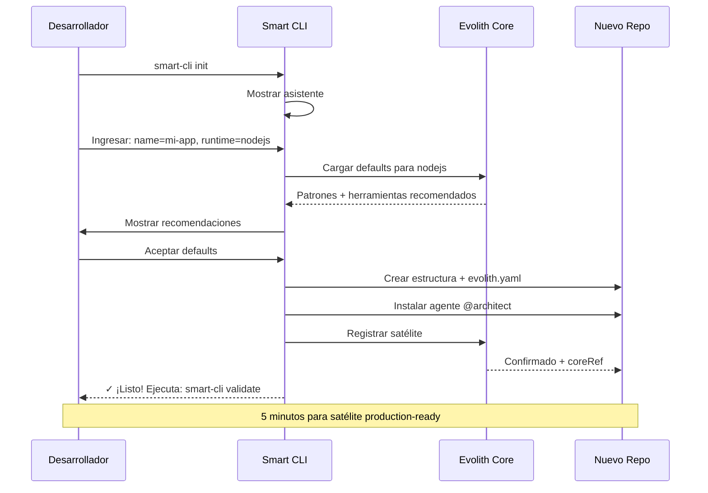
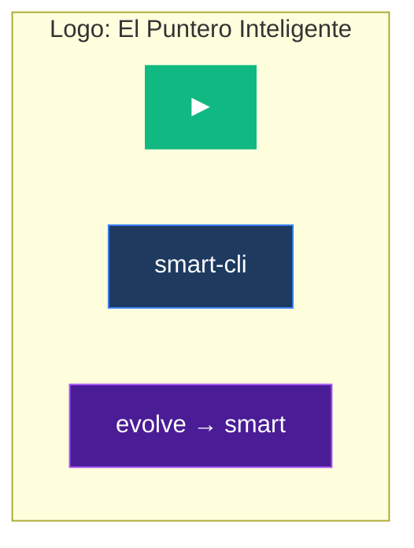
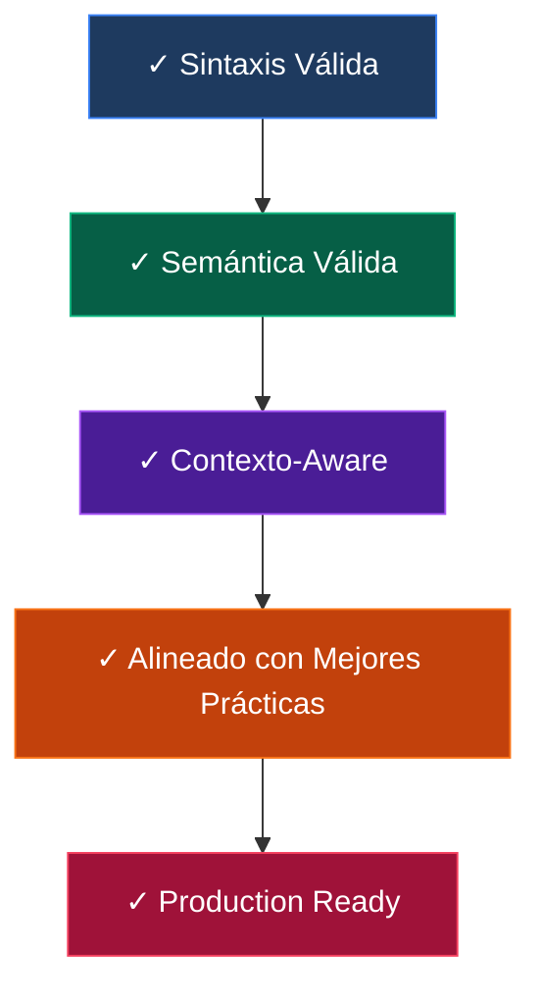

# Smart CLI — Visión del Producto

> **Bilingual Navigation:** [English](./VISION.md)
> **Estado:** Borrador
> **Owner:** Tablero de Arquitectura Evolith
> **Última Actualización:** 2026-06-06

---

## 1. Declaración de Visión

**Smart CLI** es la interfaz de línea de comandos inteligente que hace que la gobernanza de Evolith sea accesible para cada desarrollador. Transforma decisiones arquitectónicas complejas en experiencias guiadas y conversacionales — permitiendo a los equipos construir software compliant sin convertirse en expertos en gobernanza.

> *"De gobernanza compleja a comandos simples."*

---

## 2. Imagen Conceptual

### 2-1 El Smart CLI como un Compañero IA



### 2-2 El CLI como Ventana al Evolith Core



---

## 3. Propuestas de Valor Core

### 3-1 Para Desarrolladores Individuales

| Antes (Sin Smart CLI) | Después (Con Smart CLI) |
|-----------------------|-------------------------|
| Leer 50 páginas de ADRs | Preguntar: `smart-cli adr suggest --context authentication` |
| Validar manualmente 20 reglas | Ejecutar: `smart-cli validate --ruleset acl` |
| Adivinar patrones arquitectónicos | Obtener guía: `smart-cli init --wizard` |
| Buscar docs por horas | `smart-cli architecture ask "¿Cuál es el patrón de auth?"` |

### 3-2 Para Equipos



---

## 4. Concepto del Producto: Tres Modos

### 4-1 Modo Interactivo (Por Defecto)

Asistentes guiados con UI rica:

```
┌─────────────────────────────────────────────────┐
│  🚀 Asistente Smart CLI Init                    │
├─────────────────────────────────────────────────┤
│                                                 │
│  Configuremos tu repositorio satélite.          │
│                                                 │
│  ◆ Nombre del Proyecto: [________________]      │
│                                                 │
│  ◆ Runtime:                                     │
│    ○ NodeJS / TypeScript                        │
│    ○ .NET / C#                                  │
│    ○ Android / Kotlin                           │
│                                                 │
│  ◆ Arquitectura:                                │
│    ○ Clean Architecture                         │
│    ○ Hexagonal (Puertos y Adaptadores)          │
│    ○ DDD (Diseño Dirigido por Dominio)          │
│                                                 │
│  ◆ Monorepo:                                    │
│    ○ Ninguno (standalone)                       │
│    ○ Nx                                         │
│    ○ NPM Workspaces                             │
│                                                 │
│  ◆ Instalar Agentes:                            │
│    □ @architect (recomendado)                   │
│    □ @validator                                 │
│                                                 │
│           [Cancelar]              [Crear →]     │
└─────────────────────────────────────────────────┘
```

### 4-2 Modo Batch (CI/CD)

Ejecución silenciosa con salida JSON:

```bash
smart-cli init --config project.yaml --output json | tee setup-report.json
```

### 4-3 Modo MCP (Integración IA)

stdio JSON-RPC para asistentes IA:

```json
{
  "jsonrpc": "2.0",
  "method": "tools/call",
  "params": {
    "name": "evolith-validate",
    "arguments": { "path": "/repo", "format": "summary" }
  }
}
```

---

## 5. Principios de Experiencia

### 5-1 Experiencia de Desarrollador Cinco Estrellas



### 5-2 Carga Cognitiva Mínima

```
┌─────────────────────────────────────────────────────────────┐
│                    curva de carga cognitiva                  │
│                                                             │
│   ▲                                                         │
│   │         Sin CLI           │    Con Smart CLI            │
│   │                            │                            │
│ 4 │    ┌───────────────────    │    ┌─                     │
│   │    │ Decisiones complejas  │    │  Valores guiados      │
│ 3 │    │ enterradas en docs    │    │  Contexto-aware       │
│   │    └───────────────────────    │  ─────────────────────│
│ 2 │                                 │                      │
│   │                              ───┘                       │
│ 1 │    ┌─────────────────────────────────────────          │
│   │    │ Comandos simples, resultados claros               │
│   │    └───────────────────────────────────────────────────
│   └────────────────────────────────────────────────────────►
│         Novato          Intermedio        Experto
│                        Habilidad del Desarrollador
└─────────────────────────────────────────────────────────────┘
```

---

## 6. Journey del Usuario: Primeros 5 Minutos

### 6-1 Descubrimiento → Producción en 5 Minutos



### 6-2 Flujos de Sesión Típicos

```mermaid
graph TB
    subgraph Morning["Revisión Matutina"]
        M1["smart-cli sdlc status"] --> M2["Salud de phase gates"]
        M2 --> M3["Gates: 3/5 pasaron ✓"]
    end

    subgraph Task["Tarea de Desarrollo"]
        T1["smart-cli validate"] --> T2["Verificaciones: 15 pasaron"]
        T2 --> T3["Advertencias: 2 (no bloqueantes)"]
        T3 --> T4["Sugerencia: Ejecuta smart-cli docs --fix"]
    end

    subgraph Review["Code Review"]
        R1["smart-cli adr list"] --> R2["Mostrar: 5 ADRs activos"]
        R2 --> R3["Verificar: ADR-0023 aún válido?"]
        R3 --> R4["Decisión: aún aplica ✓"]
    end

    style Morning fill:#1e3a5f,stroke:#3b82f6,color:#fff
    style Task fill:#065f46,stroke:#10b981,color:#fff
    style Review fill:#4a1d96,stroke:#a855f7,color:#fff
```



---

## 7. Identidad de Marca

### 7-1 Concepto Visual

```
╔═══════════════════════════════════════════════════════════════╗
║                                                                ║
║     ██████╗ ███████╗███╗   ██╗ ██████╗  ██████╗ ██████╗      ║
║     ██╔══██╗██╔════╝████╗  ██║██╔════╝ ██╔═══██╗██╔══██╗     ║
║     ██████╔╝█████╗  ██╔██╗ ██║██║  ███╗██║   ██║██████╔╝     ║
║     ██╔═══╝ ██╔══╝  ██║╚██╗██║██║   ██║██║   ██║██╔══██╗     ║
║     ██║     ███████╗██║ ╚████║╚██████╔╝╚██████╔╝██║  ██║     ║
║     ╚═╝     ╚══════╝╚═╝  ╚═══╝ ╚═════╝  ╚═════╝ ╚═╝  ╚═╝     ║
║                                                                ║
║              ╔═══════════════════════════════╗                ║
║              ║    smart-cli — evolve smart    ║                ║
║              ╚═══════════════════════════════╝                ║
║                                                                ║
║     Colores:                                                   ║
║       Primario: #3B82F6 (Azul — Confianza)                    ║
║       Acento:  #10B981 (Verde — Éxito)                        ║
║       Oscuro:  #1E3A5F (Azul Marino — Profesional)            ║
║       Alerta:  #EF4444 (Rojo — Atención)                      ║
║                                                                ║
╚═══════════════════════════════════════════════════════════════╝
```

### 7-2 Concepto de Logo



**Concepto:** El botón de play (▶) representa movimiento hacia adelante, progresión inteligente y acción. La flecha sugiere guía hacia mejores decisiones arquitectónicas.

---

## 8. Métricas de Éxito

### 8-1 KPIs de Adopción de Desarrolladores

| Métrica | Objetivo | Medición |
|---------|----------|----------|
| Tiempo hasta primera validación exitosa | < 2 min | Telemetría |
| Comandos ejecutados por sesión | > 5 | Analíticas |
| Uso de herramientas MCP por asistentes IA | Creciendo | Logs de integración |
| Índice de adherencia de proyectos guiados por CLI | > 85% | Auditoría periódica |

### 8-2 Puertas de Calidad



---

## 9. Roadmap

| Fase | Enfoque | Hito |
|------|---------|------|
| **Beta** | Comandos core | validate, init, adr, agents |
| **v1.0** | Integración MCP | Suite completa de herramientas + soporte asistentes IA |
| **v1.1** | Guía de fases | Asistente interactivo SDLC |
| **v2.0** | Agentes autónomos | Auto-curación de cumplimiento arquitectónico |

---

*Smart CLI — Haciendo la gobernanza de Evolith accesible, un comando a la vez.*

---

[Back to CLI Index](../README.md)