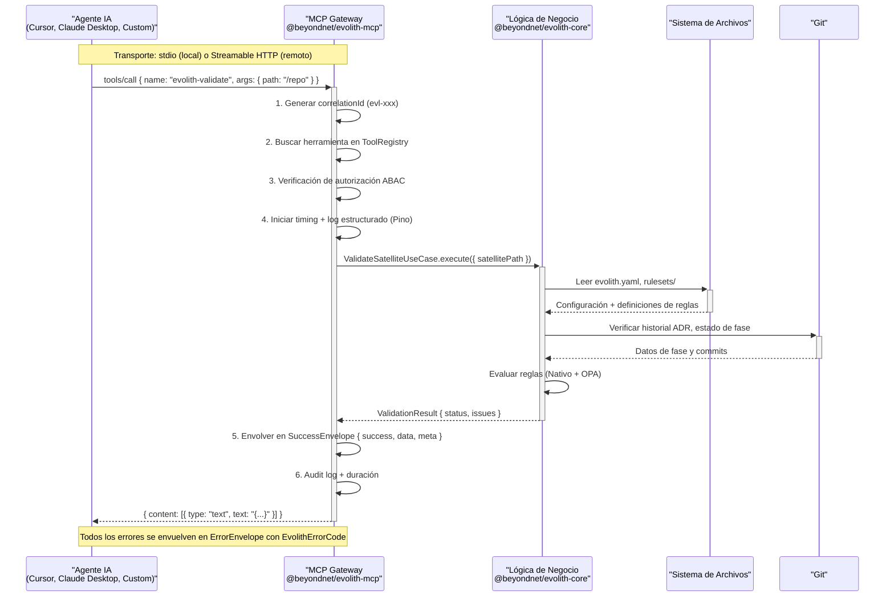

# @beyondnet/evolith-mcp

## Evolith MCP Gateway — Servidor de Protocolo de Contexto de Modelo de Primera Clase

> **Navegación bilingüe:** [English version](./README.md)

Desacopla el servidor MCP del CLI. Es un producto de primera clase que expone las herramientas MCP como un **Gateway** que se comunica con `@beyondnet/evolith-core` (capa de lógica de negocio reutilizable), en lugar de ejecutar subprocesos del CLI.

---

## Tabla de contenidos

1. [Diagrama de Arquitectura](#diagrama-de-arquitectura)
2. [Transportes](#transportes)
3. [Instalación y configuración](#instalación-y-configuración)
4. [Autenticación](#autenticación)
5. [Herramientas disponibles (55)](#herramientas-disponibles-55)
6. [Resources disponibles (12 + dinámicos)](#resources-disponibles-12--dinámicos)
7. [Prompts disponibles (8)](#prompts-disponibles-8)
8. [Operaciones mutativas](#operaciones-mutativas)
9. [Arquitectura interna](#arquitectura-interna)
10. [Casos de uso con agentes](#casos-de-uso-con-agentes)
11. [Configuración de clientes](#configuración-de-clientes)
12. [Integración con SmartCLI](#integración-con-smartcli)
13. [Guía de extensión](#guía-de-extensión)
14. [Observabilidad](#observabilidad)
15. [Buenas prácticas](#buenas-prácticas)
16. [Troubleshooting](#troubleshooting)

---

## Diagrama de Arquitectura



---

## Transportes

| Transporte | Uso | Comando |
|---|---|---|
| **stdio** (JSON-RPC 2.0) | Agentes locales, Cursor, Claude Desktop | `evolith-mcp serve` |
| **Streamable HTTP** (SDK oficial MCP) | Agentes remotos, escalabilidad | `evolith-mcp serve --transport http --port 49100` |

> El **puerto por defecto es `3000`** (`main.ts`: env `PORT` o `--port`, fallback `3000`). El `49100` de los ejemplos es un valor arbitrario, no el default.
>
> Los logs siempre se escriben a **stderr** (Pino), porque stdout está reservado para el stream JSON-RPC del transporte stdio.

---

## Instalación y configuración

### Instalación

```bash
# Desde el monorepo
npm install @beyondnet/evolith-mcp

# O globalmente
npm install -g @beyondnet/evolith-mcp
```

### Uso

```bash
# stdio (por defecto) — para Cursor, Claude Desktop, etc.
evolith-mcp serve

# HTTP — para integración remota
evolith-mcp serve --transport http --port 49100
```

### Variables de entorno

| Variable | Default | Descripción |
|---|---|---|
| `TRANSPORT` | `stdio` | Transporte activo: `stdio` o `http` |
| `PORT` | `3000` | Puerto para transporte HTTP |
| `MCP_HTTP_HOST` | `0.0.0.0` | Host de bind del servidor HTTP. Usar `127.0.0.1` para local-only |
| `EVOLITH_API_KEY` | — | API key para autenticación en transporte HTTP |
| `EVOLITH_MCP_ALLOW_NO_AUTH` | `false` | **Solo HTTP.** Permite arrancar HTTP sin API key (solo no-producción). Ignorado en `production` y en `stdio` (que advierte en el arranque) |
| `JWT_SECRET` | — | Secreto opcional para validar Bearer JWT (HS256) además del API key |
| `NODE_ENV` | `development` | En `production` la auth HTTP es obligatoria |
| `LOG_LEVEL` | `info` | Nivel de log Pino: `trace`, `debug`, `info`, `warn`, `error` |
| `REDIS_URL` | — | URL de Redis para caché de resources (ej: `redis://localhost:6379`). La caché es opcional. |
| `OTEL_EXPORTER_OTLP_ENDPOINT` | — | Endpoint OpenTelemetry para tracing |
| `OTEL_SERVICE_NAME` | `evolith-mcp` | Nombre del servicio en los traces |
| `EVOLITH_MCP_REQUEST_STATE_SECRET` | — | Clave que sella el `requestState` de MRTR (ruta 2026-07-28). Cae a `EVOLITH_API_KEY`, luego `JWT_SECRET`, luego una clave por proceso. **Defínela explícitamente cuando haya más de una réplica**, o un reintento de aprobación que aterrice en otra réplica será rechazado |
| `EVOLITH_MCP_RESOURCE_AUTH_SERVERS` | — | Emisores de authorization server publicados en el documento de Protected Resource Metadata, separados por coma. Por defecto, `EVOLITH_MCP_OAUTH_ISSUER` |
| `EVOLITH_MCP_RESOURCE_URI` | host de la petición | URI canónica de este servidor (identificador de recurso RFC 8707) publicada como `resource` |
| `EVOLITH_MCP_RESOURCE_SCOPES` | `read write` | Scopes publicados como `scopes_supported` y exigidos en el `WWW-Authenticate` |

> El binario también acepta los flags `--transport`/`-t`, `--port`/`-p`, `--api-key` y `--allow-no-auth` (**solo HTTP**), además del subcomando `evolith-mcp version`.

---

## Autenticación

### Transporte stdio

No requiere autenticación de request: el proceso es local, de un solo usuario, y lo ejecuta directamente el agente. El transporte establece un **principal de sesión local explícito** (`id=local-stdio-session`, `role=local-session`, `roles=[local-session, operator]`, `scopes=[read, write]`) que queda registrado en la auditoría de cada llamada (GT-572).

Esto **no** es un bypass de autorización: ABAC (nativo + OPA) sigue evaluándose en cada `tools/call` con esa identidad, las tools `deploy` siguen denegadas en `production` (requieren `architect`) y toda tool mutativa sigue exigiendo el gate HITL `{ apply, approvalToken }`. `--allow-no-auth` / `EVOLITH_MCP_ALLOW_NO_AUTH` **no aplican a stdio** (no hay autenticación de request que saltarse); si se pasan con `--transport stdio` el servidor lo advierte por stderr en el arranque.

### Transporte HTTP

En producción (`NODE_ENV=production`) la autenticación es **obligatoria**: `validateAuth()` ignora `EVOLITH_MCP_ALLOW_NO_AUTH` y rechaza todo request sin credencial válida (401). El valor de `EVOLITH_API_KEY` es un secreto arbitrario (cualquier string; **no** requiere prefijo) que se compara por igualdad. Se acepta en cualquiera de estos dos headers:

```
Authorization: Bearer <EVOLITH_API_KEY>
x-api-key: <EVOLITH_API_KEY>
```

`/health` es público (probe de liveness) y no requiere credencial.

Cuando hay un emisor OAuth configurado, `/.well-known/oauth-protected-resource` (y la variante con path insertado `/.well-known/oauth-protected-resource/<path>`) también es público: es el documento RFC 9728 que un cliente **no autenticado** lee para descubrir a qué authorization server ir, así que protegerlo con la credencial que intenta obtener haría imposible el descubrimiento. No contiene datos MCP — solo el emisor, el identificador de recurso y los nombres de scope. Un 401 de un recurso protegido lleva además una cabecera `WWW-Authenticate: Bearer resource_metadata="…", scope="…"`, que es el mecanismo de descubrimiento que los clientes MCP deben preferir. Sin emisor el endpoint devuelve 404 en vez de publicar un documento con `authorization_servers` vacío.

El registro de clientes nunca pasa por este servidor: es un resource server, y en la revisión 2026-07-28 el cliente obtiene su `client_id` de un Client ID Metadata Document (o de un pre-registro) en el authorization server. El Dynamic Client Registration está deprecado y no se implementa aquí; `protected-resource-metadata.spec.ts` rompe el build si alguna vez se introduce un endpoint de registro.

### Revisiones del protocolo

El servidor responde dos revisiones del protocolo en el mismo endpoint HTTP:

| Revisión | Cómo la selecciona una petición | Forma |
|---|---|---|
| `2026-07-28` (actual) | `_meta["io.modelcontextprotocol/protocolVersion"]` en cada petición, o una llamada a `server/discover` | Stateless. Sin `initialize`, sin `notifications/initialized`, sin `Mcp-Session-Id`. Todo resultado lleva `resultType`; el gate de aprobación se expresa como un `InputRequiredResult` con `requestState` sellado (MRTR) |
| `2025-11-25` | una petición `initialize` | La ruta con handshake que sirve `@modelcontextprotocol/sdk`, que emite y exige `Mcp-Session-Id` |

Ambas revisiones pasan por **un solo** dispatch, así que ABAC (nativo + OPA), el gate de scope, el gate de aprobación y la traza de auditoría son el mismo código en cualquiera de las dos rutas. La ruta `2025-11-25` se conserva porque el SDK publicado sigue declarándola como su última revisión; no es un diseño alternativo.

En la ruta `2026-07-28` una tool que cambia estado responde `resultType: "input_required"` con una petición `elicitation/create` y un `requestState` opaco. El cliente recoge la aprobación humana y **reintenta la llamada original** — nuevo id JSON-RPC, mismos parámetros, más `requestState` e `inputResponses`. El `requestState` va sellado con AES-256-GCM y ligado al principal, al tenant, a la llamada de origen y a un TTL corto, de modo que no puede reproducirse entre usuarios, llamadas ni en el tiempo. Un llamador que ya tenga una aprobación puede seguir pasando `{ apply: true, approvalToken }` inline y saltarse el round trip, igual que en la ruta `2025-11-25`.

> El `ApiKeyProvisioningService` (abajo) es un mecanismo **avanzado y opcional** para emitir keys con prefijo `evk_`, hash SHA-256 y TTL. Es independiente del `EVOLITH_API_KEY` de arranque descrito aquí.

### Aprovisionamiento de API keys

El `ApiKeyProvisioningService` gestiona el ciclo de vida de las keys:

| Operación | Descripción |
|---|---|
| `generateKey(label, options)` | Genera una key con prefijo `evk_`, hash SHA-256, TTL configurable (default 90 días) |
| `validateKey(rawKey)` | Valida la key contra el hash almacenado y verifica expiración |
| `rotateKey(keyId)` | Revoca la key actual y genera una nueva para el mismo cliente |
| `revokeKey(keyId)` | Revoca una key inmediatamente |

Las keys tienen scopes: `read`, `write`, `admin`. Se asocian a un `tenant`.

### Modelo ABAC

El `AbacEvaluator` controla qué tools puede invocar cada usuario según sus roles:

| Tipo de tool | Roles permitidos | Entorno |
|---|---|---|
| Lectura (list, get, status) | Todos los roles autenticados | Cualquiera |
| Escritura (fix, install, set) | `operator`, `sre`, `architect`, `admin` | Cualquiera |
| Escritura | `developer`, `qa` | Solo no-producción |
| Deploy (deploy, publish, merge) | `architect`, `admin`, `operator`, `sre` | Cualquiera |
| Deploy | Cualquiera excepto `architect` | **Bloqueado en producción** |

**Códigos ABAC:**

| Código | Causa |
|---|---|
| `ABAC-01` | Tool denegada para el rol/entorno del usuario |
| `ABAC-02` | Usuario sin roles — todas las tools denegadas |
| `ABAC-03` | Tool no clasificada en ningún grupo conocido |

**Clasificación de tools (heurística por substring).** Los conjuntos de roles internos son `DEVELOPER = {developer, qa}`, `OPERATOR = {operator, sre}`, `ARCHITECT = {architect, admin}`. La clasificación read/write/deploy de cada tool es heurística sobre su nombre (`abac-evaluator.ts`): cuenta como **read** si el nombre contiene `read`/`list`/`get` (o no empieza por `evolith-`); como **write** si contiene `write`/`replace`/`run`/`fix`/`advance`; como **deploy** si contiene `deploy`/`publish`/`merge`. Por esa heurística `evolith-phase-advance` se clasifica como **write** (substring `advance`), aunque solo proponga la transición. Una tool que no encaje en ningún grupo se rechaza con `ABAC-03`.

**Precedencia de autenticación (HTTP).** El guard (`mcp-server-auth.ts`) evalúa primero la **API key**: si el `Authorization: Bearer <token>` o el header `x-api-key` coincide con `EVOLITH_API_KEY`, otorga un contexto `admin` (rol `admin`, todas las tools permitidas). Solo si la key no coincide y `JWT_SECRET` está definido se intenta validar el Bearer como **JWT HS256**; en ese caso los `roles` del payload JWT son los que alimentan ABAC. `/health` es público. En producción la auth es obligatoria (ignora `EVOLITH_MCP_ALLOW_NO_AUTH`).

---

## Herramientas disponibles (55)

Las tools se obtienen en runtime via `tools/list`. Todas retornan datos crudos que el Gateway envuelve en `SuccessEnvelope` o `ErrorEnvelope`.

> El conteo se deriva de las fuentes de registro por el [Inventario de Superficie de Producto](../../../product/products/smart-cli/product-inventory.es.md) generado (`tools/*.ts`, `resources.service.ts`, `prompts.service.ts`); las tablas de abajo nombran cada tool, agrupadas por área. Cuando discrepen, mandan `tools/list` y el inventario.

### Validación

| Tool | Descripción | Mutativa |
|---|---|---|
| `evolith-validate` | Valida un repositorio contra las reglas de gobernanza Evolith (GOV, INH, ACL, OCB) | No |
| `evolith-composable-validate` | Validación multi-modo combinable: SDLC, Architecture, Ruleset, ADR, Ad-hoc | No |

**Schema `evolith-composable-validate`:**

```json
{
  "path": "string (requerido) — ruta al repositorio satelital",
  "corePath": "string — ruta al Core de Evolith",
  "engine": "'native' | 'opa' — motor de evaluación (default: native)",
  "topology": "'modular-monolith' | 'microservices' | ... — activa modo Architecture",
  "phase": "discovery | design | construction | qa | release — activa modo SDLC (el schema también acepta los alias legacy f1..f5, deprecados)",
  "ruleset": "string — activa modo Ruleset",
  "adr": "'adr-0002' | 'adr-0005' | ... — activa modo ADR",
  "file": "string — activa modo Ad-hoc sobre un archivo"
}
```

Los modos se activan combinando campos. Se pueden usar varios en una sola llamada.

---

### Evaluación (ADR-0101)

| Tool | Descripción | Mutativa |
|---|---|---|
| `evolith-evaluate` | Evalúa un `EvaluationContext` canónico (gates, artefactos, reglas, compliance) y devuelve un `EvaluationResult` en el envelope ADR-0073. Stateless: producto, tenant e iniciativa son contexto opaco | No |
| `evolith-ruleset-list` | Lista los packs de rulesets que este Core puede evaluar — las refs canónicas que acepta el `select` de `evolith-validate`, con el número de reglas por pack | No |

---

### Arquitectura

| Tool | Descripción | Mutativa |
|---|---|---|
| `evolith-architecture-validate` | Valida un proyecto satelital contra las reglas de arquitectura | No |
| `evolith-drift-detect` | Detecta drift entre la arquitectura declarada y la real | No |
| `evolith-topology-recommend` | Recomienda una composición de topología a partir de señales técnicas (advisory, ADR-0104): el Core recomienda, el tenant confirma | No |
| `evolith-phase-artifacts-evaluate` | Mide la completitud de artefactos de fases posteriores para una composición de topología confirmada (advisory, ADR-0104) | No |

---

### Patrones

| Tool | Descripción | Mutativa |
|---|---|---|
| `evolith-pattern-list` | Lista los patrones y anti-patrones canónicos (`PAT-NNNN`), con filtro opcional por categoría, tipo o topología aplicable | No |
| `evolith-pattern-get` | Obtiene un patrón por id: problema, fuerzas, solución, aplicabilidad por topología, ADRs que lo gobiernan | No |
| `evolith-pattern-list-by-topology` | Lista los patrones que aplican a una topología, con qué fuerza (required → recommended → optional) y qué reglas impone cada uno | No |

---

### Topologías

| Tool | Descripción | Mutativa |
|---|---|---|
| `evolith-topology-list` | Lista todas las topologías de arquitectura disponibles en Evolith Core | No |
| `evolith-topology-get` | Obtiene el manifiesto completo de una topología por ID | No |

**Schema `evolith-topology-list`:**

```json
{
  "corePath": "string — ruta al Core (opcional, default: ../evolith)"
}
```

**Schema `evolith-topology-get`:**

```json
{
  "id": "string (requerido) — ID de la topología (ej: modular-monolith)",
  "corePath": "string — ruta al Core (opcional)"
}
```

**Topologías disponibles:** `modular-monolith`, `distributed-modules`, `microservices`, `serverless`, `edge-computing`, `event-driven`, `data-mesh`, `agentic-ai`

---

### Gates SDLC

| Tool | Descripción | Mutativa |
|---|---|---|
| `evolith-gate-evaluate` | Evalúa un phase gate específico del SDLC | No |
| `evolith-phase-advance` | Propone una transición de fase | No¹ |

> ¹ `evolith-phase-advance` solo propone la transición — no la ejecuta.

---

### SDLC

| Tool | Descripción | Mutativa |
|---|---|---|
| `evolith-sdlc-status` | Obtiene el estado actual de la fase SDLC del repositorio | No |
| `evolith-sdlc-handoff` | Ejecuta el handoff de fase generando el manifiesto de evidencia | **Sí** |
| `evolith-dora-metrics` | Aproxima métricas DORA desde el historial de Git: deployment frequency, lead time (aprox.), total y merge commits en la ventana (`days`, default 90) | No |
| `evolith-sdlc-generate` | Genera un scaffold de Arquitectura Hexagonal a partir de un `classDiagram` Mermaid en un modelo DDD en Markdown (paridad con `sdlc generate`) | **Sí** |

---

### MoSCoW

| Tool | Descripción | Mutativa |
|---|---|---|
| `evolith-moscow-create` | Crea una matriz MoSCoW para una fase del proyecto | **Sí** |
| `evolith-moscow-load` | Carga una matriz MoSCoW existente | No |
| `evolith-moscow-update` | Actualiza ítems en la matriz MoSCoW | **Sí** |
| `evolith-moscow-remove` | Elimina ítems de la matriz | **Sí** |
| `evolith-moscow-list` | Lista las matrices MoSCoW del proyecto | No |
| `evolith-moscow-validate` | Valida que la matriz está bien formada | No |
| `evolith-moscow-report` | Genera un reporte de priorización MoSCoW | No |

> ² Las tres tools MoSCoW que escriben en `.evolith/moscow/{phase}.json` (`create`, `update`, `remove`) declaran `mutative: true` en `moscow.tools.ts` desde 2026-07-11, por lo que el dispatcher les exige `apply`/`approvalToken`; `load`, `list`, `validate` y `report` son lecturas.

---

### ADRs

| Tool | Descripción | Mutativa |
|---|---|---|
| `evolith-adr-list` | Lista todos los Architecture Decision Records (id, título, estado, fecha) | No |
| `evolith-adr-get` | Obtiene el detalle completo de un ADR por id (`ADR-0001`) o número | No |
| `evolith-adr-matrix` | Obtiene el resumen de la matriz de ADRs (totales por estado, ADRs recientes) | No |
| `evolith-adr-create` | Crea un ADR: escribe `reference/architecture/adrs/<id>.md` y actualiza la matriz | **Sí** |
| `evolith-adr-update` | Actualiza el estado de un ADR (Proposed, Accepted, Deprecated, Superseded, Amended) | **Sí** |

---

### Agentes

| Tool | Descripción | Mutativa |
|---|---|---|
| `evolith-agent-install` | Instala un agente Evolith en el repositorio | **Sí** |
| `evolith-agent-list` | Lista los agentes instalados | No |
| `evolith-agent-validate` | Valida la configuración de un agente | No |
| `evolith-agent-upgrade` | Actualiza un agente a la última versión del template | **Sí** |
| `evolith-agent-remove` | Elimina un agente del repositorio | **Sí** |
| `evolith-agent-run` | Ejecuta un intent a través del pipeline del Agent Runtime | **Sí** |

---

### Satélites

| Tool | Descripción | Mutativa |
|---|---|---|
| `evolith-satellite-list` | Lista los satélites registrados en el `satellite-registry.json` local | No |
| `evolith-satellite-status` | Obtiene el estado y el detalle de un satélite registrado por id | No |
| `evolith-satellite-create` | Crea un repositorio satélite en GitHub y lo registra (envelope ADR-0073) | **Sí** |
| `evolith-satellite-adopt` | Adopta un repositorio GitHub existente como satélite (envelope ADR-0073) | **Sí** |

---

### Scaffolding e inicialización

| Tool | Descripción | Mutativa |
|---|---|---|
| `evolith-init-batch` | Inicialización no interactiva (batch/CI) de un satélite; paridad con `init --config <json>` / `init --yes`, sin prompts | **Sí** |
| `evolith-scaffold` | Genera un satélite a lo largo del eje progresivo de madurez (fase 1 modular-monolith → 2 distributed-modules → 3 microservices) | **Sí** |
| `evolith-docs-scaffold` | Genera la documentación base que Evolith exige (`README.md`, `AGENTS.md`, `MASTER_INDEX.md`, `evolith.yaml`); espejo del comando `docs` | **Sí** |
| `evolith-fixtures` | Siembra fixtures reproducibles y datos de ejemplo (`evolith.yaml`, ADRs, rulesets) para demos y tests | **Sí** |

---

### Upgrades

| Tool | Descripción | Mutativa |
|---|---|---|
| `evolith-upgrade-plan` | Planifica una actualización del satélite contra el Core upstream (dry-run): plan de cambios, breaking changes, riesgo estimado, sin escribir nada | No |
| `evolith-upgrade-apply` | Aplica una actualización del satélite desde el Core upstream; se escriben solo los cambios upstream, nunca los locales | **Sí** |

---

### Conocimiento

| Tool | Descripción | Mutativa |
|---|---|---|
| `evolith-knowledge-search` | Busca en el corpus de conocimiento de arquitectura (ADRs, rulesets, estándares) con recuperación híbrida BM25-first; chunks rankeados con citas | No |

---

### Remediación

| Tool | Descripción | Mutativa |
|---|---|---|
| `evolith-auto-fix` | Aplica correcciones automáticas a las violations detectadas | **Sí** |

---

### Configuración

| Tool | Descripción | Mutativa |
|---|---|---|
| `evolith-config-get` | Obtiene valores de configuración del `evolith.yaml` | No |
| `evolith-config-set` | Actualiza valores en el `evolith.yaml` | **Sí** |

---

### Observabilidad

| Tool | Descripción | Mutativa |
|---|---|---|
| `evolith-metrics` | Retorna métricas internas del MCP Gateway (calls, latency, errors) | No |

### Lecturas con paridad CLI (GT-682)

Tres comandos de la CLI que no tenían contraparte MCP, portados como tools de solo lectura sobre los propios lectores de la CLI en core-domain. Sus modos de escritura (`history --clear/--replay`, `profile create/switch/delete`, `standards --init/--validate/--export`) se quedan en la CLI.

| Tool | Descripción | Mutativa |
|---|---|---|
| `evolith-history` | Lee el historial de comandos de la CLI (`$HOME/.evolith/history.jsonl`): `list`, `get`, `search`, `stats` | No |
| `evolith-profile` | Lee el store de perfiles de la CLI: `current` (perfil activo y sus valores) o `list` | No |
| `evolith-standards` | Lee los estándares bajo `<path>/reference/standards`: `list` (con `category` opcional) o `get` | No |

---

## Resources disponibles (12 + dinámicos)

Los resources se obtienen via `resources/list` y se leen via `resources/read`.

### Resources estáticos (`resources/list`)

| URI | Nombre | Descripción |
|---|---|---|
| `evolith://rulesets` | Rulesets | Lista todos los rulesets de Evolith Core |
| `evolith://phase-gates` | Phase Gates | Definiciones y requisitos de los phase gates |
| `evolith://agents` | Agents | Lista de agentes Evolith instalados |
| `evolith://core/info` | Core Info | Información general del Core (versión, total rulesets, capacidades) |
| `evolith://governance/version` | Governance Version | Versión del schema de gobernanza |
| `evolith://core/version` | Core Version | Versión del schema del Core |
| `evolith://repository/config` | Repository Config | Contenido del `evolith.yaml` del repositorio actual |
| `evolith://moscow/phase-0` | MoSCoW Phase 0 | Matriz MoSCoW para la fase de discovery |
| `evolith://architecture/topologies` | Architecture Topologies | Lista de todas las topologías disponibles |
| `evolith://architecture/patterns` | Architecture Patterns | Patrones y anti-patrones canónicos (`PAT-NNNN`) con su aplicabilidad y las reglas que los hacen cumplir |
| `evolith://capabilities` | Capability Manifest | Manifiesto de capacidades versionado del motor de evaluación (`evaluationKinds`, engines, surfaces, `supportedConsumers`) |
| `evolith://contracts` | Machine Contracts | Conjunto de schemas/contratos legibles por máquina que el Core publica para consumidores externos |

### URIs dinámicos (accesibles via `resources/read`)

| Patrón URI | Descripción |
|---|---|
| `evolith://ruleset/{name}` | Contenido de un ruleset por nombre |
| `evolith://agent/{name}` | Definición de un agente instalado |
| `evolith://architecture/topology/{id}` | Manifiesto de una topología por ID |
| `evolith://open-core/artifacts` | Reglas de boundary Open-Core (OCB) |
| `evolith://acl/rules` | Reglas Anti-Corruption Layer |
| `evolith://moscow/{phase}` | Análisis MoSCoW de cualquier fase |

---

## Prompts disponibles (8)

Los prompts se obtienen via `prompts/list` y se invocan via `prompts/get`.

| Prompt | Descripción | Argumentos |
|---|---|---|
| `evolith/validate-repository` | Validar un repositorio contra reglas de gobernanza | `path` (req), `ruleset` (opt) |
| `evolith/agent-onboarding` | Instalar y configurar un nuevo agente | `name` (req), `template` (opt) |
| `evolith/architecture-review` | Review de arquitectura F1/F2/F3 | `path` (req), `level` (opt) |
| `evolith/prepare-discovery` | Preparar artefactos de la fase de discovery | `path` (req) |
| `evolith/phase-gate-check` | Verificar readiness de phase gate | `path` (req) |
| `evolith/sdlc-handoff` | Ejecutar handoff de fase SDLC | `path` (req), `fromPhase` (req), `toPhase` (req) |
| `evolith/ruleset-analysis` | Analizar cumplimiento de un ruleset | `ruleset` (req), `path` (opt) |
| `evolith/moscow-prioritization` | Crear matriz MoSCoW para el SDLC | `path` (req), `phase` (opt) |

---

## Operaciones mutativas

Las tools marcadas como mutativas (`mutative: true`) requieren **aprobación explícita** para prevenir cambios accidentales. El dispatcher ([`mcp-tool-dispatch.ts:137`](./src/mcp/mcp-tool-dispatch.ts)) rechaza la llamada con `FORBIDDEN` salvo que el request incluya **ambos** campos:

```json
{
  "name": "winston",
  "dir": "/path/to/repo",
  "apply": true,
  "approvalToken": "<token-no-vacío>"
}
```

- `apply` debe ser exactamente `true`.
- `approvalToken` debe ser un string no vacío. El servidor nunca lo registra en claro: lo reduce a un fingerprint `sha256:…` antes de auditarlo.

> El `approvalToken` es el contrato de aprobación a nivel de protocolo. Algunos schemas de tool aún declaran un campo `confirm` y existe el helper `isMutationAllowed()` (lee `mcp.allowMutations` de `evolith.yaml`), pero **el guard que realmente bloquea la ejecución en `handleCallTool` es `apply` + `approvalToken`** — `confirm` y `mcp.allowMutations` no lo sustituyen.

### Tools mutativas

| Tool | Operación |
|---|---|
| `evolith-agent-install` | Escribe archivos del agente en el repositorio |
| `evolith-agent-upgrade` | Sobrescribe la configuración del agente |
| `evolith-agent-remove` | Elimina el directorio del agente |
| `evolith-agent-run` | Ejecuta un intent por el Agent Runtime (las skills pueden escribir) |
| `evolith-config-set` | Modifica `evolith.yaml` |
| `evolith-sdlc-handoff` | Genera el manifiesto de handoff y escribe estado |
| `evolith-sdlc-generate` | Escribe un scaffold hexagonal a partir de un modelo DDD |
| `evolith-auto-fix` | Aplica correcciones automáticas al código |
| `evolith-adr-create` / `evolith-adr-update` | Escriben un fichero de ADR y la matriz de ADRs |
| `evolith-moscow-create` / `evolith-moscow-update` / `evolith-moscow-remove` | Escriben `.evolith/moscow/{phase}.json` |
| `evolith-satellite-create` / `evolith-satellite-adopt` | Crean o enlazan un repositorio GitHub y escriben el registro local de satélites |
| `evolith-init-batch` / `evolith-scaffold` / `evolith-docs-scaffold` / `evolith-fixtures` | Escriben los ficheros de un satélite, su documentación base o fixtures |
| `evolith-upgrade-apply` | Escribe los cambios upstream en el satélite |

> Exactamente **20** tools declaran `mutative: true` en el código (2026-09-20; las otras 35 son lecturas). El conjunto es el que el dispatcher protege por construcción — una tool está guardada porque es mutativa, no porque esté listada aquí. `evolith-upgrade-plan` y `evolith-phase-advance` son lecturas a propósito: calculan y proponen, no escriben.

---

## Arquitectura interna

El Gateway es una aplicación **NestJS** (módulos + inyección de dependencias).

```
@beyondnet/evolith-mcp/
├── src/
│   ├── main.ts                         ← Bootstrap, parseArgs, arranque stdio/HTTP
│   ├── app.module.ts                   ← Módulo raíz
│   ├── common/
│   │   ├── errors.ts                   ← ErrorCodes + DomainException
│   │   ├── envelopes.ts                ← SuccessEnvelope / ErrorEnvelope + correlationId
│   │   └── stderr-logger.ts            ← LoggerService sobre Pino → stderr
│   ├── mcp/
│   │   ├── mcp.module.ts
│   │   ├── tool.interface.ts           ← interfaz McpTool + token MCP_TOOLS
│   │   ├── tool-registry.service.ts    ← registro dinámico de tools
│   │   ├── mcp-server.service.ts       ← MCP SDK Server + dispatch + transportes
│   │   ├── mcp-tool-dispatch.ts        ← dispatch con ABAC + audit + mutative guard
│   │   ├── mcp-server-auth.ts          ← autenticación HTTP (EVOLITH_API_KEY)
│   │   ├── abac-evaluator.ts           ← evaluador ABAC nativo + OPA
│   │   ├── api-key-provisioning.service.ts  ← ciclo de vida de API keys
│   │   ├── audit-logger.ts             ← log estructurado de cada tool call
│   │   ├── mcp-cache.service.ts        ← caché de resources en Redis
│   │   ├── metrics.service.ts          ← métricas internas del Gateway
│   │   ├── prompts.service.ts          ← serve prompts/list y prompts/get
│   │   └── resources.service.ts        ← serve resources/list y resources/read
│   ├── tools/
│   │   ├── tools.module.ts             ← registra todas las tools
│   │   ├── validate.tool.ts            ← evolith-validate
│   │   ├── composable-validate.tool.ts ← evolith-composable-validate (GT-312)
│   │   ├── architecture.tools.ts       ← evolith-architecture-validate, drift-detect
│   │   ├── topology.tools.ts           ← evolith-topology-list, topology-get
│   │   ├── gate.tools.ts               ← evolith-gate-evaluate
│   │   ├── phase-advance.tools.ts      ← evolith-phase-advance
│   │   ├── sdlc.tools.ts               ← sdlc-status, sdlc-handoff, dora-metrics
│   │   ├── moscow.tools.ts             ← moscow-create/load/update/remove/list/validate/report
│   │   ├── agent.tools.ts              ← agent-install/list/validate/upgrade/remove
│   │   ├── auto-fix.tools.ts           ← evolith-auto-fix
│   │   ├── config.tools.ts             ← config-get, config-set
│   │   └── metrics.tool.ts             ← evolith-metrics
│   ├── resources/
│   │   └── corpus-resource.handler.ts  ← recursos de corpus documentales (ADRs, playbooks)
│   ├── watcher/
│   │   └── watcher.service.ts          ← observa cambios en archivos del workspace
│   └── domain/
│       └── domain.module.ts            ← cablea @beyondnet/evolith-core con @beyondnet/evolith-infra-providers

@beyondnet/evolith-core               ← lógica de negocio (use-cases, validators, tipos)
@beyondnet/evolith-infra-providers    ← adapters (NodeFileSystem, YamlConfigParser, DiskRulesetRepository)
```

### WatcherService

Observa archivos del workspace (ej: `evolith.yaml`) para invalidar cachés o disparar revalidaciones cuando el usuario modifica la configuración mientras el Gateway está corriendo en modo stdio de larga duración.

### CorpusResourceHandler

Maneja el acceso a recursos de corpus documentales (ADRs, playbooks, specs) para que los agentes puedan leer contexto arquitectural estructurado sin invocar tools mutativas.

---

## Casos de uso con agentes

### 1. Validación de repositorio desde Claude Desktop

```json
{
  "name": "evolith/validate-repository",
  "arguments": { "path": "/Users/me/my-service" }
}
```

### 2. Onboarding de agente desde Cursor

```json
{
  "name": "evolith/agent-onboarding",
  "arguments": { "name": "guardian", "template": "enterprise" }
}
```

### 3. Review de arquitectura automatizado

```json
{
  "name": "evolith-composable-validate",
  "arguments": {
    "path": "/repo",
    "topology": "modular-monolith",
    "phase": "design",
    "engine": "native"
  }
}
```

### 4. Ciclo SDLC completo con MoSCoW + gate check

```
1. evolith-sdlc-status     → estado actual de la fase
2. evolith-moscow-create   → crear matriz de priorización
3. evolith-gate-evaluate   → evaluar gate de la fase actual
4. evolith-sdlc-handoff    → generar manifiesto de handoff
5. evolith-phase-advance   → proponer avance a la siguiente fase
```

### 5. Consultar topologías antes de validar

```json
{ "name": "evolith-topology-list" }

{ "name": "evolith-topology-get", "arguments": { "id": "agentic-ai" } }
```

---

## Configuración de clientes

### Cursor (`~/.cursor/config.json`)

```json
{
  "mcpServers": {
    "evolith": {
      "command": "evolith-mcp",
      "args": ["serve"],
      "env": { "LOG_LEVEL": "info" }
    }
  }
}
```

### Claude Desktop (`claude_desktop_config.json`)

```json
{
  "mcpServers": {
    "evolith": {
      "command": "evolith-mcp",
      "args": ["serve"]
    }
  }
}
```

### Agente custom (transporte HTTP)

```bash
EVOLITH_API_KEY=evk_abc123 evolith-mcp serve --transport http --port 49100

curl -X POST http://localhost:49100/mcp \
  -H "Authorization: Bearer evk_abc123" \
  -H "Content-Type: application/json" \
  -d '{"jsonrpc":"2.0","method":"tools/call","params":{"name":"evolith-validate","arguments":{"path":"/repo"}},"id":1}'
```

---

## Integración con SmartCLI

### Estado de migración

**Fase 1 — Coexistencia (actual):** `evolith-cli mcp` sigue funcionando. `evolith-mcp serve` es el nuevo punto de entrada.

**Fase 2 — Deprecación:** `evolith-cli mcp` mostrará `console.warn`. Migrar configuraciones a `evolith-mcp`.

**Fase 3 — Remoción:** Eliminar código MCP de `@beyondnet/evolith-cli` en major version bump.

### Diferencias de comportamiento

| Aspecto | `evolith-cli mcp` (legacy) | `evolith-mcp` (nuevo) |
|---|---|---|
| Transporte | Solo stdio | stdio + Streamable HTTP |
| Auth | Sin auth | ABAC + API keys en HTTP |
| Caché | Sin caché | Redis opcional |
| Observabilidad | Logs básicos | Pino + OTEL + audit logger |
| Tools | Subconjunto | 55 tools completas |

---

## Guía de extensión

1. Crear `src/tools/mi-herramienta.tool.ts` implementando `McpTool`.
2. Inyectar el servicio de dominio necesario desde `@beyondnet/evolith-core`.
3. Retornar datos crudos — el Gateway los envuelve automáticamente.
4. Registrar en `tools.module.ts`.

```typescript
import { Injectable } from "@nestjs/common";
import { McpTool, McpToolSchema } from "../mcp/tool.interface";

@Injectable()
export class MiHerramientaTool implements McpTool {
  readonly schema: McpToolSchema = {
    name: "evolith-mi-herramienta",
    description: "Descripción de lo que hace",
    inputSchema: {
      type: "object",
      properties: { param1: { type: "string", description: "..." } },
      required: ["param1"],
    },
  };

  async execute(args: Record<string, unknown>): Promise<unknown> {
    if (!args.param1) throw new Error("param1 is required");
    return { ok: true };
  }
}
```

Para tools mutativas: añadir `readonly mutative = true`. El dispatcher exigirá `{ "apply": true, "approvalToken": "..." }` en el request antes de ejecutar la tool.

---

## Observabilidad

### Logs Pino → stderr

```bash
evolith-mcp serve 2>/tmp/mcp.log
tail -f /tmp/mcp.log | jq .
```

### `evolith-metrics` tool

```json
{
  "uptimeMs": 1820345,
  "totalCalls": 142,
  "totalFailures": 4,
  "tools": {
    "evolith-validate": { "calls": 80, "failures": 1, "totalLatencyMs": 1440, "avgLatencyMs": 18 }
  },
  "recentErrors": ["RULESET_NOT_FOUND: ..."]
}
```

### OpenTelemetry

```bash
OTEL_EXPORTER_OTLP_ENDPOINT=http://otel-collector:4318 \
OTEL_SERVICE_NAME=evolith-mcp \
evolith-mcp serve
```

### Audit Logger

Cada tool call se registra con: `toolName`, `userId`, `tenant`, `environment`, `allowed` (ABAC), `durationMs`, `correlationId`.

---

## Buenas prácticas

- Usar **prompts como punto de entrada** para workflows de agente.
- No confirmar tools mutativas sin validar primero con las de lectura equivalentes.
- Ejecutar `evolith-validate` antes de `evolith-auto-fix`.
- En producción HTTP, rotar API keys cada 90 días.
- Redis es opcional pero recomendado en instalaciones de larga duración.
- Usar `evolith-composable-validate` en lugar de llamadas separadas para múltiples modos.

---

## Troubleshooting

### stdio: logs mezclados con la respuesta MCP

```bash
evolith-mcp serve 2>/tmp/mcp.log
```

### stdio: `Refusing to start the MCP stdio transport` (GT-572)

Con `NODE_ENV=production` el transporte stdio **no** recibe el principal `local-session` de forma implícita: exige la misma credencial configurada que cualquier otra superficie productiva. Sin ella el servidor **no arranca** — falla ruidosamente en el arranque por `stderr` y sale con código `78` (`EX_CONFIG`), en lugar de anunciar todas sus tools y luego denegar cada `tools/call` con `FORBIDDEN`.

Soluciones (una de):

```bash
export EVOLITH_API_KEY=<key>                                  # contenedor: -e EVOLITH_API_KEY=<key>
evolith-mcp serve --transport stdio --api-key <key>
NODE_ENV=development evolith-mcp serve --transport stdio      # sesión local de desarrollo
```

`--allow-no-auth` / `EVOLITH_MCP_ALLOW_NO_AUTH` es un switch de desarrollo **solo HTTP** y deliberadamente no sustituye a la credencial productiva.

### HTTP: `401 Unauthorized`

Verificar que `EVOLITH_API_KEY` está configurado y que el request envía el mismo valor en `Authorization: Bearer <key>` o `x-api-key: <key>`. Se compara por igualdad exacta (no requiere prefijo `evk_`). En `NODE_ENV=production` la auth es obligatoria aunque `EVOLITH_MCP_ALLOW_NO_AUTH=true`.

### Tool no encontrada en registry

Verificar que el provider está registrado en `tools.module.ts` y que el nombre en `schema.name` coincide exactamente.

### `ABAC-02: No roles present`

El contexto de usuario no tiene roles. Verificar que el JWT lleva los claims de roles.

### Redis no disponible

La caché degrada gracefulmente. Los resources se servirán desde filesystem sin caché.

### OPA: `policy.wasm not found`

El comportamiento ante una policy ausente es **fail-closed** (GT-348/349), no fail-open. Si el archivo `sdk/cli/rulesets/opa/policy.wasm` no existe bajo `CORE_PATH` y `NODE_ENV === "production"`, el evaluador retorna `allowed: false` con la violación `ABAC_POLICY_MISSING` (denegación dura). Solo en entornos **no productivos** el evaluador OPA se abstiene devolviendo `allowed: true` para delegar en la política nativa. Un error del motor OPA siempre deniega. Usar `engine: "native"` como alternativa.

---

## Licencia

ISC — Beyondnet
