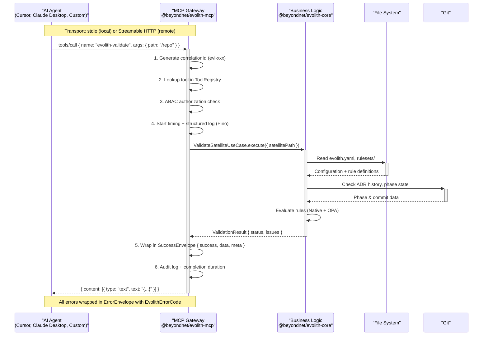

# @beyondnet/evolith-mcp

## Evolith MCP Gateway — First-Class Model Context Protocol Server

> **Bilingual navigation:** [Versión en Español](./README.es.md)

Decouples the MCP server from the CLI. It is a first-class product that exposes the MCP tools as a **Gateway** talking to `@beyondnet/evolith-core` (the reusable business-logic layer), instead of shelling out to CLI subprocesses.

---

## Table of contents

1. [Architecture diagram](#architecture-diagram)
2. [Transports](#transports)
3. [Installation and configuration](#installation-and-configuration)
4. [Authentication](#authentication)
5. [Available tools (55)](#available-tools-55)
6. [Available resources (12 + dynamic)](#available-resources-12--dynamic)
7. [Available prompts (8)](#available-prompts-8)
8. [Mutative operations](#mutative-operations)
9. [Internal architecture](#internal-architecture)
10. [Agent use cases](#agent-use-cases)
11. [Client configuration](#client-configuration)
12. [SmartCLI integration](#smartcli-integration)
13. [Extension guide](#extension-guide)
14. [Observability](#observability)
15. [Good practices](#good-practices)
16. [Troubleshooting](#troubleshooting)

---

## Architecture diagram



---

## Transports

| Transport | Use | Command |
|---|---|---|
| **stdio** (JSON-RPC 2.0) | Local agents, Cursor, Claude Desktop | `evolith-mcp serve` |
| **Streamable HTTP** (official MCP SDK) | Remote agents, scalability | `evolith-mcp serve --transport http --port 49100` |

> The **default port is `3000`** (`main.ts`: env `PORT` or `--port`, falling back to `3000`). The `49100` used in the examples is an arbitrary value, not the default.
>
> Logs are always written to **stderr** (Pino), because stdout is reserved for the JSON-RPC stream of the stdio transport.

---

## Installation and configuration

### Installation

```bash
# From the monorepo
npm install @beyondnet/evolith-mcp

# Or globally
npm install -g @beyondnet/evolith-mcp
```

### Usage

```bash
# stdio (default) — for Cursor, Claude Desktop, etc.
evolith-mcp serve

# HTTP — for remote integration
evolith-mcp serve --transport http --port 49100
```

### Environment variables

| Variable | Default | Description |
|---|---|---|
| `TRANSPORT` | `stdio` | Active transport: `stdio` or `http` |
| `PORT` | `3000` | Port for the HTTP transport |
| `MCP_HTTP_HOST` | `0.0.0.0` | Bind host of the HTTP server. Use `127.0.0.1` for local-only |
| `EVOLITH_API_KEY` | — | API key for authentication on the HTTP transport |
| `EVOLITH_MCP_ALLOW_NO_AUTH` | `false` | **HTTP only.** Allows HTTP to start without an API key (non-production only). Ignored in `production` and on `stdio` (which warns at startup) |
| `JWT_SECRET` | — | Optional secret used to validate a Bearer JWT (HS256) in addition to the API key |
| `NODE_ENV` | `development` | In `production`, HTTP auth is mandatory |
| `LOG_LEVEL` | `info` | Pino log level: `trace`, `debug`, `info`, `warn`, `error` |
| `REDIS_URL` | — | Redis URL for the resource cache (e.g. `redis://localhost:6379`). The cache is optional. |
| `OTEL_EXPORTER_OTLP_ENDPOINT` | — | OpenTelemetry endpoint for tracing |
| `OTEL_SERVICE_NAME` | `evolith-mcp` | Service name used in the traces |
| `EVOLITH_MCP_REQUEST_STATE_SECRET` | — | Key that seals the MRTR `requestState` (2026-07-28 path). Falls back to `EVOLITH_API_KEY`, then `JWT_SECRET`, then a per-process key. **Set it explicitly whenever more than one replica is served**, or an approval retry landing on another replica is rejected |
| `EVOLITH_MCP_RESOURCE_AUTH_SERVERS` | — | Comma-separated authorization server issuers published in the Protected Resource Metadata document. Defaults to `EVOLITH_MCP_OAUTH_ISSUER` |
| `EVOLITH_MCP_RESOURCE_URI` | request host | Canonical URI of this server (RFC 8707 resource identifier) published as `resource` |
| `EVOLITH_MCP_RESOURCE_SCOPES` | `read write` | Scopes published as `scopes_supported` and challenged in `WWW-Authenticate` |

> The binary also accepts the flags `--transport`/`-t`, `--port`/`-p`, `--api-key` and `--allow-no-auth` (**HTTP only**), as well as the `evolith-mcp version` subcommand.

---

## Authentication

### stdio transport

No request authentication is required: the process is local, single-user, and the agent runs it directly. The transport establishes an **explicit local session principal** (`id=local-stdio-session`, `role=local-session`, `roles=[local-session, operator]`, `scopes=[read, write]`) that is recorded in the audit trail of every call (GT-572).

This is **not** an authorization bypass: ABAC (native + OPA) is still evaluated on every `tools/call` with that identity, the `deploy` tools are still denied in `production` (they require `architect`), and every mutative tool still demands the HITL gate `{ apply, approvalToken }`. `--allow-no-auth` / `EVOLITH_MCP_ALLOW_NO_AUTH` **do not apply to stdio** (there is no request authentication to skip); if they are passed together with `--transport stdio`, the server warns about it on stderr at startup.

### HTTP transport

In production (`NODE_ENV=production`), authentication is **mandatory**: `validateAuth()` ignores `EVOLITH_MCP_ALLOW_NO_AUTH` and rejects every request without a valid credential (401). The value of `EVOLITH_API_KEY` is an arbitrary secret (any string; **no** prefix required) compared by equality. It is accepted in either of these two headers:

```
Authorization: Bearer <EVOLITH_API_KEY>
x-api-key: <EVOLITH_API_KEY>
```

`/health` is public (a liveness probe) and requires no credential.

When an OAuth issuer is configured, `/.well-known/oauth-protected-resource` (and the path-inserted `/.well-known/oauth-protected-resource/<path>`) is also public: it is the RFC 9728 document an **unauthenticated** client reads to discover which authorization server to go to, so gating it behind the credential it is trying to obtain would make discovery impossible. It carries no MCP data — only the issuer, the resource identifier and the scope names. A 401 from a protected resource additionally carries a `WWW-Authenticate: Bearer resource_metadata="…", scope="…"` challenge, which is the discovery mechanism MCP clients must prefer. Without an issuer the endpoint returns 404 rather than publishing a document with an empty `authorization_servers`.

Client registration never flows through this server: it is a resource server, and the 2026-07-28 revision has clients obtain a `client_id` from a Client ID Metadata Document (or pre-registration) at the authorization server. Dynamic Client Registration is deprecated and is not implemented here; `protected-resource-metadata.spec.ts` fails the build if a registration endpoint is ever introduced.

### Protocol revisions

The server answers two protocol revisions on the same HTTP endpoint:

| Revision | How a request selects it | Shape |
|---|---|---|
| `2026-07-28` (current) | `_meta["io.modelcontextprotocol/protocolVersion"]` on every request, or a `server/discover` call | Stateless. No `initialize`, no `notifications/initialized`, no `Mcp-Session-Id`. Every result carries `resultType`; the approval gate is expressed as an `InputRequiredResult` with a sealed `requestState` (MRTR) |
| `2025-11-25` | an `initialize` request | The handshake-based path served by `@modelcontextprotocol/sdk`, which mints and requires `Mcp-Session-Id` |

Both revisions run through **one** dispatch, so ABAC (native + OPA), the scope gate, the approval gate and the audit trail are the same code on either path. The `2025-11-25` path is retained because the published SDK still declares it as its latest revision; it is not an alternative design.

On the `2026-07-28` path a state-changing tool answers `resultType: "input_required"` with an `elicitation/create` request and an opaque `requestState`. The client gathers the human's approval and **retries the original call** — new JSON-RPC id, same parameters, plus `requestState` and `inputResponses`. The `requestState` is sealed with AES-256-GCM and bound to the principal, the tenant, the originating call and a short TTL, so it cannot be replayed across users, calls or time. A caller that already holds an approval may still pass `{ apply: true, approvalToken }` inline and skip the round trip, exactly as on the `2025-11-25` path.

> The `ApiKeyProvisioningService` (below) is an **advanced and optional** mechanism for issuing keys with an `evk_` prefix, a SHA-256 hash and a TTL. It is independent of the startup `EVOLITH_API_KEY` described here.

### API key provisioning

The `ApiKeyProvisioningService` manages the lifecycle of the keys:

| Operation | Description |
|---|---|
| `generateKey(label, options)` | Generates a key with an `evk_` prefix, a SHA-256 hash and a configurable TTL (90 days by default) |
| `validateKey(rawKey)` | Validates the key against the stored hash and checks expiry |
| `rotateKey(keyId)` | Revokes the current key and generates a new one for the same client |
| `revokeKey(keyId)` | Revokes a key immediately |

Keys carry scopes: `read`, `write`, `admin`. They are bound to a `tenant`.

### ABAC model

The `AbacEvaluator` controls which tools each user may invoke, based on their roles:

| Tool type | Allowed roles | Environment |
|---|---|---|
| Read (list, get, status) | Every authenticated role | Any |
| Write (fix, install, set) | `operator`, `sre`, `architect`, `admin` | Any |
| Write | `developer`, `qa` | Non-production only |
| Deploy (deploy, publish, merge) | `architect`, `admin`, `operator`, `sre` | Any |
| Deploy | Anyone except `architect` | **Blocked in production** |

**ABAC codes:**

| Code | Cause |
|---|---|
| `ABAC-01` | Tool denied for the user's role/environment |
| `ABAC-02` | User with no roles — every tool is denied |
| `ABAC-03` | Tool not classified into any known group |

**Tool classification (substring heuristic).** The internal role sets are `DEVELOPER = {developer, qa}`, `OPERATOR = {operator, sre}` and `ARCHITECT = {architect, admin}`. The read/write/deploy classification of each tool is a heuristic over its name (`abac-evaluator.ts`): it counts as **read** if the name contains `read`/`list`/`get` (or does not begin with `evolith-`); as **write** if it contains `write`/`replace`/`run`/`fix`/`advance`; as **deploy** if it contains `deploy`/`publish`/`merge`. Because of that heuristic, `evolith-phase-advance` is classified as **write** (the `advance` substring), even though it only proposes the transition. A tool that fits no group is rejected with `ABAC-03`.

**Authentication precedence (HTTP).** The guard (`mcp-server-auth.ts`) evaluates the **API key** first: if the `Authorization: Bearer <token>` or the `x-api-key` header matches `EVOLITH_API_KEY`, it grants an `admin` context (role `admin`, every tool allowed). Only if the key does not match and `JWT_SECRET` is defined does it try to validate the Bearer as a **JWT HS256**; in that case the `roles` in the JWT payload are what feed ABAC. `/health` is public. In production, auth is mandatory (it ignores `EVOLITH_MCP_ALLOW_NO_AUTH`).

---

## Available tools (55)

The tools are obtained at runtime via `tools/list`. All of them return raw data, which the Gateway wraps in a `SuccessEnvelope` or an `ErrorEnvelope`.

> The count is derived from the registration sources by the generated [Product Surface Inventory](../../../product/products/smart-cli/product-inventory.md) (`tools/*.ts`, `resources.service.ts`, `prompts.service.ts`); the tables below name every tool, grouped by area. When they disagree, `tools/list` and the inventory win.

### Validation

| Tool | Description | Mutative |
|---|---|---|
| `evolith-validate` | Validates a repository against the Evolith governance rules (GOV, INH, ACL, OCB) | No |
| `evolith-composable-validate` | Combinable multi-mode validation: SDLC, Architecture, Ruleset, ADR, Ad-hoc | No |

**`evolith-composable-validate` schema:**

```json
{
  "path": "string (required) — path to the satellite repository",
  "corePath": "string — path to the Evolith Core",
  "engine": "'native' | 'opa' — evaluation engine (default: native)",
  "topology": "'modular-monolith' | 'microservices' | 'serverless' | ... — enables Architecture mode",
  "phase": "'discovery' | 'design' | 'construction' | 'qa' | 'release' — enables SDLC mode (the schema also accepts the legacy aliases 'f1'..'f5', deprecated)",
  "ruleset": "string — enables Ruleset mode",
  "adr": "'adr-0002' | 'adr-0005' | 'adr-0010' | ... — enables ADR mode",
  "file": "string — enables Ad-hoc mode over a single file"
}
```

Modes are enabled by combining fields. Several of them can be used in a single call.

---

### Evaluation (ADR-0101)

| Tool | Description | Mutative |
|---|---|---|
| `evolith-evaluate` | Evaluates a canonical `EvaluationContext` (gates, artifacts, rules, compliance) and returns an `EvaluationResult` in the ADR-0073 envelope. Stateless: product, tenant and initiative are opaque context | No |
| `evolith-ruleset-list` | Lists the ruleset packs this Core can evaluate — the canonical refs accepted by `evolith-validate`'s `select`, with the rule count per pack | No |

---

### Architecture

| Tool | Description | Mutative |
|---|---|---|
| `evolith-architecture-validate` | Validates a satellite project against the architecture rules | No |
| `evolith-drift-detect` | Detects drift between the declared architecture and the real one | No |
| `evolith-topology-recommend` | Recommends a topology composition from technical signals (advisory, ADR-0104): the Core recommends, the tenant confirms | No |
| `evolith-phase-artifacts-evaluate` | Measures downstream-phase artifact completeness for a confirmed topology composition (advisory, ADR-0104) | No |

---

### Patterns

| Tool | Description | Mutative |
|---|---|---|
| `evolith-pattern-list` | Lists the canonical patterns and anti-patterns (`PAT-NNNN`), optionally filtered by category, kind or applicable topology | No |
| `evolith-pattern-get` | Gets one pattern by id: problem, forces, solution, applicability per topology, governing ADRs | No |
| `evolith-pattern-list-by-topology` | Lists the patterns that apply to a topology, how strongly (required → recommended → optional) and which rules each one imposes | No |

---

### Topologies

| Tool | Description | Mutative |
|---|---|---|
| `evolith-topology-list` | Lists every architecture topology available in Evolith Core | No |
| `evolith-topology-get` | Gets the full manifest of a topology by ID | No |

**`evolith-topology-list` schema:**

```json
{
  "corePath": "string — path to the Core (optional, default: ../evolith)"
}
```

**`evolith-topology-get` schema:**

```json
{
  "id": "string (required) — topology ID (e.g. modular-monolith)",
  "corePath": "string — path to the Core (optional)"
}
```

**Available topologies:** `modular-monolith`, `distributed-modules`, `microservices`, `serverless`, `edge-computing`, `event-driven`, `data-mesh`, `agentic-ai`

---

### SDLC gates

| Tool | Description | Mutative |
|---|---|---|
| `evolith-gate-evaluate` | Evaluates a specific SDLC phase gate | No |
| `evolith-phase-advance` | Proposes a phase transition | No¹ |

> ¹ `evolith-phase-advance` only proposes the transition — it does not execute it. Executing it is the responsibility of the operator or of the Tracker.

---

### SDLC

| Tool | Description | Mutative |
|---|---|---|
| `evolith-sdlc-status` | Gets the current SDLC phase state of the repository | No |
| `evolith-sdlc-handoff` | Runs the phase handoff, generating the evidence manifest | **Yes** |
| `evolith-dora-metrics` | Approximates DORA metrics from the Git history: deployment frequency, lead time (approx.), total and merge commits within the window (`days`, default 90) | No |
| `evolith-sdlc-generate` | Generates a Hexagonal Architecture scaffold from a Mermaid `classDiagram` in a Markdown DDD model (parity with `sdlc generate`) | **Yes** |

---

### MoSCoW

| Tool | Description | Mutative |
|---|---|---|
| `evolith-moscow-create` | Creates a MoSCoW matrix for a phase of the project | **Yes** |
| `evolith-moscow-load` | Loads an existing MoSCoW matrix | No |
| `evolith-moscow-update` | Updates items in the MoSCoW matrix | **Yes** |
| `evolith-moscow-remove` | Removes items from the matrix | **Yes** |
| `evolith-moscow-list` | Lists the MoSCoW matrices of the project | No |
| `evolith-moscow-validate` | Validates that the matrix is well formed | No |
| `evolith-moscow-report` | Generates a MoSCoW prioritization report | No |

> ² The three MoSCoW tools that write to `.evolith/moscow/{phase}.json` (`create`, `update`, `remove`) declare `mutative: true` in `moscow.tools.ts` since 2026-07-11, so the dispatcher demands `apply`/`approvalToken` for them; `load`, `list`, `validate` and `report` are reads.

---

### ADRs

| Tool | Description | Mutative |
|---|---|---|
| `evolith-adr-list` | Lists every Architecture Decision Record (id, title, status, date) | No |
| `evolith-adr-get` | Gets the full details of one ADR by id (`ADR-0001`) or number | No |
| `evolith-adr-matrix` | Gets the ADR matrix summary (totals by status, recent ADRs) | No |
| `evolith-adr-create` | Creates an ADR: writes `reference/architecture/adrs/<id>.md` and updates the matrix | **Yes** |
| `evolith-adr-update` | Updates the status of an ADR (Proposed, Accepted, Deprecated, Superseded, Amended) | **Yes** |

---

### Agents

| Tool | Description | Mutative |
|---|---|---|
| `evolith-agent-install` | Installs an Evolith agent in the repository | **Yes** |
| `evolith-agent-list` | Lists the installed agents | No |
| `evolith-agent-validate` | Validates the configuration of an agent | No |
| `evolith-agent-upgrade` | Upgrades an agent to the latest version of the template | **Yes** |
| `evolith-agent-remove` | Removes an agent from the repository | **Yes** |
| `evolith-agent-run` | Runs an intent through the Agent Runtime pipeline | **Yes** |

---

### Satellites

| Tool | Description | Mutative |
|---|---|---|
| `evolith-satellite-list` | Lists the registered satellites from the local `satellite-registry.json` | No |
| `evolith-satellite-status` | Gets the status and details of a registered satellite by id | No |
| `evolith-satellite-create` | Creates a satellite repository on GitHub and registers it (ADR-0073 envelope) | **Yes** |
| `evolith-satellite-adopt` | Adopts an existing GitHub repository as a satellite (ADR-0073 envelope) | **Yes** |

---

### Scaffolding and initialization

| Tool | Description | Mutative |
|---|---|---|
| `evolith-init-batch` | Non-interactive (batch/CI) initialization of a satellite; parity with `init --config <json>` / `init --yes`, without prompts | **Yes** |
| `evolith-scaffold` | Scaffolds a satellite along the progressive maturity axis (phase 1 modular-monolith → 2 distributed-modules → 3 microservices) | **Yes** |
| `evolith-docs-scaffold` | Scaffolds the base documentation Evolith requires (`README.md`, `AGENTS.md`, `MASTER_INDEX.md`, `evolith.yaml`); mirrors the `docs` command | **Yes** |
| `evolith-fixtures` | Seeds reproducible fixtures and sample data (`evolith.yaml`, ADRs, rulesets) for demos and tests | **Yes** |

---

### Upgrades

| Tool | Description | Mutative |
|---|---|---|
| `evolith-upgrade-plan` | Plans a satellite upgrade against the upstream Core (dry-run): change plan, breaking changes, estimated risk, nothing written | No |
| `evolith-upgrade-apply` | Applies a satellite upgrade from the upstream Core; upstream-only changes are written, local-only changes never are | **Yes** |

---

### Knowledge

| Tool | Description | Mutative |
|---|---|---|
| `evolith-knowledge-search` | Searches the architecture knowledge corpus (ADRs, rulesets, standards) with BM25-first hybrid retrieval; ranked chunks with citations | No |

---

### Remediation

| Tool | Description | Mutative |
|---|---|---|
| `evolith-auto-fix` | Applies automatic fixes to the detected violations | **Yes** |

---

### Configuration

| Tool | Description | Mutative |
|---|---|---|
| `evolith-config-get` | Gets configuration values from `evolith.yaml` | No |
| `evolith-config-set` | Updates values in `evolith.yaml` | **Yes** |

---

### Observability

| Tool | Description | Mutative |
|---|---|---|
| `evolith-metrics` | Returns internal MCP Gateway metrics (calls, latency, errors) | No |

### CLI parity reads (GT-682)

Three CLI commands that had no MCP counterpart, ported as read-only tools over the CLI's own readers in core-domain. Their write modes (`history --clear/--replay`, `profile create/switch/delete`, `standards --init/--validate/--export`) stay on the CLI.

| Tool | Description | Mutative |
|---|---|---|
| `evolith-history` | Reads the CLI command history (`$HOME/.evolith/history.jsonl`): `list`, `get`, `search`, `stats` | No |
| `evolith-profile` | Reads the CLI profile store: `current` (active profile and its values) or `list` | No |
| `evolith-standards` | Reads the standards under `<path>/reference/standards`: `list` (optional `category`) or `get` | No |

---

## Available resources (12 + dynamic)

Resources are obtained via `resources/list` and read via `resources/read`.

### Static resources (`resources/list`)

| URI | Name | Description |
|---|---|---|
| `evolith://rulesets` | Rulesets | Lists every ruleset of Evolith Core |
| `evolith://phase-gates` | Phase Gates | Definitions and requirements of the phase gates |
| `evolith://agents` | Agents | List of installed Evolith agents |
| `evolith://core/info` | Core Info | General Core information (version, total rulesets, capabilities) |
| `evolith://governance/version` | Governance Version | Version of the governance schema |
| `evolith://core/version` | Core Version | Version of the Core schema |
| `evolith://repository/config` | Repository Config | Contents of the current repository's `evolith.yaml` |
| `evolith://moscow/phase-0` | MoSCoW Phase 0 | MoSCoW matrix for the discovery phase |
| `evolith://architecture/topologies` | Architecture Topologies | List of every available topology |
| `evolith://architecture/patterns` | Architecture Patterns | Canonical patterns and anti-patterns (`PAT-NNNN`) with their applicability and enforcing rules |
| `evolith://capabilities` | Capability Manifest | Versioned capability manifest of the evaluation engine (`evaluationKinds`, engines, surfaces, `supportedConsumers`) |
| `evolith://contracts` | Machine Contracts | Machine-readable schema/contract set the Core publishes for external consumers |

### Dynamic URIs (reachable via `resources/read`)

| URI Pattern | Description |
|---|---|
| `evolith://ruleset/{name}` | Contents of a ruleset by name (e.g. `evolith://ruleset/governance/base`) |
| `evolith://agent/{name}` | Definition of an installed agent (e.g. `evolith://agent/winston`) |
| `evolith://architecture/topology/{id}` | Manifest of a topology (e.g. `evolith://architecture/topology/modular-monolith`) |
| `evolith://open-core/artifacts` | Open-Core boundary (OCB) rules |
| `evolith://acl/rules` | Anti-Corruption Layer rules |
| `evolith://moscow/{phase}` | MoSCoW analysis of any phase (e.g. `evolith://moscow/phase-1`) |

---

## Available prompts (8)

Prompts are obtained via `prompts/list` and invoked via `prompts/get`.

| Prompt | Description | Arguments |
|---|---|---|
| `evolith/validate-repository` | Validate a repository against the governance rules | `path` (req), `ruleset` (opt) |
| `evolith/agent-onboarding` | Install and configure a new agent | `name` (req), `template` (opt: standard/minimal/enterprise) |
| `evolith/architecture-review` | F1/F2/F3 architecture review | `path` (req), `level` (opt: F1/F2/F3) |
| `evolith/prepare-discovery` | Prepare the artifacts of the discovery phase | `path` (req) |
| `evolith/phase-gate-check` | Check phase gate readiness | `path` (req) |
| `evolith/sdlc-handoff` | Run the SDLC phase handoff | `path` (req), `fromPhase` (req), `toPhase` (req) |
| `evolith/ruleset-analysis` | Analyse compliance with a ruleset | `ruleset` (req), `path` (opt) |
| `evolith/moscow-prioritization` | Create a MoSCoW matrix for the SDLC | `path` (req), `phase` (opt, default: phase-0) |

---

## Mutative operations

Tools marked as mutative (`mutative: true`) require **explicit approval** in order to prevent accidental changes. The dispatcher ([`mcp-tool-dispatch.ts:137`](./src/mcp/mcp-tool-dispatch.ts)) rejects the call with `FORBIDDEN` unless the request carries **both** fields:

```json
{
  "name": "winston",
  "dir": "/path/to/repo",
  "apply": true,
  "approvalToken": "<non-empty-token>"
}
```

- `apply` must be exactly `true`.
- `approvalToken` must be a non-empty string. The server never logs it in the clear: it reduces it to a `sha256:…` fingerprint before auditing it.

> The `approvalToken` is the approval contract at the protocol level. Some tool schemas still declare a `confirm` field, and the helper `isMutationAllowed()` exists (it reads `mcp.allowMutations` from `evolith.yaml`), but **the guard that actually blocks execution in `handleCallTool` is `apply` + `approvalToken`** — neither `confirm` nor `mcp.allowMutations` replaces it.

### Mutative tools

| Tool | Operation |
|---|---|
| `evolith-agent-install` | Writes the agent files into the repository |
| `evolith-agent-upgrade` | Overwrites the agent configuration |
| `evolith-agent-remove` | Deletes the agent directory |
| `evolith-agent-run` | Runs an intent through the Agent Runtime (skills may write) |
| `evolith-config-set` | Modifies `evolith.yaml` |
| `evolith-sdlc-handoff` | Generates the handoff manifest and writes state |
| `evolith-sdlc-generate` | Writes a hexagonal scaffold from a DDD model |
| `evolith-auto-fix` | Applies automatic fixes to the code |
| `evolith-adr-create` / `evolith-adr-update` | Write an ADR file and the ADR matrix |
| `evolith-moscow-create` / `evolith-moscow-update` / `evolith-moscow-remove` | Write `.evolith/moscow/{phase}.json` |
| `evolith-satellite-create` / `evolith-satellite-adopt` | Create or link a GitHub repository and write the local satellite registry |
| `evolith-init-batch` / `evolith-scaffold` / `evolith-docs-scaffold` / `evolith-fixtures` | Write a satellite's files, documentation base or fixtures |
| `evolith-upgrade-apply` | Writes upstream changes into the satellite |

> Exactly **20** tools declare `mutative: true` in the code (2026-09-20; the other 35 are reads). The set is what the dispatcher protects by construction — a tool is guarded because it is mutative, not because it is listed here. `evolith-upgrade-plan` and `evolith-phase-advance` are deliberately reads: they compute and propose, they do not write.

---

## Internal architecture

The Gateway is a **NestJS** application (modules + dependency injection).

```
@beyondnet/evolith-mcp/
├── src/
│   ├── main.ts                         ← Bootstrap, parseArgs, stdio/HTTP startup
│   ├── app.module.ts                   ← Root module
│   ├── common/
│   │   ├── errors.ts                   ← ErrorCodes + DomainException
│   │   ├── envelopes.ts                ← SuccessEnvelope / ErrorEnvelope + correlationId
│   │   └── stderr-logger.ts            ← LoggerService over Pino → stderr
│   ├── mcp/
│   │   ├── mcp.module.ts
│   │   ├── tool.interface.ts           ← McpTool interface + MCP_TOOLS token
│   │   ├── tool-registry.service.ts    ← dynamic tool registry
│   │   ├── mcp-server.service.ts       ← MCP SDK Server + dispatch + transports
│   │   ├── mcp-tool-dispatch.ts        ← dispatch with ABAC + audit + mutative guard
│   │   ├── mcp-server-auth.ts          ← HTTP authentication (EVOLITH_API_KEY)
│   │   ├── abac-evaluator.ts           ← native ABAC evaluator + OPA
│   │   ├── api-key-provisioning.service.ts  ← API key lifecycle
│   │   ├── audit-logger.ts             ← structured log of every tool call
│   │   ├── mcp-cache.service.ts        ← resource cache in Redis
│   │   ├── metrics.service.ts          ← internal Gateway metrics
│   │   ├── prompts.service.ts          ← serves prompts/list and prompts/get
│   │   └── resources.service.ts        ← serves resources/list and resources/read
│   ├── tools/
│   │   ├── tools.module.ts             ← registers every tool
│   │   ├── validate.tool.ts            ← evolith-validate
│   │   ├── composable-validate.tool.ts ← evolith-composable-validate (GT-312)
│   │   ├── architecture.tools.ts       ← evolith-architecture-validate, drift-detect
│   │   ├── topology.tools.ts           ← evolith-topology-list, topology-get
│   │   ├── gate.tools.ts               ← evolith-gate-evaluate
│   │   ├── phase-advance.tools.ts      ← evolith-phase-advance
│   │   ├── sdlc.tools.ts               ← sdlc-status, sdlc-handoff, dora-metrics
│   │   ├── moscow.tools.ts             ← moscow-create/load/update/remove/list/validate/report
│   │   ├── agent.tools.ts              ← agent-install/list/validate/upgrade/remove
│   │   ├── auto-fix.tools.ts           ← evolith-auto-fix
│   │   ├── config.tools.ts             ← config-get, config-set
│   │   └── metrics.tool.ts             ← evolith-metrics
│   ├── resources/
│   │   └── corpus-resource.handler.ts  ← handler for documentary corpus resources
│   ├── watcher/
│   │   └── watcher.service.ts          ← watches workspace files for changes
│   └── domain/
│       └── domain.module.ts            ← wires @beyondnet/evolith-core to @beyondnet/evolith-infra-providers

@beyondnet/evolith-core               ← business logic (use-cases, validators, types)
@beyondnet/evolith-infra-providers    ← adapters (NodeFileSystem, YamlConfigParser, DiskRulesetRepository)
```

### WatcherService

`WatcherService` watches workspace files (e.g. `evolith.yaml`) in order to invalidate caches or trigger re-validations when the user edits the configuration while the Gateway is running. It is enabled automatically on the long-lived stdio transport.

### CorpusResourceHandler

Handles access to documentary corpus resources (ADRs, playbooks, specs) so that agents can read structured architectural context without invoking mutative tools.

---

## Agent use cases

### 1. Repository validation from Claude Desktop

```json
// prompts/get
{
  "name": "evolith/validate-repository",
  "arguments": { "path": "/Users/me/my-service" }
}
```

The prompt guides the agent to use `evolith-validate` and to report the blocking violations.

### 2. Agent onboarding from Cursor

```json
// prompts/get
{
  "name": "evolith/agent-onboarding",
  "arguments": { "name": "guardian", "template": "enterprise" }
}
```

The agent will invoke `evolith-agent-install` and `evolith-agent-validate` in sequence.

### 3. Automated architecture review

```json
// tools/call
{
  "name": "evolith-composable-validate",
  "arguments": {
    "path": "/repo",
    "topology": "modular-monolith",
    "phase": "design",
    "engine": "native"
  }
}
```

Combines SDLC and Architecture validation in a single call.

### 4. A full SDLC cycle with MoSCoW + gate check

```
1. tools/call evolith-sdlc-status     → current state of the phase
2. tools/call evolith-moscow-create   → create the prioritization matrix
3. tools/call evolith-gate-evaluate   → evaluate the gate of the current phase
4. tools/call evolith-sdlc-handoff    → generate the handoff manifest
5. tools/call evolith-phase-advance   → propose moving on to the next phase
```

### 5. Querying the topologies before validating

```json
// tools/call
{ "name": "evolith-topology-list" }
// → list of available topologies

{ "name": "evolith-topology-get", "arguments": { "id": "agentic-ai" } }
// → full manifest with rules and requirements
```

---

## Client configuration

### Cursor (`~/.cursor/config.json`)

```json
{
  "mcpServers": {
    "evolith": {
      "command": "evolith-mcp",
      "args": ["serve"],
      "env": {
        "LOG_LEVEL": "info"
      }
    }
  }
}
```

### Claude Desktop (`claude_desktop_config.json`)

```json
{
  "mcpServers": {
    "evolith": {
      "command": "evolith-mcp",
      "args": ["serve"]
    }
  }
}
```

### Custom agent (HTTP transport)

```bash
# Start the HTTP server
EVOLITH_API_KEY=evk_abc123 evolith-mcp serve --transport http --port 49100

# Call it from the agent
curl -X POST http://localhost:49100/mcp \
  -H "Authorization: Bearer evk_abc123" \
  -H "Content-Type: application/json" \
  -d '{"jsonrpc":"2.0","method":"tools/call","params":{"name":"evolith-validate","arguments":{"path":"/repo"}},"id":1}'
```

---

## SmartCLI integration

### Migration plan away from `evolith-cli mcp`

**Phase 1 — Coexistence (current):** `evolith-cli mcp` keeps working. `evolith-mcp serve` is the new entry point.

**Phase 2 — Deprecation:** `evolith-cli mcp` will emit a `console.warn`. Migrate the Cursor / Claude Desktop configurations to `evolith-mcp`.

**Phase 3 — Removal:** Drop the MCP code from `@beyondnet/evolith-cli` in a major version bump. The CLI keeps its validation commands.

### Behavioural differences

| Aspect | `evolith-cli mcp` (legacy) | `evolith-mcp` (new) |
|---|---|---|
| Transport | stdio only | stdio + Streamable HTTP |
| Auth | No auth | ABAC + API keys over HTTP |
| Cache | No cache | Optional Redis |
| Observability | Basic logs | Pino + OTEL + audit logger |
| Tools | A subset | The full 55 tools |

---

## Extension guide

To add a new tool:

1. Create `src/tools/my-tool.tool.ts` implementing `McpTool` (`schema`, `execute`; add `readonly mutative = true` if it changes state).
2. Inject whichever domain service it needs (from `@beyondnet/evolith-core`).
3. Return raw data — `McpServerService` wraps it automatically in a `SuccessEnvelope` and captures errors into an `ErrorEnvelope`.
4. Register the tool in `tools.module.ts`: add the provider and include it in the `MCP_TOOLS` factory.

```typescript
import { Injectable } from "@nestjs/common";
import { McpTool, McpToolSchema } from "../mcp/tool.interface";

@Injectable()
export class MyTool implements McpTool {
  readonly schema: McpToolSchema = {
    name: "evolith-my-tool",
    description: "Description of what it does",
    inputSchema: {
      type: "object",
      properties: { param1: { type: "string", description: "..." } },
      required: ["param1"],
    },
  };

  async execute(args: Record<string, unknown>): Promise<unknown> {
    if (!args.param1) throw new Error("param1 is required");
    return { ok: true };
  }
}
```

For mutative tools, add `readonly mutative = true`. The dispatcher will then demand `{ "apply": true, "approvalToken": "..." }` in the request before it runs the tool.

---

## Observability

### Pino logs → stderr

Every log goes to `stderr` (never `stdout`). Structured JSON format with `correlationId`, `tool`, `duration` and `success`.

```bash
# Follow the logs live (stdio)
evolith-mcp serve 2>&1 | grep '"level"'
```

### `evolith-metrics` tool

Returns the internal metrics of the Gateway:

```json
{
  "uptimeMs": 1820345,
  "totalCalls": 142,
  "totalFailures": 4,
  "tools": {
    "evolith-validate": { "calls": 80, "failures": 1, "totalLatencyMs": 1440, "avgLatencyMs": 18 },
    "evolith-gate-evaluate": { "calls": 32, "failures": 0, "totalLatencyMs": 992, "avgLatencyMs": 31 }
  },
  "recentErrors": ["RULESET_NOT_FOUND: ..."]
}
```

### OpenTelemetry

```bash
OTEL_EXPORTER_OTLP_ENDPOINT=http://otel-collector:4318 \
OTEL_SERVICE_NAME=evolith-mcp \
evolith-mcp serve
```

### Audit Logger

Every tool call is recorded with: `toolName`, `userId`, `tenant`, `environment`, `allowed` (ABAC), `durationMs` and `correlationId`. The records go to `stderr` in JSON format.

---

## Good practices

- **Use prompts as the entry point** for agent workflows — they spare the agent from having to reason out the sequence of tools.
- **Do not confirm mutative calls in bulk** without first validating with the equivalent read-only tools.
- **Run `evolith-validate` before `evolith-auto-fix`** so you know the real scope of the changes.
- **On production HTTP**, rotate the API keys every 90 days and restrict scopes to the minimum needed.
- **Redis is optional but recommended** on long-lived installations, to avoid repeated filesystem reads in `resources/read`.
- **Use `evolith-composable-validate`** instead of separate calls when several modes are needed — it cuts latency and correlates the results.

---

## Troubleshooting

### stdio: logs appear interleaved with the MCP response

Logs go to `stderr`. If the client merges stdout and stderr, separate the streams:

```bash
evolith-mcp serve 2>/tmp/mcp.log
```

### stdio: `Refusing to start the MCP stdio transport` (GT-572)

Under `NODE_ENV=production`, the stdio transport does **not** receive the `local-session` principal implicitly: it demands the same configured credential as any other production surface. Without it the server does **not** start — it fails loudly at startup on `stderr` and exits with code `78` (`EX_CONFIG`), instead of advertising all of its tools and then denying every `tools/call` with `FORBIDDEN`.

Fixes (any one of them):

```bash
export EVOLITH_API_KEY=<key>                                  # container: -e EVOLITH_API_KEY=<key>
evolith-mcp serve --transport stdio --api-key <key>
NODE_ENV=development evolith-mcp serve --transport stdio      # local development session
```

`--allow-no-auth` / `EVOLITH_MCP_ALLOW_NO_AUTH` is an **HTTP-only** development switch and deliberately does not stand in for the production credential.

### HTTP: `401 Unauthorized`

Check that `EVOLITH_API_KEY` is configured on the server and that the request sends the same value in `Authorization: Bearer <key>` or `x-api-key: <key>`. The value is compared for exact equality (no `evk_` prefix required). Under `NODE_ENV=production`, auth is mandatory even with `EVOLITH_MCP_ALLOW_NO_AUTH=true`.

### Tool not found (`Tool not found in registry`)

The tool may not be registered in `tools.module.ts`. Check that the provider has been added and that the name in `schema.name` matches exactly the one being invoked.

### `ABAC-02: No roles present`

The user context (`mcp-user-context`) carries no roles. On the HTTP transport, check that the JWT or the user context carries the role claims correctly.

### Redis unavailable

The cache degrades gracefully. Resources are served straight from the filesystem with no cache, and a warning is emitted in the logs.

### OPA: `policy.wasm not found`

The OPA evaluator requires `sdk/cli/rulesets/opa/policy.wasm` under `CORE_PATH`. The behaviour when a policy is missing is **fail-closed** (GT-348/349), not fail-open: if the file does not exist and `NODE_ENV === "production"`, the evaluator returns `allowed: false` with the `ABAC_POLICY_MISSING` violation (a hard denial). Only in **non-production** environments does the OPA evaluator abstain, returning `allowed: true` so that the native policy decides. An error inside the OPA engine always denies. To force native evaluation, do not specify `engine: "opa"`.

---

## License

ISC — Beyondnet
