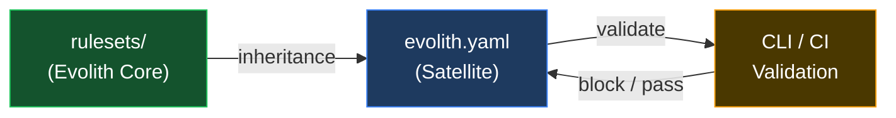

# Evolith Rulesets Hub

> **Navegación bilingüe:** [Versión en Español](./README.es.md)

Machine-readable governance rules that satellite repositories inherit and validate against.

---

## Purpose

> **Goal:** turn the human-authored constitution into automated, CI-enforceable rules that satellites cannot silently bypass.
>
> **Objectives:** version every rule, validate every artifact against a schema, and gate every phase transition automatically.

Evolith Rulesets are the **machine-readable enforcement layer** of the Evolith governance framework. While `reference/` contains human-authored standards, ADRs, and documentation, `rulesets/` contains the concrete rules, schemas, and contracts that tools (CLI, CI pipelines, linters) consume to **validate** satellite compliance.

### Source of truth

| Layer | Location | Authoritative for |
|---|---|---|
| Human standards / ADRs / constitution | `reference/**` | Intent, rationale, design (the *why*) |
| Native rulesets (`*.rules.json`) | `rulesets/<category>/*.rules.json` | The canonical machine-readable rule definition (the *what*) |
| JSON Schemas | `rulesets/schema/*.schema.json` | The structural contract of each artifact |
| OPA policies (`*.rego`) | `rulesets/opa/**` | Parity enforcement engine; must not drift from Native semantics |

Markdown explains, Native `*.rules.json` defines, schemas validate structure, and OPA + the Native evaluator both enforce. Where OPA and Native both apply, they must agree (Dual-Engine Parity).

> **Two independent axes.** The **SDLC axis** (idea → product, five phases with gates) is a *separate* concern from the **topology axis** (architecture groupers resolved through `topology.manifest.json`). Legacy `f1/f2/f3` are **not** SDLC phases — they are obsolete aliases of the *topology* progressive axis (`modular-monolith` → `distributed-modules` → `microservices`). Do not conflate "phase" in the SDLC sense with these topology aliases.

---

## Rule Categories

If you are onboarding a new satellite repository, read the categories in this order — from inheritance contract to artifact validation:

| Document | Description | Goal / Objective | Type | Mandatory |
|---|---|---|---|---|
| [Governance Rules](./governance/README.md) | `evolith.yaml` contract and inheritance rules | Govern satellite inheritance | Ruleset category | Yes |
| [Architecture Rules](./architecture/README.md) | Progressive-axis topology aliases (F1/F2/F3 → modular-monolith/distributed-modules/microservices) | Resolve topology aliases | Ruleset category | Yes |
| [ADR-Encoded Rules](./adr/README.md) | Rules derived from accepted ADRs | Enforce ADR decisions automatically | Ruleset category | Yes |
| [Cross-Cutting Rules](./cross-cutting/README.md) | Compliance baseline, Definition of Done, manifesto, and taxonomy rules | Enforce cross-cutting compliance | Ruleset category | Yes |
| [SDLC Rules](./sdlc/README.md) | Quality gates and threshold definitions | Enforce lifecycle quality | Ruleset category | Yes |
| [Anti-Corruption Layer Rules](./acl/README.md) | External system integration governance | Protect domain boundaries | Ruleset category | Yes |
| [CLI Rules](./cli/README.md) | Smart CLI release readiness and Core parity | Gate CLI releases | Ruleset category | Yes |
| [Evidence Rules](./evidence/README.md) | Auditable evidence manifests | Standardize evidence | Ruleset category | Yes |
| [MCP Rules](./mcp/README.md) | MCP protocol compliance | Validate MCP exposure | Ruleset category | Yes |
| [Observability Rules](./observability/README.md) | Telemetry evidence for operations | Verify telemetry evidence | Ruleset category | Yes |
| [Topology Rulesets](./topologies/README.md) | Executable topology-specific Native and OPA rules | Govern topology validation | Ruleset category | Yes |
| [Schemas](./schema/README.md) | JSON Schema for validating Evolith artifacts | Validate artifact structure | Schema collection | Yes |
| [OPA Policies](./opa/README.md) | OPA policies and their input schemas | Validate governance and architectural rules | Policy collection | Yes |

---

## Directory Structure

```
rulesets/
├── compliance-baseline/        # WS1 executable compliance baseline entrypoint
│   └── compliance-baseline.rules.json
├── definition-of-done/         # WS1 executable Definition of Done entrypoint
│   └── definition-of-done.rules.json
├── engineering-manifesto/      # WS1 executable Engineering Manifesto entrypoint
│   └── engineering-manifesto.rules.json
├── repository-taxonomy/        # WS1 executable Repository Taxonomy entrypoint
│   └── repository-taxonomy.rules.json
├── phase-gates/                # WS1 executable SDLC phase-gates entrypoint
│   └── phase-gates.rules.json
├── quality-thresholds/         # WS1 executable quality-thresholds entrypoint
│   └── quality-thresholds.rules.json
├── satellite-contracts/        # WS1 executable Satellite Contracts entrypoint
│   └── satellite-contracts.rules.json
├── opa/                        # OPA policies and input schemas
│   ├── schemas/                # OPA policy input schemas (26 schemas)
│   ├── *.rego                  # Rego policy files (34 non-test; main.rego aggregates)
│   └── README.md               # OPA index
├── schema/                     # JSON Schema definitions (36 schemas)
│   ├── adr.schema.json         # ADR artifact validation
│   ├── prd.schema.json         # PRD artifact validation
│   ├── discovery-canvas.schema.json     # Phase 1
│   ├── technical-feasibility.schema.json # Phase 1
│   ├── ballpark-estimation.schema.json   # Phase 1
│   ├── evolith-user-story.schema.json    # Phase 1
│   ├── agile-backlog.schema.json          # Phase 1
│   ├── cli-impact-analysis.schema.json   # Phase 1-2
│   ├── functional-story.schema.json      # Phase 2
│   ├── technical-story.schema.json       # Phase 3
│   ├── test-summary-report.schema.json   # Phase 4
│   ├── release-notes.schema.json         # Phase 5
│   ├── evolith-yaml.schema.json          # Satellite governance
│   └── topology-manifest.schema.json     # Topology manifest contract
├── architecture/               # Topology progressive-axis alias index (F1/F2/F3 → topologies)
│   └── README.md               # Resolves aliases through topology manifests
├── topologies/                 # Topology-specific executable rules
│   └── README.md
├── adr/                        # ADR-encoded rules (7 top-level + adr/generated/)
│   ├── adr-0002-hexagonal-architecture.rules.json
│   ├── adr-0005-cicd-quality-gates.rules.json
│   ├── adr-0018-testing-pyramid.rules.json
│   ├── adr-0032-protocol-selection.rules.json
│   ├── adr-0040-multi-runtime.rules.json
│   ├── adr-0050-gitflow-branching.rules.json
│   ├── adr-0010-multi-tenancy.rules.json
│   └── generated/              # 108 auto-generated *.rules.json (one per accepted ADR); do not hand-edit
├── cross-cutting/              # Standalone full copies (NOT symlinks/aliases); content diverges from the canonical files
│   ├── compliance-baseline.rules.json    # divergent copy of compliance-baseline/compliance-baseline.rules.json
│   ├── definition-of-done.rules.json     # divergent copy of definition-of-done/definition-of-done.rules.json
│   ├── engineering-manifesto.rules.json  # divergent copy of engineering-manifesto/engineering-manifesto.rules.json
│   └── repository-taxonomy.rules.json    # divergent copy of repository-taxonomy/repository-taxonomy.rules.json
├── acl/                        # Anti-Corruption Layer rules
│   ├── anti-corruption-layer.rules.json  # ACL enforcement
│   └── anti-corruption-layer.rules.es.json
├── contracts/                  # Machine contracts + fixtures (evolith-machine-contracts.json)
├── executive-scorecards/       # DORA + SPACE scorecard rules (also mirrored under governance/)
│   └── executive-scorecards.rules.json
├── tenants/                    # Multi-tenancy tenant rules and example overrides
├── infrastructure/             # Helm + OPA-sidecar rules (helm-enforcement, opa-sidecar-bundle)
│   └── opa/                    # Co-located *.rego sources (see note below on opa/infrastructure/)
├── sdlc/                       # SDLC gate rules
│   ├── phase-gates.rules.json
│   ├── quality-thresholds.rules.json
│   └── dependency-pinning.rules.json
├── cli/                        # Smart CLI release and parity rules
│   ├── release-readiness.rules.json
│   └── core-parity.rules.json
├── evidence/                   # Auditable evidence contract
│   └── evidence-manifest.rules.json
├── mcp/                        # MCP protocol exposure rules
│   └── protocol-compliance.rules.json
├── observability/              # Telemetry evidence rules
│   └── telemetry-evidence.rules.json
└── governance/                 # Federated governance rules
    ├── inheritance.rules.json
    ├── satellite-contracts.rules.json
    ├── open-core-boundary.rules.json  # Core vs Enterprise separation
    └── executive-scorecards.rules.json  # DORA + SPACE metrics (mirror of executive-scorecards/)
```

> **Duplicate-source notes.** A few areas keep more than one copy of the same logical rules; this is a known state, not a guarantee of identical content:
> - `cross-cutting/*.rules.json` are full standalone copies of the domain-specific files (`compliance-baseline/`, `definition-of-done/`, `engineering-manifesto/`, `repository-taxonomy/`) and their content currently **diverges** from those canonical sources — they are not aliases or symlinks.
> - `executive-scorecards.rules.json` exists both at the top level (`executive-scorecards/`) and under `governance/`.
> - The infrastructure Rego lives under both `infrastructure/opa/*.rego` and `opa/infrastructure/*.rego` with differing file sizes; the policies aggregated by `main.rego` are the ones under [`opa/infrastructure/`](./opa/README.md).

---

The canonical topology rule artifact is the file declared by each `topology.manifest.json`. Progressive-axis artifacts are present in **two** locations: the executable copies under [`rulesets/topologies/progressive-axis/`](./topologies/README.md) (`{topology}.rules.json`, plus `.rego`/`.wasm`/`topology.manifest.json` where compiled) and the deep-dive copies under `reference/core/architecture/topologies/progressive-axis/`. Consumers must resolve the manifest (which names the authoritative file) rather than construct legacy `rulesets/architecture/f*.rules.json` paths.

## How Rulesets Work



1. **Evolith Core** publishes rulesets
2. **Satellites** declare `evolith.yaml` inheriting specific rule versions
3. **CLI / CI** validates satellite against inherited rules
4. **Failures** block phase gates or merge

---

## Key Principles

| Principle | Description |
|---|---|
| **Versioned rules** | Every rule has a version; satellites pin to a specific version |
| **Fail-fast validation** | CI must fail on rule violations; no bypass without explicit waiver |
| **Topology-aware** | `f1/f2/f3` are obsolete aliases of the *topology* progressive axis (modular-monolith → distributed-modules → microservices); topology manifests drive broader topology-specific validation. They are not SDLC phases. |
| **Federated inheritance** | Satellites inherit from Core; they do not modify Core rules |
| **Schema-first** | All artifacts have JSON Schema for machine validation |

---

## Related Documents

| Document | Description | Goal / Objective | Type | Mandatory |
|---|---|---|---|---|
| [CONTRIBUTING.md](../CONTRIBUTING.md) | Clone/dev-setup, tests, branch/commit/PR conventions, ruleset/OPA/schema authoring standards | Onboard contributors | Contribution guide | Yes |
| [AGENTS.md](../AGENTS.md) | Agent rules and conventions | Govern agent contributions | Standard | Yes |
| [Repository Taxonomy](../reference/governance/standards/repository-taxonomy.md) | What goes where in Evolith | Keep the repository organized | Governance standard | Yes |
| [Child Repository Inheritance](../reference/core/foundations/inheritance-model/child-repository-inheritance-guide.md) | How products inherit from Evolith | Standardize inheritance | Guide | Yes |
| [Navigation Hub](../reference/navigation/README.md) | Full repository navigation | Centralize navigation | Navigation hub | No |

---

<div align="center">
  <sub>Evolith — Enterprise Architecture Platform | Rulesets Hub</sub>
</div>
