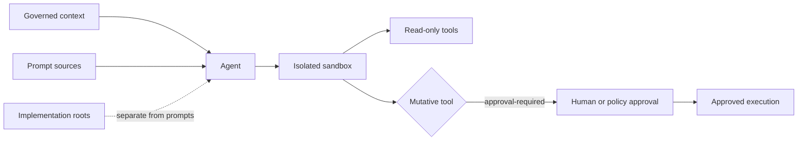

# Agentic AI Topology Profile

> **Bilingual Navigation:** [Version en Espanol](./README.es.md)

**Status:** Accepted
**Dimension:** `ai`
**Topology ID:** `agentic-ai`
**Manifest:** [topology.manifest.json](./topology.manifest.json)

Agentic AI is the topology for systems where an AI agent can inspect context, plan work, call tools, or propose changes. It is composable with every progressive-axis profile; it is not a delivery phase or a substitute for product ownership.

## Purpose and Scope

Use this profile when an agent has access to repository, service, or operational context. The profile governs the agent boundary, not the model vendor or orchestration framework.

Every adopting satellite MUST provide `agent.config.json`. The native evaluator and the OPA policy enforce the same controls.

**Read the `Assurance` column before you rely on a green verdict.** `observed` means the evaluation inspected the repository — it opened the declared directories, read the runbook, or scanned the declared implementation roots. `declared` means the verdict was decided by comparing fields in `agent.config.json`: a satellite that declares a sandbox it does not have will pass. That is a real limit of a static evaluation and is stated here rather than left for a buyer to discover.

| Rule | Required control | Assurance |
|---|---|---|
| AAI-R01 | Stable agent identity and one or more declared capabilities | `declared` |
| AAI-R02 | An isolated sandbox with deny or allowlist network and process access | `declared` |
| AAI-R03 | Non-overlapping prompt sources and implementation roots | `observed` |
| AAI-R04 | `approval-required` policy for mutative tools | `declared` |
| AAI-R05 | Ephemeral execution with bounded duration, memory, and CPU | `declared` |
| AAI-R06 | Untrusted context treated as data with provenance and schema validation | `declared` |
| AAI-R07 | Capability-scoped delegation and append-only correlated action evidence | `declared` |
| AAI-R08 | Positive token and context ceilings, bounded MCP concurrency, and a readable runbook path | `observed` |
| AAI-R09 | Bounded delegation, credential rotation cadence, and incident revocation | `declared` |
| AAI-R10 | Declared implementation roots free of raw sockets and environment-inheriting child processes (advisory) | `observed` |

## Configuration Contract

`agent.config.json` is a portable declaration, not a runtime-specific agent framework file. It keeps prompts, deterministic implementation, and execution permissions independently reviewable.

```json
{
  "agent": {
    "id": "architecture-reviewer",
    "capabilities": ["read-architecture", "review-changes"]
  },
  "sandbox": {
    "mode": "isolated",
    "network": "allowlist",
    "process": "deny",
    "ephemeral": true,
    "maxDurationSeconds": 30,
    "maxMemoryMb": 512,
    "maxCpuCores": 1
  },
  "promptSources": ["prompts"],
  "implementationRoots": ["src/agents"],
  "contextPolicy": {
    "untrustedContent": "data-only",
    "provenanceRequired": true,
    "toolOutputSchemaValidation": true
  },
  "toolPolicy": {
    "mutative": "approval-required",
    "capabilityDelegation": "scoped-and-expiring"
  },
  "audit": {
    "appendOnly": true,
    "correlationId": "required"
  },
  "operationalBudgets": {
    "maxPromptTokens": 16000,
    "maxCompletionTokens": 4000,
    "maxContextWindowTokens": 128000,
    "mcpToolConcurrency": {
      "maxInFlight": 4,
      "perToolMaxInFlight": 2
    },
    "runbooksPath": "docs/agentic-ai-runbooks.md"
  },
  "credentialLifecycle": {
    "delegationMaxTtlSeconds": 900,
    "rotationCadenceDays": 30,
    "revocation": {
      "onIncident": "immediate",
      "maxPropagationSeconds": 60
    }
  }
}
```

The declared prompt and implementation paths MUST not overlap. A capability is not permission: the sandbox and tool policy are the execution authority. Untrusted context remains data, never authority; every action carries a scoped capability and append-only correlated evidence.

## Operational Contract

`operationalBudgets` declares enforceable ceilings for one execution. `maxPromptTokens` limits supplied instructions and context, `maxCompletionTokens` limits generated output, and `maxContextWindowTokens` limits the combined model context. `mcpToolConcurrency.maxInFlight` caps all concurrent tool calls; `perToolMaxInFlight` prevents a single tool from consuming the whole budget. An adopter MUST choose values appropriate to its approved model and capacity, and MUST point `runbooksPath` to its maintained incident guide.

`credentialLifecycle` limits delegated authority to `delegationMaxTtlSeconds`, requires rotation no less frequently than `rotationCadenceDays`, and defines how quickly incident revocation reaches every executor. `onIncident` SHOULD be `immediate`; `scheduled` is permitted only when a documented operational dependency prevents immediate revocation. The topology reference runbooks are [available here](./runbooks.md).

## Interaction and Security Boundary



The sandbox is the only route to tool execution. Prompts provide instructions; implementation roots contain deterministic code. Neither can silently grant network, process, or mutative access.

## Governing Decisions and Validation

[ADR-0058](../../../../reference/core/architecture/adrs/core/0058-ai-consumable-architecture-knowledge.md) governs AI-consumable architecture knowledge. [ADR-0081](../../../../reference/core/architecture/adrs/core/0081-agentic-ai-sandbox-isolation.md), [ADR-0082](../../../../reference/core/architecture/adrs/core/0082-agentic-ai-trust-boundary.md), and [ADR-0083](../../../../reference/core/architecture/adrs/core/0083-agentic-ai-action-authorization-audit.md) establish the sandbox, trust, and authorization boundaries. [ADR-AI-001](../../../../reference/core/foundations/common-rules/ai-augmented/06-adrs/adr-ai-001-harness-strategy.md) and [ADR-AI-005](../../../../reference/core/foundations/common-rules/ai-augmented/06-adrs/adr-ai-005-human-in-the-loop-policy.md) remain supporting proposed decisions.

Run the profile through the topology-aware validator:

```bash
evolith validate --topology agentic-ai
```

The native ruleset is [agentic-ai.rules.json](./agentic-ai.rules.json); its equivalent OPA policy is [agentic-ai.rego](./agentic-ai.rego). Both evaluate the same `agent.config.json` contract.

## Business Boundary

This profile is technical-only. It does not define business ownership, prioritization, ROI, cost, budget, staffing, delivery timing, or Funnel 0. Evolith Tracker owns those concerns through its ACL.

## Corpus Navigation

The Agentic AI corpus is the required implementation baseline for this topology:

| Area | Guidance |
|---|---|
| Adoption | [Adoption guide](./adoption.md) |
| Operations | [Operations guide](./operations.md) |
| Security | [Security guide](./security.md) |
| Resilience | [Resilience guide](./resilience.md) |
| Design | [Patterns and anti-patterns](./patterns.md) |
| Evolution | [Evolution guide](./evolution.md) |
| Summary | [Adoption, operations, and evolution guide](./maturity.md) |

This corpus implements the [Topology Corpus Standard](../../../../reference/core/architecture/topologies/topology-corpus-standard.md) for Agentic AI. A profile is not ready for acceptance until all of these guides, executable controls, contract fixtures, tests, and control-plane interfaces are present and validated.

---
[Back to Topology Hub](../../README.md)
