# Arquitectura del Smart CLI

> **Audiencia:** Desarrolladores, Arquitectos, Ingenieros DevOps  
> **Propósito:** Documentar la arquitectura del sistema, componentes, modelos de datos y flujos del Evolith Smart CLI  
> **Bilingual:** [English](./ARCHITECTURE.md)

---

## Tabla de Contenidos

1. [Visión General del Sistema](#1-visión-general-del-sistema)
2. [Arquitectura de Componentes](#2-arquitectura-de-componentes)
3. [Flujo de Comandos](#3-flujo-de-comandos)
4. [Modelos de Datos](#4-modelos-de-datos)
5. [Máquina de Estados de Fase](#5-máquina-de-estados-de-fase)
6. [Diagramas de Secuencia](#6-diagramas-de-secuencia)
7. [Despliegue de Infraestructura](#7-despliegue-de-infraestructura)
8. [Requisitos Técnicos](#8-requisitos-técnicos)

---

## 1. Visión General del Sistema

### 1-1 Arquitectura de Alto Nivel

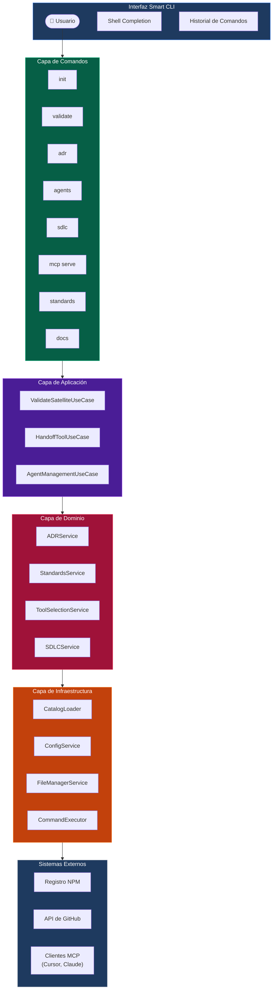

---

## 2. Arquitectura de Componentes

### 2-1 Capas de Clean Architecture

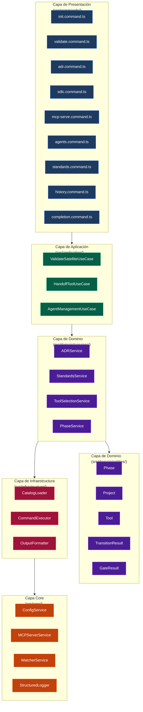

### 2-2 Arquitectura del Servidor MCP

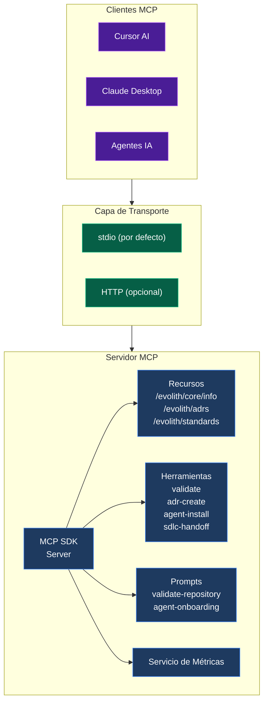

---

## 3. Flujo de Comandos

### 3-1 Flujo de Resolución de Comandos

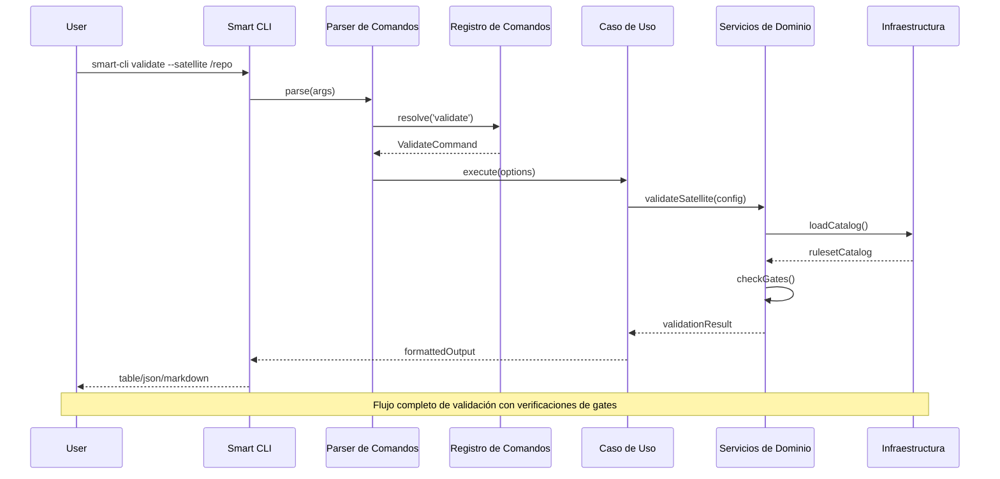

### 3-2 Flujo del Comando Init

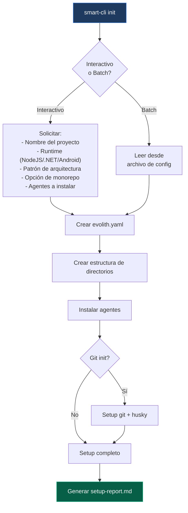

---

## 4. Modelos de Datos

### 4-1 Diagrama de Entidad-Relación

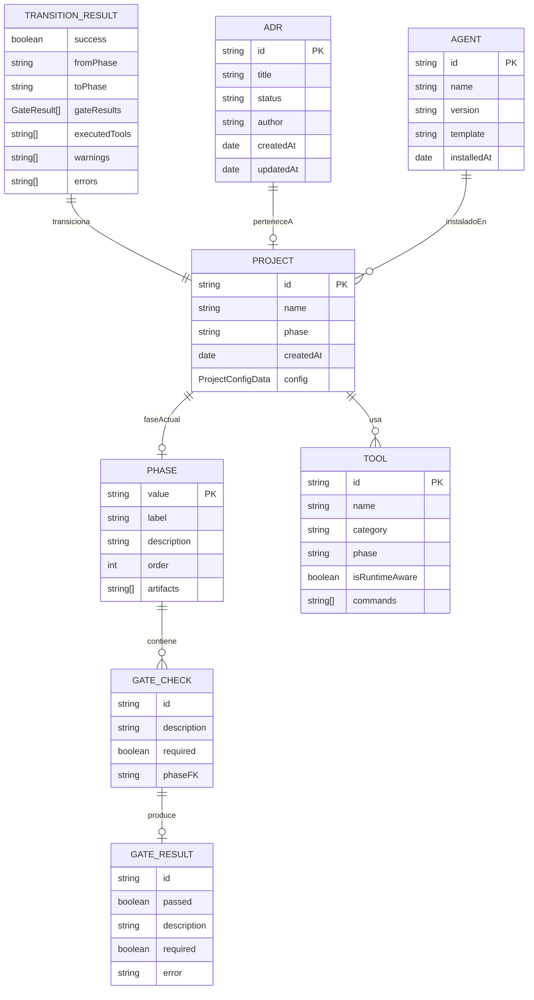

### 4-2 Esquema de Configuración del Proyecto

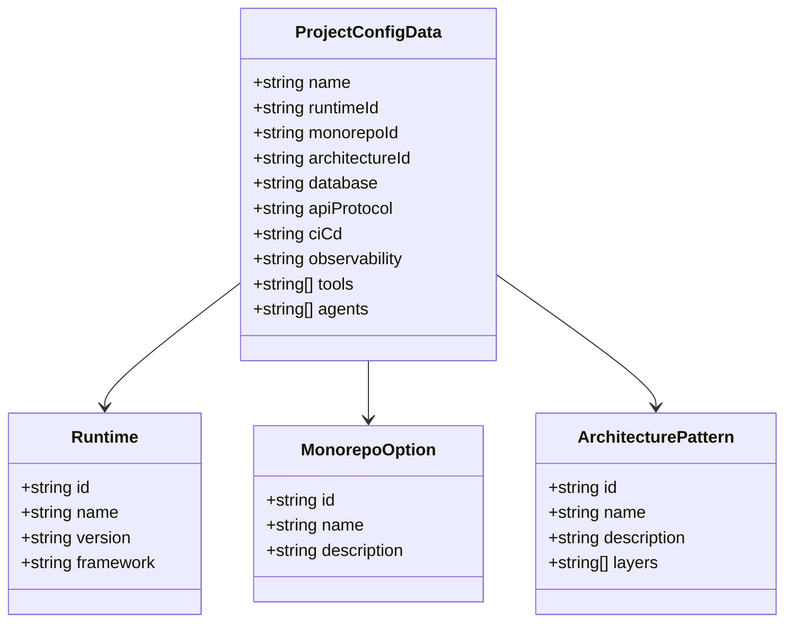

### 4-3 Esquema del Catálogo de Herramientas

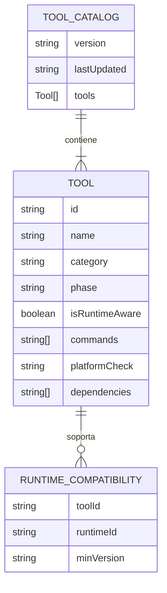

---

## 5. Máquina de Estados de Fase

### 5-1 Transiciones de Fase SDLC

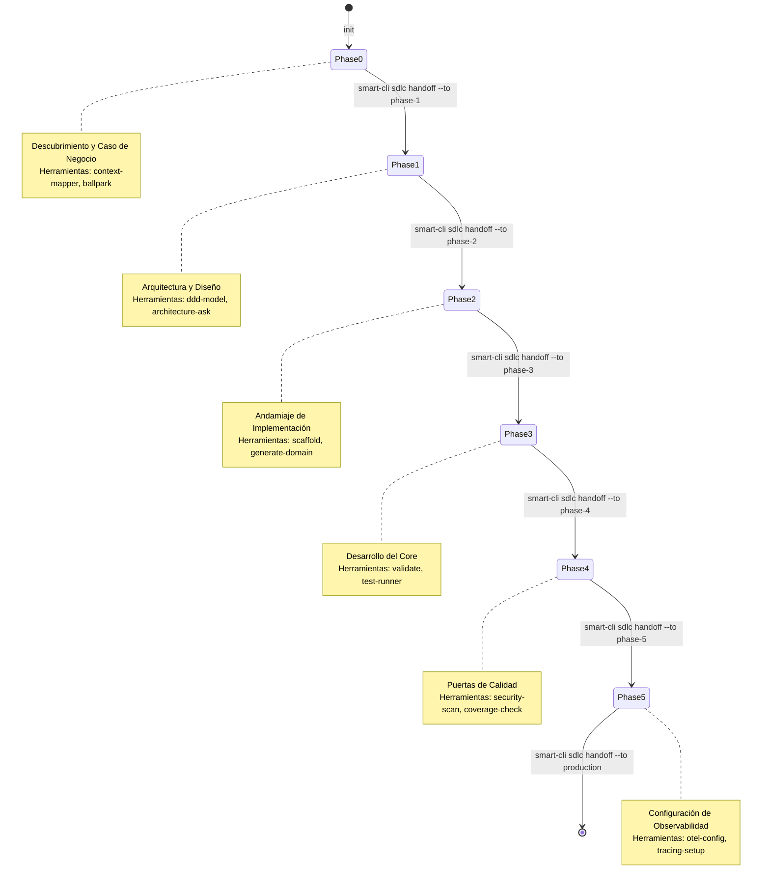

### 5-2 Flujo de Verificación de Gates

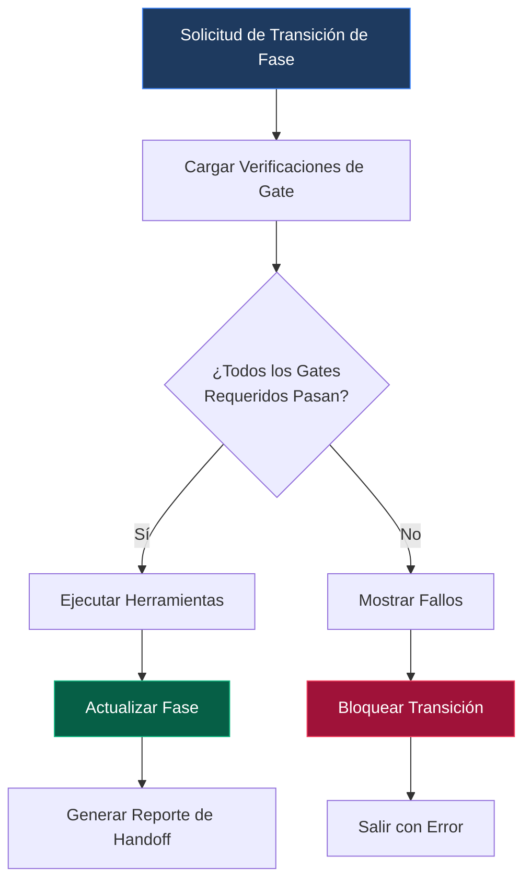

---

## 6. Diagramas de Secuencia

### 6-1 Invocación de Herramienta MCP: validate

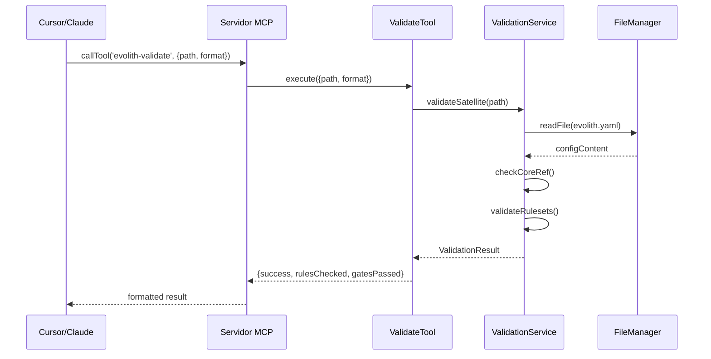

### 6-2 Flujo de Instalación de Agente

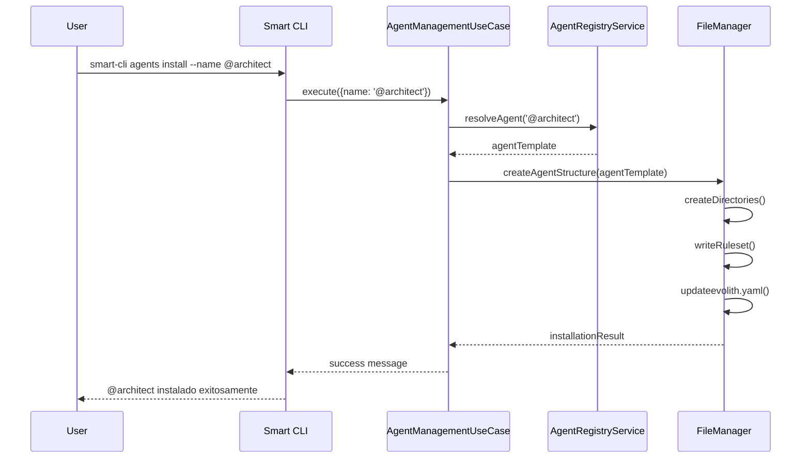

---

## 7. Despliegue de Infraestructura

### 7-1 Arquitectura de Despliegue

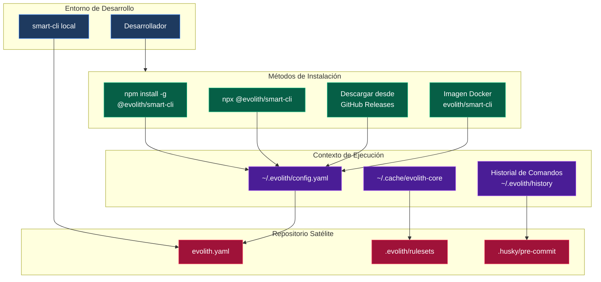

### 7-2 Estructura del Sistema de Archivos

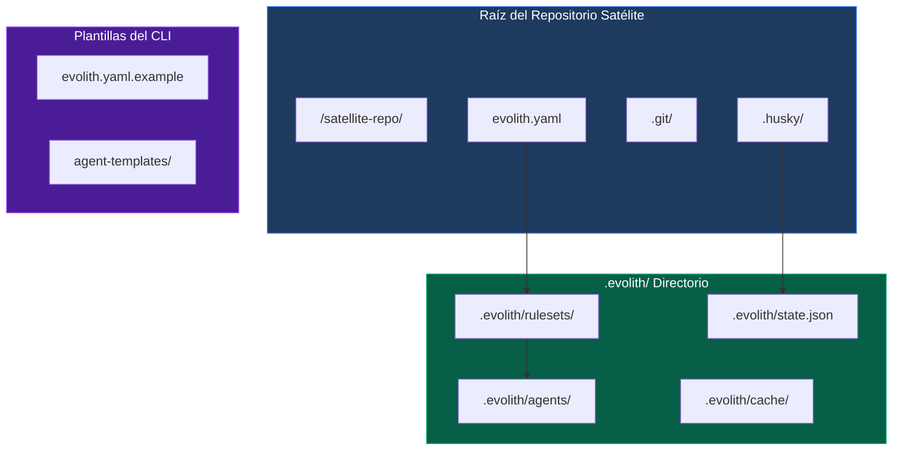

---

## 8. Requisitos Técnicos

### 8-1 Requisitos de Runtime

| Requisito | Versión | Notas |
|-----------|---------|-------|
| Node.js | >= 18.0.0 | LTS recomendado |
| npm | >= 9.0.0 | Para instalación global |
| Git | >= 2.30 | Para operaciones git |
| Memoria | 512MB min | Para servidor MCP |
| Disco | 200MB min | Para CLI + cache |

### 8-2 Dependencias

| Paquete | Versión | Propósito |
|---------|---------|-----------|
| @nestjs/common | ^11.1.24 | DI y modularidad |
| @nestjs/core | ^11.1.24 | Runtime de NestJS |
| nest-commander | ^3.20.1 | Framework CLI |
| @clack/prompts | ^1.5.1 | UI interactiva |
| @modelcontextprotocol/sdk | ^1.29.0 | Protocolo MCP |
| chalk | ^4.1.2 | Salida con colores |
| yaml | ^2.9.0 | Parseo de config |
| chokidar | ^5.0.0 | Watcher de archivos |
| fs-extra | ^11.3.5 | Operaciones de archivos |
| ora | ^9.4.0 | Spinners |

### 8-3 Variables de Entorno

| Variable | Por Defecto | Propósito |
|----------|-------------|-----------|
| `EVOLITH_CONFIG_PATH` | `~/.evolith` | Directorio de config |
| `EVOLITH_LOG_LEVEL` | `info` | Nivel de logging |
| `EVOLITH_CORE_PATH` | `../evolith` | Referencia al core |
| `EVOLITH_PROFILE` | `default` | Perfil de config |
| `EVOLITH_NO_CACHE` | `false` | Skip cache |
| `EVOLITH_FORCE_COLOR` | `auto` | Forzar colores |

---

## Apéndice: Esquema de Configuración

```yaml
# evolith.yaml - Configuración del Satélite
apiVersion: evolith.dev/v1
kind: Satellite

coreRef:
  version: "1.0.0"
  path: "../evolith"

governance:
  version: "1.0"
  adrRegistry:
    - id: "ADR-0001"
      status: "accepted"

product:
  name: "my-project"
  type: "library"
  runtime: "typescript"

sdlc:
  currentPhase: "phase-1"
  phaseHistory:
    - phase: "phase-0"
      enteredAt: "2026-01-15T10:00:00Z"
      exitedAt: "2026-01-20T14:30:00Z"

agents:
  installed:
    - name: "@architect"
      version: "1.0.0"
      installedAt: "2026-01-15T10:05:00Z"
```

---

## Versión del Documento

| Versión | Fecha | Autor | Cambios |
|---------|------|-------|---------|
| 1.0.0 | 2026-06-06 | Equipo Evolith | Documentación inicial de arquitectura |

---

## Ver También

- [Guía de Integración MCP](./docs/MCP-INTEGRATION.md)
- [Catálogo de Comandos](./docs/planning/cli-command-catalog.md)
- [ADR-0069: Implementación del Protocolo Servidor MCP](../../../reference/core/architecture/adrs/core/0069-ai-agent-context-protocol-integration.es.md)