# Evolith CLI Architecture

> **Audience:** Developers, Architects, DevOps Engineers  
> **Purpose:** Document the system architecture, components, data models, and flows for the Evolith Evolith CLI  
> **Bilingual:** [Español](./ARCHITECTURE.es.md)

---

## Table of Contents

1. [System Overview](#1-system-overview)
2. [Component Architecture](#2-component-architecture)
3. [Command Flow](#3-command-flow)
4. [Data Models](#4-data-models)
5. [Phase State Machine](#5-phase-state-machine)
6. [Sequence Diagrams](#6-sequence-diagrams)
7. [Infrastructure Deployment](#7-infrastructure-deployment)
8. [Technical Requirements](#8-technical-requirements)

---

## 1. System Overview

### 1-1 High-Level Architecture

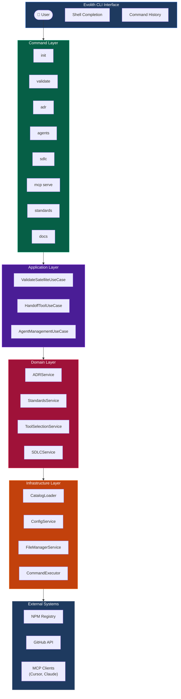

---

## 2. Component Architecture

### 2-1 Clean Architecture Layers

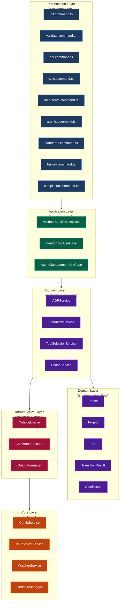

### 2-2 MCP Server Architecture

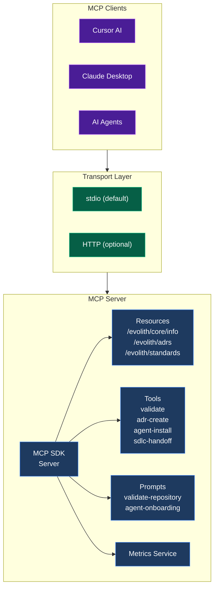

---

## 3. Command Flow

### 3-1 Command Resolution Flow

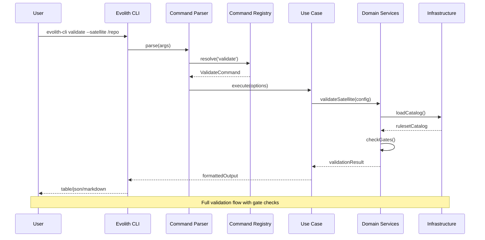

### 3-2 Init Command Flow

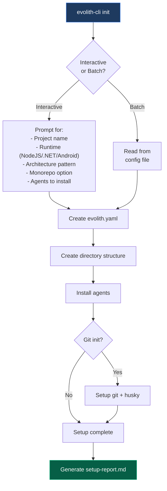

---

## 4. Data Models

### 4-1 Entity Relationship Diagram

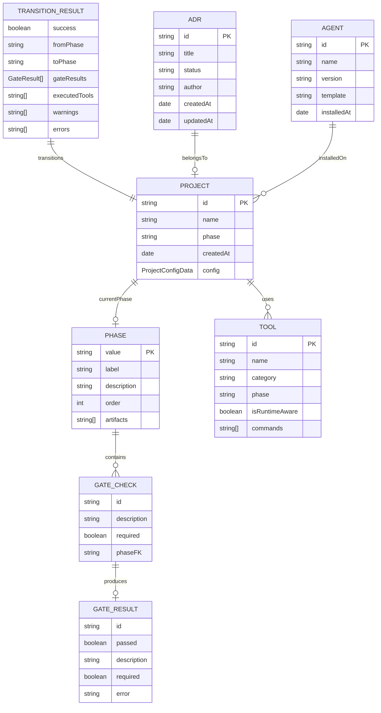

### 4-2 Project Configuration Schema

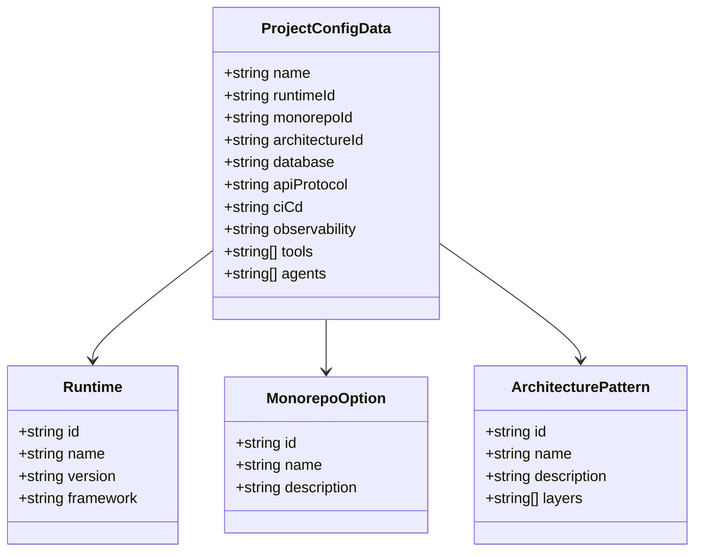

### 4-3 Tool Catalog Schema

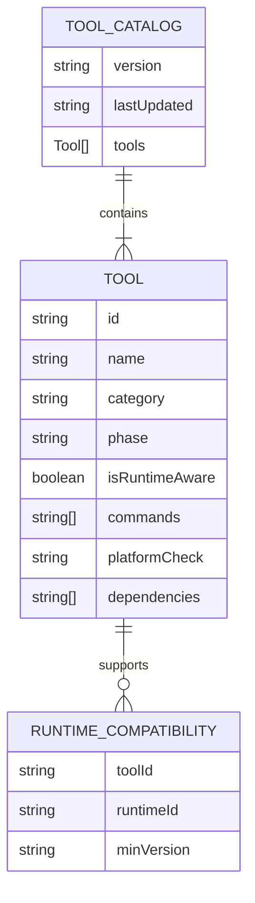

---

## 5. Phase State Machine

### 5-1 SDLC Phase Transitions

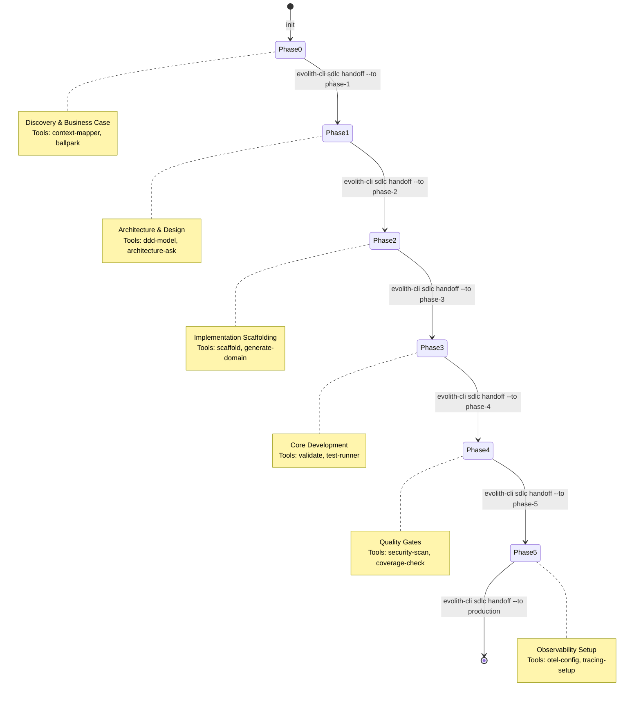

### 5-2 Gate Check Flow

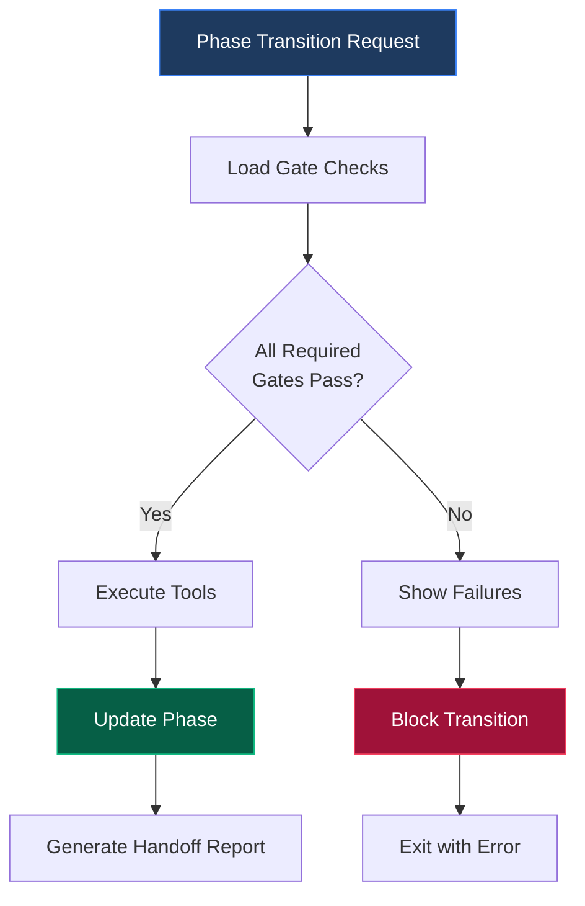

---

## 6. Sequence Diagrams

### 6-1 MCP Tool Invocation: validate

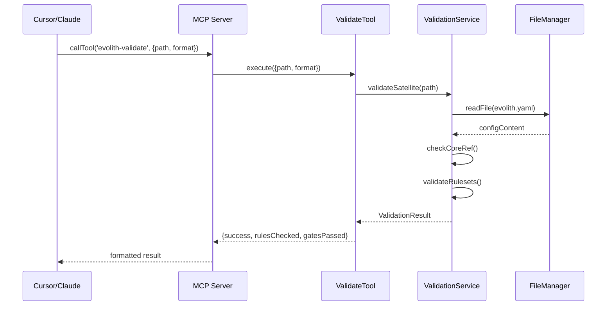

### 6-2 Agent Installation Flow

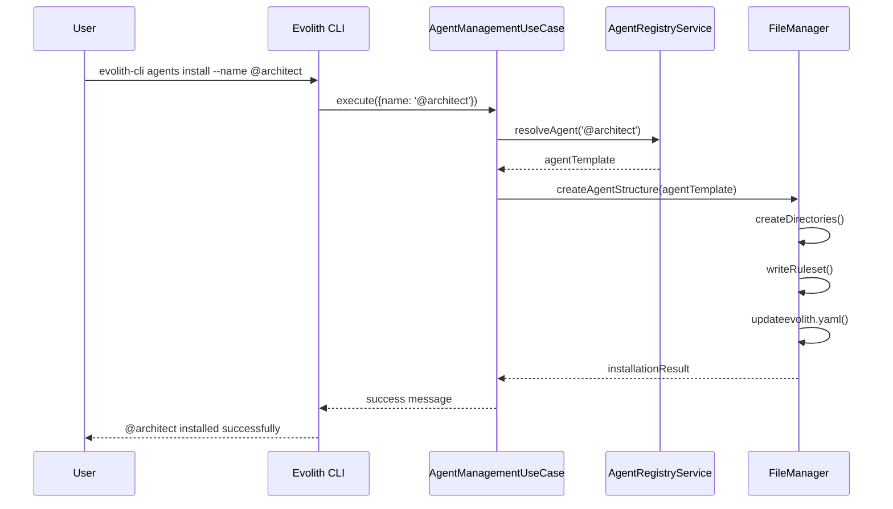

---

## 7. Infrastructure Deployment

### 7-1 Deployment Architecture

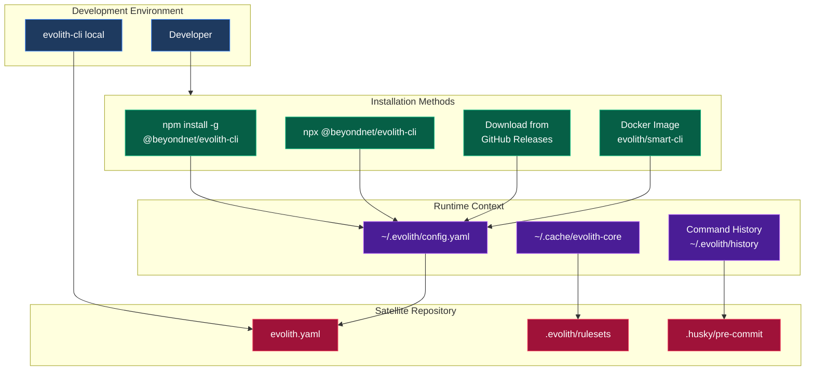

### 7-2 File System Layout

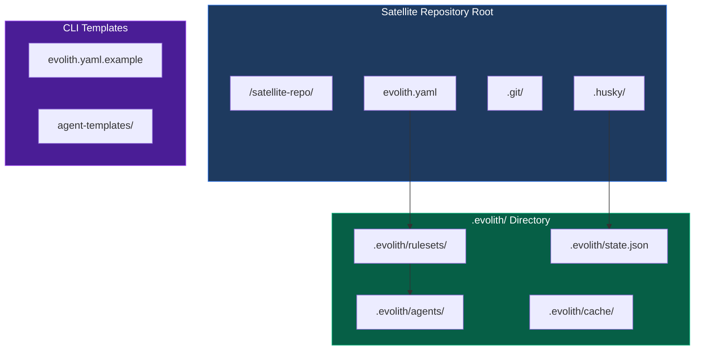

---

## 8. Technical Requirements

### 8-1 Runtime Requirements

| Requirement | Version | Notes |
|-------------|---------|-------|
| Node.js | >= 18.0.0 | LTS recommended |
| npm | >= 9.0.0 | For global install |
| Git | >= 2.30 | For git operations |
| Memory | 512MB min | For MCP server |
| Disk | 200MB min | For CLI + cache |

### 8-2 Dependencies

| Package | Version | Purpose |
|---------|---------|---------|
| @nestjs/common | ^11.1.24 | DI & modularity |
| @nestjs/core | ^11.1.24 | NestJS runtime |
| nest-commander | ^3.20.1 | CLI framework |
| @clack/prompts | ^1.5.1 | Interactive UI |
| @modelcontextprotocol/sdk | ^1.29.0 | MCP protocol |
| chalk | ^4.1.2 | Colored output |
| yaml | ^2.9.0 | Config parsing |
| chokidar | ^5.0.0 | File watching |
| fs-extra | ^11.3.5 | File operations |
| ora | ^9.4.0 | Spinners |

### 8-3 Environment Variables

| Variable | Default | Purpose |
|----------|---------|---------|
| `EVOLITH_CONFIG_PATH` | `~/.evolith` | Config directory |
| `EVOLITH_LOG_LEVEL` | `info` | Logging level |
| `EVOLITH_CORE_PATH` | `../evolith` | Core reference |
| `EVOLITH_PROFILE` | `default` | Config profile |
| `EVOLITH_NO_CACHE` | `false` | Skip cache |
| `EVOLITH_FORCE_COLOR` | `auto` | Force colors |

---

## Appendix: Configuration Schema

```yaml
# evolith.yaml - Satellite Configuration
apiVersion: evolith.dev/v1
kind: Satellite

coreRef:
  version: "1.0.0"
  path: "../evolith"

governance:
  version: "1.0"
  adrRegistry:
    - id: "ADR-0001"
      status: "accepted"

product:
  name: "my-project"
  type: "library"
  runtime: "typescript"

sdlc:
  currentPhase: "phase-1"
  phaseHistory:
    - phase: "phase-0"
      enteredAt: "2026-01-15T10:00:00Z"
      exitedAt: "2026-01-20T14:30:00Z"

agents:
  installed:
    - name: "@architect"
      version: "1.0.0"
      installedAt: "2026-01-15T10:05:00Z"
```

---

## Document Version

| Version | Date | Author | Changes |
|---------|------|--------|---------|
| 1.0.0 | 2026-06-06 | Evolith Team | Initial architecture documentation |

---

## See Also

- [MCP Integration Guide](./docs/MCP-INTEGRATION.md)
- [Command Reference](./docs/planning/cli-command-catalog.md)
- [ADR-0069: MCP Server Protocol Implementation](../../../reference/core/architecture/adrs/core/0069-ai-agent-context-protocol-integration.md)